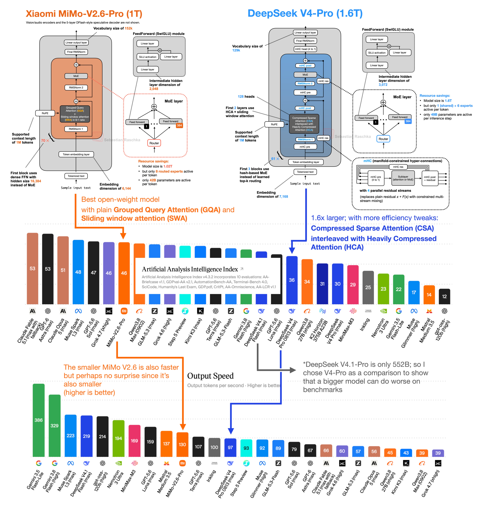

# 🐦 @rasbt

## 📅 September 22, 2026

> 1 post(s) archived.

---

### 🕐 13:46 UTC · @rasbt

> MiMo-V2.6 is &quot;simply&quot; the best (for now). Despite its simple architecture design it&apos;s currently No.1 in the open-weight benchmarks (weighted average). With &quot;simple,&quot; I mean a classic Grouped Query Attention (GQA) with Sliding Window Attention (SWA) at a tiny 128-token window size. So, that underlines one of the points I&apos;ve been trying to make in recent months: most of the progress still comes from the data and post-training recipe improvements. Fancy attention variants are just mostly efficiency tweaks. What are some of the training data improvements and recipe improvements? The MiMo team shared a pretty detailed technical report. Lots to carefully digest there, but in short, there are a few things that stood out: 1. An increase in agent tasks; also training across different harnesses (the average DeepSWE pass@1 accuracy on held-out harnesses improved from approximately 50% -&gt; 66%). 2. Better reward signals: they replaced a simple correctness verifier with an agentic grader that looks at the execution traces as well. 3. Large RL batches (1,568 prompts × 16 rollouts = 25,088 trajectories) and 2.7–3.7 billion training tokens per update (unclear, though, what the predecessor used). MiMo-V2.6-Pro debuts as the top open weights model on the Artificial Analysis Intelligence Index (46). At $0.13 per Intelligence Index task, it lands on the Intelligence vs. Cost per Task Pareto frontier @Xiaomi has just released MiMo-V2.6-Pro, an open weights model with major ad…

🔗 [View original post](https://x.com/rasbt/status/2102394156731535413)

---
