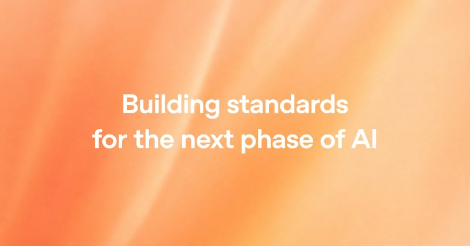

# 🐦 @sama

## 📅 September 22, 2026

> 11 post(s) archived.

---

### 🕐 21:38 UTC · @sama

> argh i meant VOICE not video :( sorry to dissapoint

🔗 [View original post](https://x.com/sama/status/2102512794235207758)

---

### 🕐 18:44 UTC · @sama

> Startups are naturally good at this; it is hard to keep a bigger company good at this and i think an underexplored space. OpenAI&apos;s superpower is the ability to swiftly assemble an empowered group of highly capable people to work on the most important and urgent thing at any point of time. No one really cares for org lines. It&apos;s how we stay nimble, seize opportunities, and recover from mistakes.

🔗 [View original post](https://x.com/sama/status/2102469008079679640)

---

### 🕐 18:42 UTC · @sama

> michelle embodies this as much as anyone openai is so, so lucky to have benefited from everything she has done so far and i think people will be quite pleased to see what she + team have cooking next! just crossed four years at openai! the special thing about this place is the constant capacity for rebirth. for all its faults, there is nowhere quite like it. the team makes high conviction, contrarian bets over and over, and they are mostly right. it&apos;s a new company every three…

🔗 [View original post](https://x.com/sama/status/2102468713866055872)

---

### 🕐 18:34 UTC · @sama

> We ❤️ developers. See you next week.

🔗 [View original post](https://x.com/sama/status/2102466605758452017)

---

### 🕐 18:34 UTC · @sama

> (As a side note, getting ready for this DevDay is the first time I remember ever, in OpenAI history, saying &quot;this is too much stuff to launch&quot;.)

🔗 [View original post](https://x.com/sama/status/2102466607373004888)

---

### 🕐 18:34 UTC · @sama

> We want the OpenAI API to feature the best model at every price point and to be the best at every modality (text, code, image, video, etc). And then we want you all to come up with great ideas and build them and to get to be happy users. The best ideas will come from you all.

🔗 [View original post](https://x.com/sama/status/2102466603111551187)

---

### 🕐 18:28 UTC · @sama

> Especially compared by per-task pricing, which is the metric that should matter, I don&apos;t think there is anything competitive anywhere in the market. We want people to be able to use tons of AI; it is important to being able to explore this new renaissance in front of us. GPT-6 Sol and Luna are big improvements on intelligence, alignment, work output, coding, computer use, and more over their 5.6-family predecessors. They are also half the price per token, and even less per task!

🔗 [View original post](https://x.com/sama/status/2102465143997440308)

---

### 🕐 18:26 UTC · @sama

> GPT-6 Sol and Luna are big improvements on intelligence, alignment, work output, coding, computer use, and more over their 5.6-family predecessors. They are also half the price per token, and even less per task!

🔗 [View original post](https://x.com/sama/status/2102464672519815512)

---

### 🕐 18:25 UTC · @sama

> GPT-6 Sol and Luna are great models but also these characters are so cute Please welcome GPT-6 Sol and GPT-6 Luna to the GPT-6 universe. GPT-6 Sol and Luna build on the advances behind GPT-6 Astra, bringing much of its strengths into faster and more affordable models to support work at scale. We’ve also made caching and inference more efficient, and we…

🔗 [View original post](https://x.com/sama/status/2102464201335984392)

---

### 🕐 16:51 UTC · @sama

> We have been focusing on efficiency and intelligence for all. Very proud of the team. Only possible when you have incredible models at the top end of the capability that you can then use to make a big difference in everything else.

🔗 [View original post](https://x.com/thsottiaux/status/2102440619616682120)

---

### 🕐 15:06 UTC · @sama

> People outside the AI labs should have a real say in how this technology develops, and a clear way to judge if it&apos;s happening safely. Standards should help prevent the concentration of power, including by making sure new companies and open-model companies can compete. They should also help countries and companies compare evidence and learn from failures. We think the US should lead this effort. Here is our proposal: https://openai.com/index/building-standards-next-phase-ai/

🔗 [View original post](https://x.com/sama/status/2102414347364335917)

---
