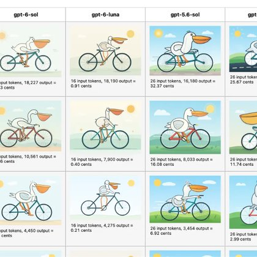

# 🐦 @simonw

## 📅 September 22, 2026

> 2 post(s) archived.

---

### 🕐 23:50 UTC · @simonw

> Big model release today - I wrote about Claude Opus 5.5, GPT-6 Sol, and GPT-6 Luna - plus comparison grids of pelicans by the different model families at different reasoning levels https://simonwillison.net/2026/Sep/22/opus-and-sol-and-luna/

🔗 [View original post](https://x.com/simonw/status/2102546103984079131)

---

### 🕐 20:07 UTC · @simonw

> GPT-6 Luna is half the price of 5.6 Luna, which was already an astonishingly cheap model given how capable it is Luna is my favorite model for building product features thanks to its cost (and speed) Please welcome GPT-6 Sol and GPT-6 Luna to the GPT-6 universe. GPT-6 Sol and Luna build on the advances behind GPT-6 Astra, bringing much of its strengths into faster and more affordable models to support work at scale. We’ve also made caching and inference more efficient, and we…

🔗 [View original post](https://x.com/simonw/status/2102490016752779458)

---
