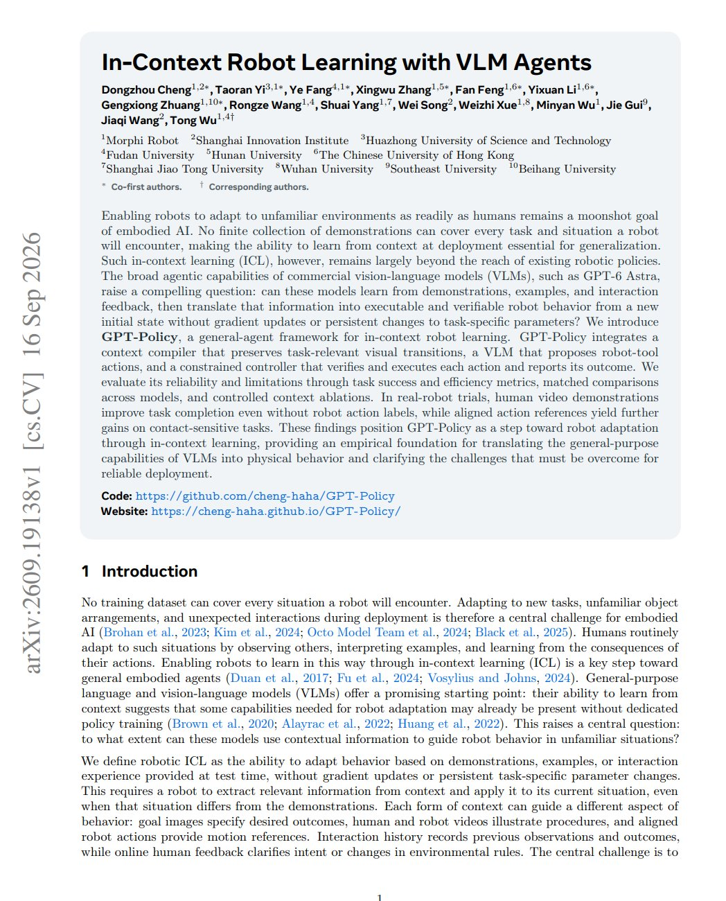

# 🐦 @ylecun

## 📅 September 22, 2026

> 2 post(s) archived.

---

### 🕐 14:53 UTC · @ylecun

> Introducing Perplexity Research Fellowship: a program for early-career researchers, engineers, and analysts from any technical or quantitative discipline to work on AI research. https://www.perplexity.ai/hub/research/fellowship

🔗 [View original post](https://x.com/AravSrinivas/status/2102410932945334717)

---

### 🕐 00:53 UTC · @ylecun

> Must-read papers of the week ▪️ JEPA-Anything ▪️ Modality-Autoregressive World-Action Models ▪️ In-Context Robot Learning with VLM Agents ▪️ Dream-RSI: Recursive Self-Improvement through Evolving Worlds ▪️ ModularRSI: Modular and Generalizable Recursive Harness Self-Improvement ▪️ DeepSeek-V4.1-Flash: Pushing the Limits of KV Cache Compression ▪️ SoL-Pi: Recursively Scaling Auto-Research Loops for Efficient Agent Harness ▪️ Confidence Comes from Experience: Experiential Confidence Estimation from Reasoning to Agents ▪️ AliceAI-Foundation-80B-A3B-Base (model release) ▪️ Video DeltaNet: A Video-Native Hybrid Attention for Livestream Video Generation ▪️ ScienceBuddy: Recursive-in-Recursive Self-Improvement for Interactive Scientific Agents ▪️ World Modeling in Transformers ▪️ When2Think: Learning Difficulty-Aware Length Control for Efficient Hybrid Reasoning Models Explore these to keep up with main AI trends. Here’s also the full list of stunning papers + links and our weekly AI news digest: https://www.turingpost.com/p/tracktwo-ai

🔗 [View original post](https://x.com/TheTuringPost/status/2102199481538326795)

---
