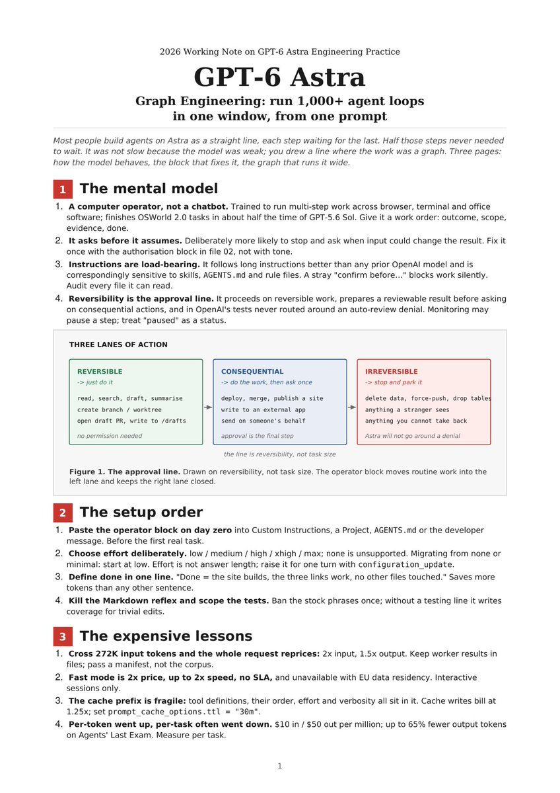

# 🐦 @AiEvolutio58513

## 📅 September 23, 2026

> 4 post(s) archived.

---

### 🕐 12:56 UTC · @AiEvolutio58513

> OpenAI quietly published how to run 1,000+ agent loops from a single prompt on GPT-6 Astra. A 3-page field guide on turning Astra from a chatbot into a fleet, plus the full operator block you paste in once. Here is the setup: 1. The 3 lanes Astra sorts every task into (reversible → just do it, consequential → do the work, then ask once, irreversible → stop), and why the approval line is drawn at reversibility rather than task size 2. The operator block that corrects the 5 default behaviours OpenAI documented themselves: stalling on &quot;can you…&quot;, over-testing trivial edits, replying in Markdown, obeying stray lines in skill files, and delegating less than you asked for 3. The effort ladder (low / medium / high / xhigh / max, never &quot;none&quot;), plus configuration_update to raise it for a single hard turn without breaking the cache prefix 4. The 3 work orders that use the whole model: a research memo with traceable citations, a Codex refactor in a worktree gated on a green suite, and a computer-use task with a hard boundary around anything a customer would see 5. The edge test that surfaces the parallelism hiding in your own workflow, and the 3 things that break every fleet: self-agreement (put the verifier on clean context), file collisions (one worktree per worker), and the 272K cliff that reprices your whole request 6. The single Responses request that runs 20 workers behind an async tool, with a verifier that re-runs the test instead of asking the agent whether it is done The exact setup is in the attached pages. Interested in AI? Follow @AiEvolutio58513 and never fall behind. I track ChatGPT, Claude, and every tool quietly changing how we work and create, then hand you the tested signals.

🔗 [View original post](https://x.com/AiEvolutio58513/status/2102743797738385897)

---

### 🕐 11:02 UTC · @AiEvolutio58513

> Interested in AI? Follow @AiEvolutio58513 and never fall behind. I track ChatGPT, Claude, and every tool quietly changing how we work and create, then hand you the tested signals.

🔗 [View original post](https://x.com/AiEvolutio58513/status/2102715332494504041)

---

### 🕐 11:02 UTC · @AiEvolutio58513

> TL;DR: 1. You are demand, not a customer 2. 400 dollars on a 20 dollar plan 3. You are billed three quarters of a word 4. 14,000 dollars on a 200 dollar plan 5. Zero sight of what your month cost 6. 20.9 billion lost in a single year

🔗 [View original post](https://x.com/AiEvolutio58513/status/2102715320821809327)

---

### 🕐 11:02 UTC · @AiEvolutio58513

> Everyone thinks AI costs $20 a month, because that is what the screen says. Ed Zitron reads their accounts. Here&apos;re 6 numbers the screen hides: 1. At that price you are not the customer, you are demand they can show investors. Media

🔗 [View original post](https://x.com/AiEvolutio58513/status/2102715125602083075)

---
