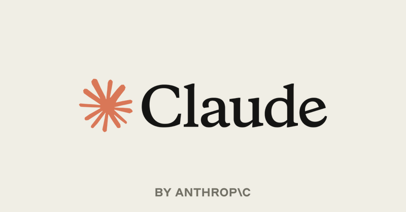
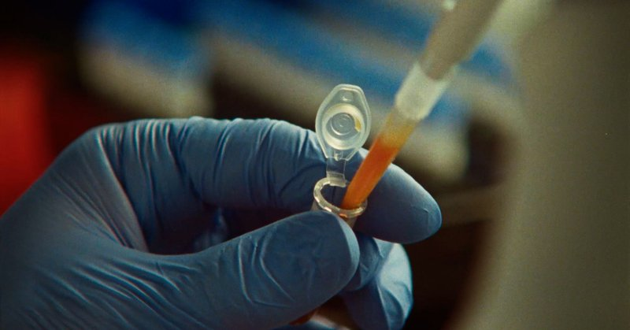

# 🐦 @bcherny

## 📅 September 23, 2026

> 2 post(s) archived.

---

### 🕐 20:15 UTC · @bcherny

> If you&apos;ve noticed how fast https://claude.ai and the Desktop app have become in the last few weeks, here&apos;s how we did it. Lots of juicy learnings &amp; techniques in the blog post for engineers working on speeding up your own apps. We made claude​.ai 3x faster in two weeks. Here’s how we use Claude to measure, debug and improve performance. Prompts and methods included. https://claude.dev/blog/how-we-made-claude-ai-faster/

🔗 [View original post](https://x.com/bcherny/status/2102854267782705648)

---

### 🕐 18:18 UTC · @bcherny

> Claude has discovered a previously unknown enzyme system hidden in the DNA of bacteriophages. Beside the enzyme’s gene sits a long array of repeating DNA—a structure that looks somewhat similar to CRISPR. We don’t yet understand what this system does, but only a handful of known systems share its features, and all of them are able to cut, copy, and paste DNA. Historically, the discovery of such programmable systems has helped revolutionize medicine. CRISPR, for instance, is now the foundation of genetic medicines. But it will take much more work to learn what this system does, and whether it can be put to similar use. Read more: https://www.anthropic.com/news/claude-discovers-novel-enzyme-system

🔗 [View original post](https://x.com/AnthropicAI/status/2102824959827742916)

---
