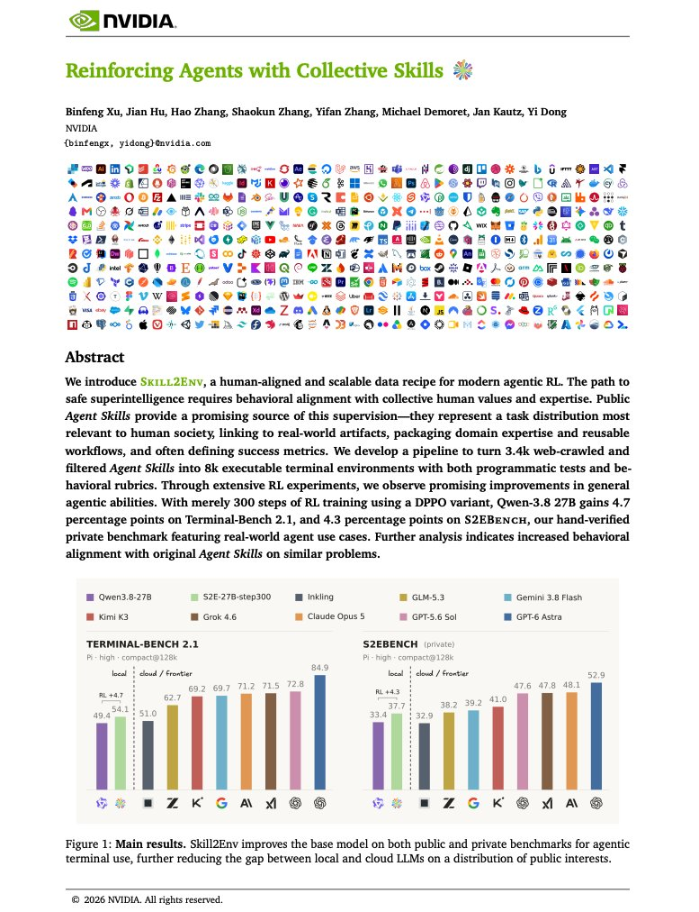
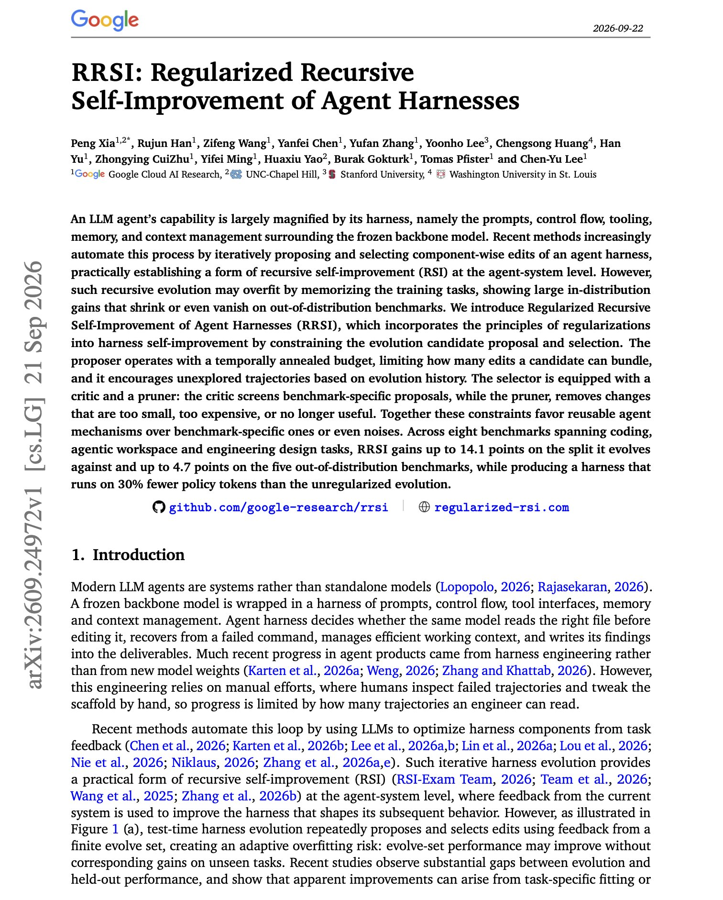
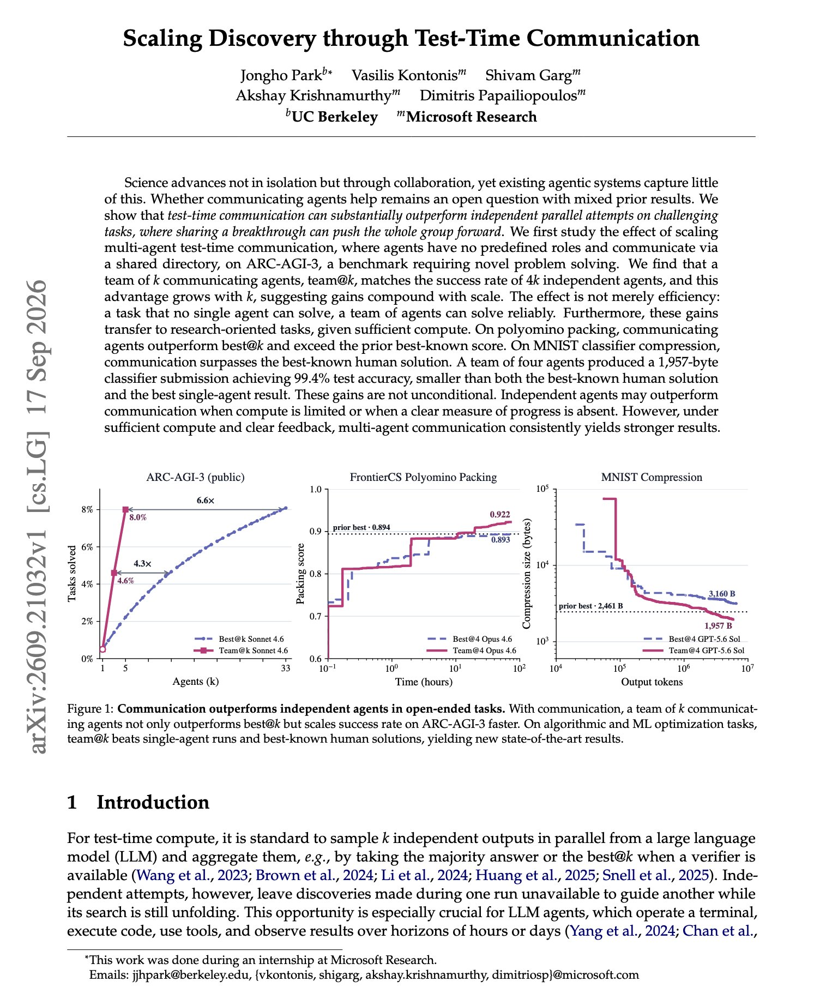
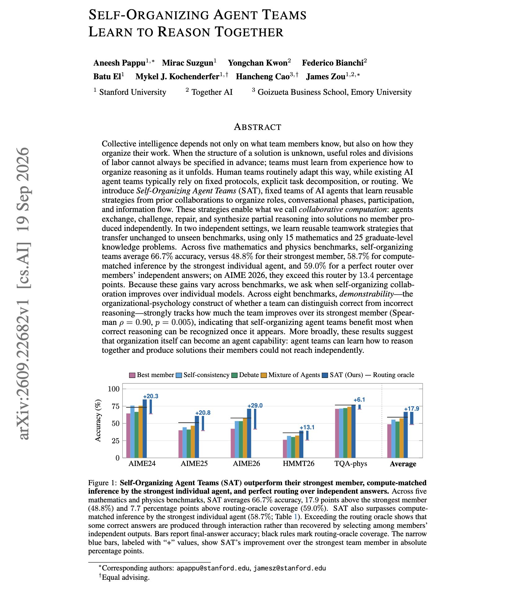
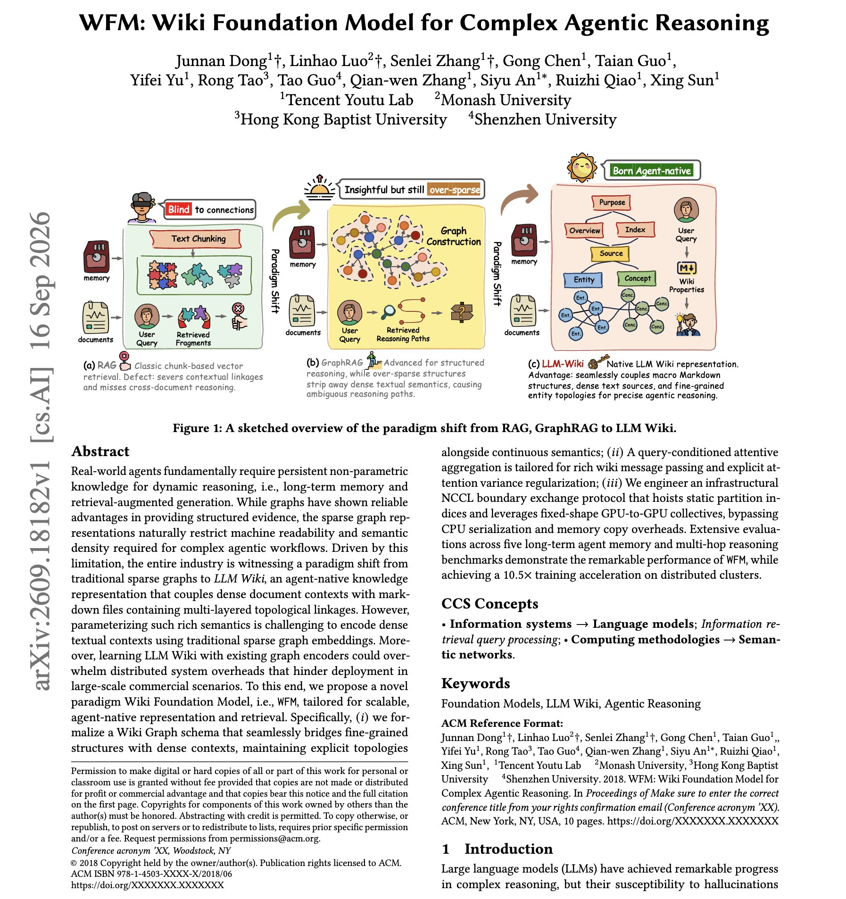

# 🐦 @dair_ai

## 📅 September 23, 2026

> 6 post(s) archived.

---

### 🕐 20:28 UTC · @dair_ai

> Exciting work from NVIDIA. (bookmark it) Interesting to see this approach to turn public Agent Skills into RL environments. Lots of excitement around RL environments so this is a great read. Skill2Env compiles each Skill into executable terminal tasks. A Codex planner reads the SKILL.md bundle, researches related public assets and splits the Skill into workflows. A Codex creator then builds each task with programmatic tests and a behavioral rubric taken from the Skill&apos;s own quality criteria. From about 3.4k crawled Skills, the pipeline produced 7,971 tasks across 13 domains, with software engineering under a quarter of the corpus. Generating them with GPT-5.6 Sol cost over $90k in API usage. After 300 steps of outcome-only RL, Qwen3.8-27B improved from 49.4% to 54.1% on Terminal-Bench 2.1 and from 33.4% to 37.7% pass@1 on S2EBench, their hand-verified held-out benchmark. Adding the rubric to the reward gave smaller benchmark gains, 50.1% on Terminal-Bench 2.1. Given the source SKILL.md, a judge preferred the rubric-trained model&apos;s trajectories over the base model&apos;s on 73.0% of tasks, against 54.5% for the outcome-only model. Paper: https://github.com/NVlabs/Skill2Env/blob/main/paper/Skill2Env_arXiv.pdf Chat with Paper: https://academy.dair.ai/papers/reinforcing-agents-with-collective-skills

🔗 [View original post](https://x.com/dair_ai/status/2102857541776707799)

---

### 🕐 20:13 UTC · @dair_ai

> Must-read paper from Google on self-improving agent harnesses. If you auto-optimize your agent&apos;s harness, your eval score can go up while the agent gets worse on real tasks. This paper shows how to prevent that. Of five harness-evolution methods compared on agentic workspace tasks, RRSI scored the lowest on the tasks it evolved against and highest on all three out-of-distribution benchmarks. Automated harness evolution proposes edits to prompts, control flow, tools and memory, keeps the ones that raise the score, and repeats. The authors show this overfits the training tasks. Meta-Harness reached 93.0 on the Harvey LAB evolve split but gained only 0.3 to 1.5 points on JobBench, GDPval and APEX-Agents. RRSI adds regularization on both sides of the loop. The proposer gets an edit budget that shrinks over time and is pushed toward directions it has not tried. A critic rejects benchmark-specific edits, and a pruner removes edits that are too small, too costly or no longer useful. RRSI scored 90.5 on the evolve split and gained 3.5 to 4.7 points on the three held-out benchmarks. In the ablation, unregularized evolution used 3.80M tokens per trial against 2.42M for RRSI. With Gemini 3.5 Flash, RRSI raised Terminal-Bench 2.1 from 64.6 to 78.7 and carried a 2.2-point gain over to SWE-bench Verified. Paper: https://arxiv.org/abs/2609.24972 Chat with Paper: https://academy.dair.ai/papers/rrsi-regularized-recursive-self-improvement-of-agent-harnesses-2609.24972

🔗 [View original post](https://x.com/omarsar0/status/2102853768266256738)

---

### 🕐 15:35 UTC · @dair_ai

> Banger paper from Microsoft Research and colleagues. It studies the potential benefits of agents that share progress while they work. (bookmark it) Communication is still a challenge with multi-agent systems. In this setup, agents have no predefined roles and communicate via a shared directory. They report that a team of k agents that write their findings to a shared directory matches the success rate of 4k agents working independently on ARC-AGI-3. The gap grows with k, and teams reliably solve some tasks that no single agent solves. The same setup beat best@k on polyomino packing and exceeded the prior best-known score. On MNIST compression, a four-agent team wrote a 1,957-byte classifier with 99.4% test accuracy, smaller than the best-known human solution. Independent agents still do better when compute is tight or when there is no clear measure of progress, so the paper also tells you when it might be a good idea to skip communication. Paper: https://arxiv.org/abs/2609.21032 Chat with Paper: https://academy.dair.ai/papers/scaling-discovery-through-test-time-communication-2609.21032

🔗 [View original post](https://x.com/omarsar0/status/2102783808286384159)

---

### 🕐 15:05 UTC · @dair_ai

> Banger paper from Stanford and Together AI. They show why it might be a good idea to let your agent team learn its own way of working together. (bookmark it) Three models (o3-mini, Claude Sonnet 4 and DeepSeek-V3) averaged 66.7% across five math and physics benchmarks as a self-organizing team. Their strongest member alone scored 48.8%, and a perfect router choosing among the members&apos; independent answers scored 59.0%. On AIME 2026 the team reached 71.2%, 13.4 points above that router. One member reviews the team&apos;s earlier exchanges and rewrites the teamwork strategy, covering roles, the order of discussion phases, who participates and how partial answers are combined. The strategies were learned from only 15 AIME 2024 problems and then applied unchanged to held-out AIME 2024 problems and four new benchmarks. Paper: https://academy.dair.ai/papers/self-organizing-agent-teams-learn-to-reason-together-2609.22682

🔗 [View original post](https://x.com/dair_ai/status/2102776257687781501)

---

### 🕐 14:09 UTC · @dair_ai

> https://x.com/i/article/2102570923941367808

🔗 [View original post](https://x.com/omarsar0/status/2102762406204076532)

---

### 🕐 02:05 UTC · @dair_ai

> Interesting paper on agent memory stored as a linked markdown wiki. Lots of great ideas and insights if you work with LLM Wikis. Wikis are useful for agents because each page holds dense text and the links between pages hold structure. WFM is a Wiki Foundation Model trained to use both at once. It turns an LLM Wiki into a graph and retrieves from it with message passing conditioned on the query, so the text of each page and the link structure shape the result together. The team also built a GPU-to-GPU training protocol that trains 10.5x faster, and reports strong results on five agent memory and multi-hop reasoning benchmarks. If your agent&apos;s long-term memory is a folder of linked markdown files, WFM is designed for that format. Paper: https://arxiv.org/abs/2609.18182 Chat with Paper: https://academy.dair.ai/papers/wfm-wiki-foundation-model-for-complex-agentic-reasoning-2609.18182

🔗 [View original post](https://x.com/omarsar0/status/2102579964436680959)

---
