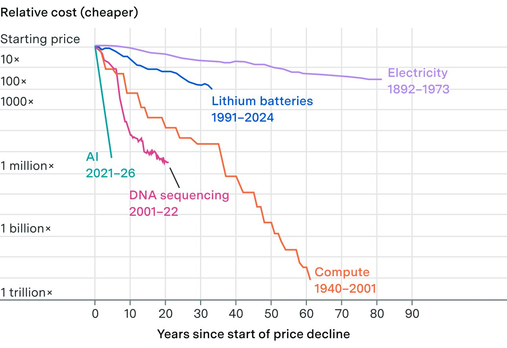
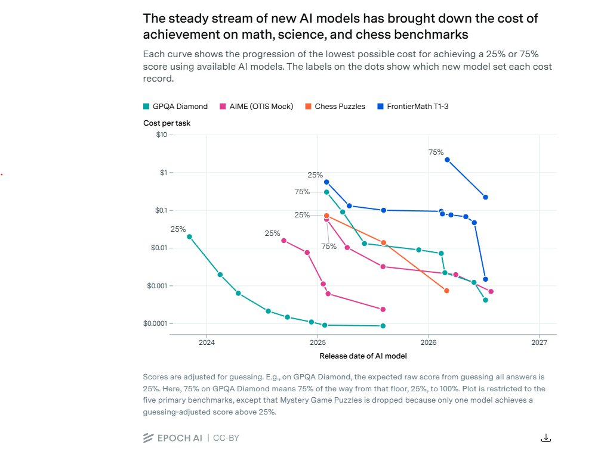
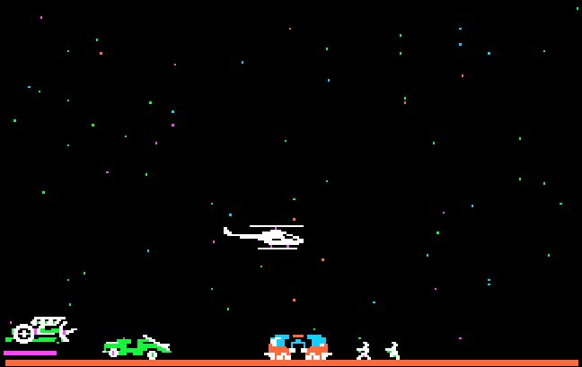

# 🐦 @emollick

## 📅 September 23, 2026

> 11 post(s) archived.

---

### 🕐 21:04 UTC · @emollick

> Also this terrific chart. All from: https://epoch.ai/publications/the-plunging-price-of-thought

🔗 [View original post](https://x.com/emollick/status/2102866687016206734)

---

### 🕐 20:59 UTC · @emollick

> This is a really important graph showing the cost of achieving 25% or 75% scores in various hard math and science benchmarks. Costs are collapsing even as ability is increasing It is also why optimizing for cost for a particular solution right now may end up being short sighted

🔗 [View original post](https://x.com/emollick/status/2102865436459069474)

---

### 🕐 19:50 UTC · @emollick

> So far, the answer appears to be &quot;no&quot;

🔗 [View original post](https://x.com/emollick/status/2102848092500373602)

---

### 🕐 18:58 UTC · @emollick

> The original is playable here: https://classicreload.com/apple2-rescue-raiders.html

🔗 [View original post](https://x.com/emollick/status/2102835034147127599)

---

### 🕐 18:56 UTC · @emollick

> There is an abandonware game I loved as a kid called Rescue Raiders. I asked Claude to create a modern &amp; updated version of the game with new graphics, goals, tech trees, etc. It iterated back-and-forth with critic &amp; art agents until I got this. Its fun! https://rescue-raiders.netlify.app/ Media

🔗 [View original post](https://x.com/emollick/status/2102834402908582112)

---

### 🕐 17:38 UTC · @emollick

> This is both fun and a useful measure of how much better multimodal AI has gotten In a short time. Can AI tell if you&apos;ve built your IKEA furniture wrong? Our new benchmark, the Furniture Assembly Benchmark (FAB), gives models the manual and a photo of a half-completed piece of furniture and asks them to spot the mistake. The top score has gone from 28% to 80% in just 10 months…

🔗 [View original post](https://x.com/emollick/status/2102814884111249872)

---

### 🕐 15:58 UTC · @emollick

> I appreciate the references to hidden incidents, and I am sure there are some, but it would be really useful to know if there are any public ones around internal use of AI? There are hundreds of millions of people with AI access at work right now...

🔗 [View original post](https://x.com/emollick/status/2102789826856841326)

---

### 🕐 14:35 UTC · @emollick

> Has there actually been a major security AI incident around internal use of a commercially released frontier model, operating in ordinary deployment with normal safeguards? Everybody in organizations was deeply worried about this in 2023, but I am not aware of real incidents?

🔗 [View original post](https://x.com/emollick/status/2102768800399548792)

---

### 🕐 05:11 UTC · @emollick

> Open source here: https://github.com/emollick/wasteland-annotated

🔗 [View original post](https://x.com/emollick/status/2102626794104934520)

---

### 🕐 03:04 UTC · @emollick

> Open source here: https://github.com/emollick/orbital-declaration And if you like this, the most realistic space game I have played is Children of a Dead Earth (I have no connection to the game, except as a player): https://www.childrenofadeadearth.com/ Also I had the AI research here: https://projectrho.com/public_html/rocket/

🔗 [View original post](https://x.com/emollick/status/2102594959618736317)

---

### 🕐 03:00 UTC · @emollick

> I had Fable/Opus build a hard science fiction starship combat game, with orbital mechanics, delta-v, heat, and realistic tactics, but simplified for 2D space with the hard math done by the game. Its quite fun to play (if you like this kind of thing): https://orbital-declaration.netlify.app/ Media

🔗 [View original post](https://x.com/emollick/status/2102593821376696785)

---
