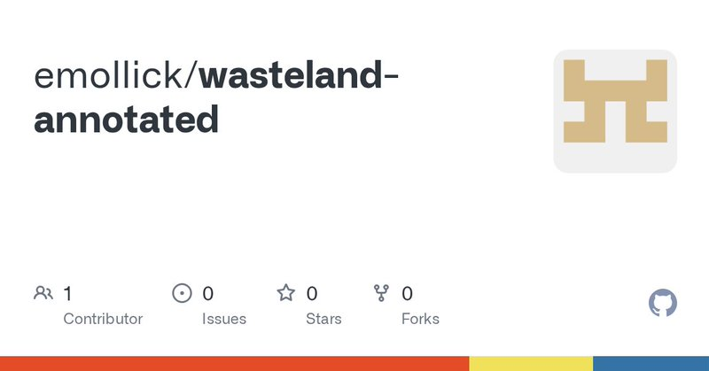

# 🐦 @emollick

## 📅 September 23, 2026

> 5 post(s) archived.

---

### 🕐 15:58 UTC · @emollick

> I appreciate the references to hidden incidents, and I am sure there are some, but it would be really useful to know if there are any public ones around internal use of AI? There are hundreds of millions of people with AI access at work right now...

🔗 [View original post](https://x.com/emollick/status/2102789826856841326)

---

### 🕐 14:35 UTC · @emollick

> Has there actually been a major security AI incident around internal use of a commercially released frontier model, operating in ordinary deployment with normal safeguards? Everybody in organizations was deeply worried about this in 2023, but I am not aware of real incidents?

🔗 [View original post](https://x.com/emollick/status/2102768800399548792)

---

### 🕐 05:11 UTC · @emollick

> Open source here: https://github.com/emollick/wasteland-annotated

🔗 [View original post](https://x.com/emollick/status/2102626794104934520)

---

### 🕐 03:04 UTC · @emollick

> Open source here: https://github.com/emollick/orbital-declaration And if you like this, the most realistic space game I have played is Children of a Dead Earth (I have no connection to the game, except as a player): https://www.childrenofadeadearth.com/ Also I had the AI research here: https://projectrho.com/public_html/rocket/

🔗 [View original post](https://x.com/emollick/status/2102594959618736317)

---

### 🕐 03:00 UTC · @emollick

> I had Fable/Opus build a hard science fiction starship combat game, with orbital mechanics, delta-v, heat, and realistic tactics, but simplified for 2D space with the hard math done by the game. Its quite fun to play (if you like this kind of thing): https://orbital-declaration.netlify.app/ Media

🔗 [View original post](https://x.com/emollick/status/2102593821376696785)

---
