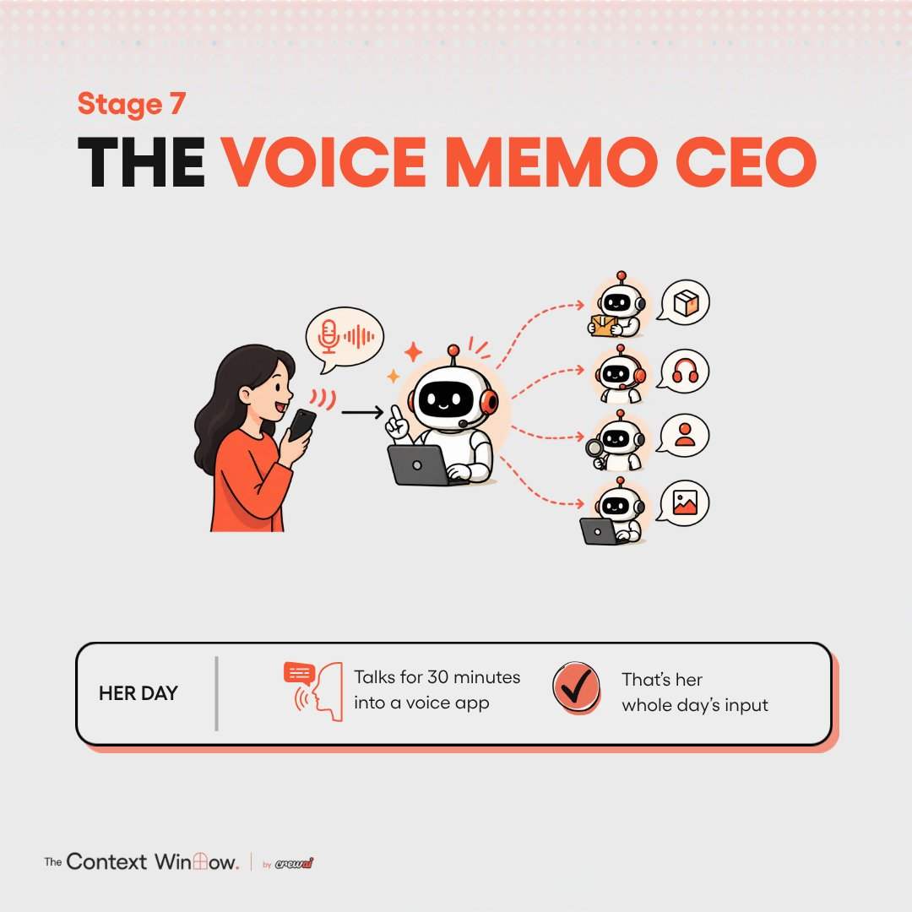
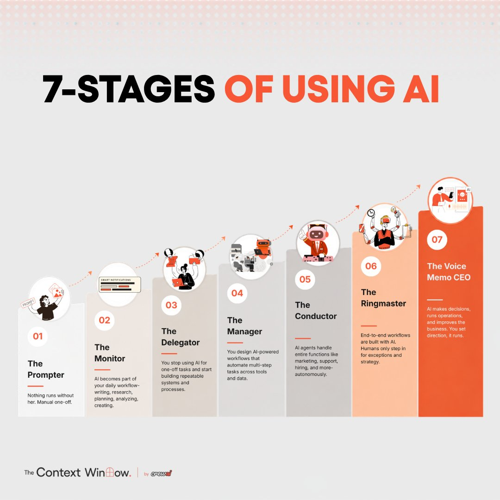

# 🐦 @joaomdmoura

## 📅 September 23, 2026

> 3 post(s) archived.

---

### 🕐 16:01 UTC · @joaomdmoura

> Which stage is your team on?

🔗 [View original post](https://x.com/joaomdmoura/status/2102790498134225193)

---

### 🕐 16:01 UTC · @joaomdmoura

> 7. The Voice Memo CEO: one agent runs the rest. You talk into a voice app for 30 minutes. A chief of staff agent shuts down the agents not earning their keep and starts new ones where there is a gap. Nobody works this way yet. It is where the best builders are heading.

🔗 [View original post](https://x.com/joaomdmoura/status/2102790485962375338)

---

### 🕐 16:01 UTC · @joaomdmoura

> Our growth team mapped out 7 stages of using AI at work. Most people never get past the first one.

🔗 [View original post](https://x.com/joaomdmoura/status/2102790380425224488)

---
