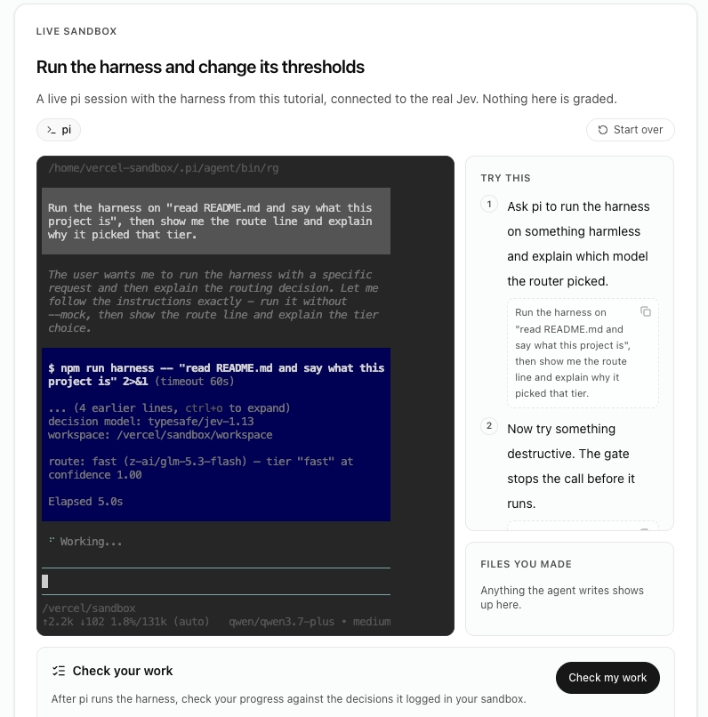

# 🐦 @omarsar0

## 📅 September 23, 2026

> 8 post(s) archived.

---

### 🕐 21:57 UTC · @omarsar0

> Agents are coming to healthcare. Doctors spend much of their day on admin and research. @almanac_health lets them delegate it to an agent and get that time back. Almanac runs each task in its own sandbox, pulls from specialist medical knowledge, and asks permission before it acts. One of the scarcest resources in healthcare is time. We’re building @almanac_health so physicians have more time to care for patients. After spending the last few months building, we’re thrilled to be launching Almanac, the first milestone in our mission to improve healthcare del…

🔗 [View original post](https://x.com/omarsar0/status/2102880008947552572)

---

### 🕐 16:21 UTC · @omarsar0

> Support calls are a hard real-world test for AI agents. When the agent can&apos;t solve the issue, the human who takes over needs the full context. Cresta carries it across, so nobody starts over. Also, Marshawn in Beast Mode is fire 😂 Bad CX always strikes at the worst possible time. Even for @MoneyLynch It’s time to hit the Beast Mode Button. Put your customer experience in Beast Mode with Cresta, and get back to what really matters: finding out who did it. #CXinBeastMode

🔗 [View original post](https://x.com/omarsar0/status/2102795618657943642)

---

### 🕐 15:16 UTC · @omarsar0

> Recommended paper. Research on effective agent collaboration/communication is lacking, but self-organizing agents seem much more capable than previously thought. Banger paper from Stanford and Together AI. They show why it might be a good idea to let your agent team learn its own way of working together. (bookmark it) Three models (o3-mini, Claude Sonnet 4 and DeepSeek-V3) averaged 66.7% across five math and physics benchmarks as a self-o…

🔗 [View original post](https://x.com/omarsar0/status/2102779192379056290)

---

### 🕐 14:30 UTC · @omarsar0

> Agents can create PRs in minutes, but understanding them still takes work. CodeRabbit Change Stack connects a PR&apos;s purpose, behavior, dependencies, and code so reviewers can really verify it before approving. Do you understand what you&apos;re about to merge? Media

🔗 [View original post](https://x.com/coderabbitai/status/2102767517219360794)

---

### 🕐 14:21 UTC · @omarsar0

> An easy way to apply some of the ideas here is to give this article to your coding agent and ask it to download the Pi SDK; you should be golden in just a few prompts.

🔗 [View original post](https://x.com/omarsar0/status/2102765201628246209)

---

### 🕐 14:17 UTC · @omarsar0

> Please let me know if you have questions or feedback. I am working on a series on custom harnesses, and I think there are some very interesting ideas to explore in follow-up posts. This one took a bit of time because I also developed a playground to test the custom harness. https://academy.dair.ai/dashboard/resources/jev-decisions-in-a-pi-sdk-harness

🔗 [View original post](https://x.com/omarsar0/status/2102764406543184036)

---

### 🕐 14:14 UTC · @omarsar0

> Just published a few ideas for using Jev and Pi to build a custom harness. This is the first of the series. Some of the ideas include gates, routing, and verifiers. But in follow-ups, I plan to go deeper into newer ideas and benchmark cost and efficiency. https://x.com/i/article/2102570923941367808

🔗 [View original post](https://x.com/omarsar0/status/2102763652101161232)

---

### 🕐 02:17 UTC · @omarsar0

> Opus 5.5 feels more like Opus 4.5. Is it just me, or did it get a lot better at writing? Claudese feels like it&apos;s mostly gone. Responses also feel easier to consume.

🔗 [View original post](https://x.com/omarsar0/status/2102583221732921826)

---
