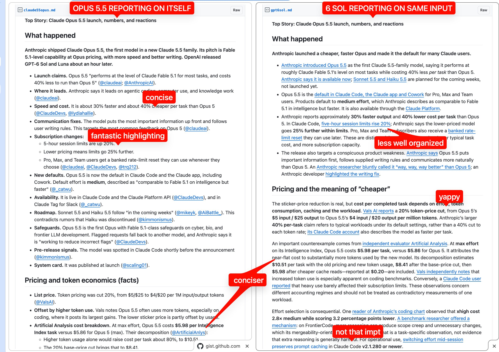

# 🐦 @swyx

## 📅 September 23, 2026

> 3 post(s) archived.

---

### 🕐 08:31 UTC · @swyx

> Give TypeSafe’s Diogo Almeida a billion dollars and he still wouldn’t pre-train. His bet: slice, dice, and Frankenstein existing stacks — anything except burning the check on a scratch foundation model. @swyx @labenz Latent Space — Why We Made Jev — Diogo Almeida, TypeSafe Co-founder &amp; CEO https://www.youtube.com/watch?v=cFx9Z3ZXca0 Media

🔗 [View original post](https://x.com/fourweekmba/status/2102677181025427675)

---

### 🕐 06:43 UTC · @swyx

> @latentspacepod https://www.latent.space/p/ainews-claude-opus-55-the-new-default

🔗 [View original post](https://x.com/swyx/status/2102650088137130205)

---

### 🕐 06:43 UTC · @swyx

> can confirm. ran @latentspacepod AINews side by side with 6 Sol and the difference was night and day: https://www.latent.space/p/ainews-claude-opus-55-the-new-default 5.5 Opus is the new default model for AINews going forward. so much more concise and tasteful reporting, with much less slopese than even 5 Opus. also important news we fixed the writing

🔗 [View original post](https://x.com/swyx/status/2102650014552182920)

---
