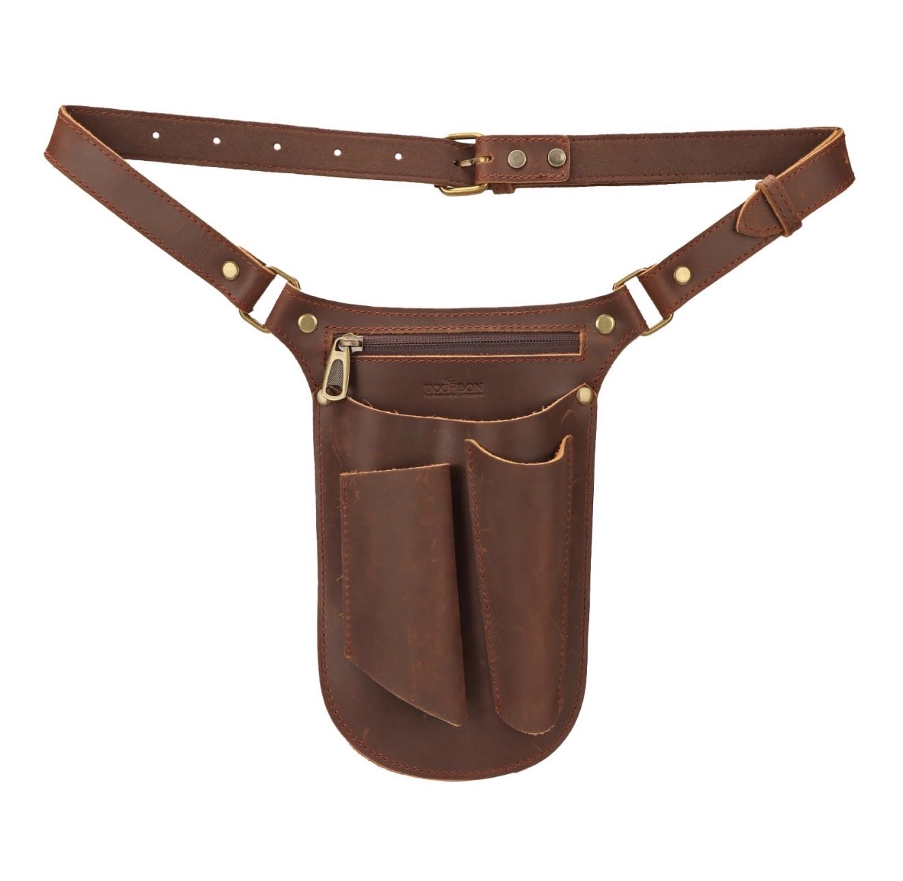
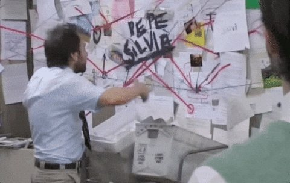
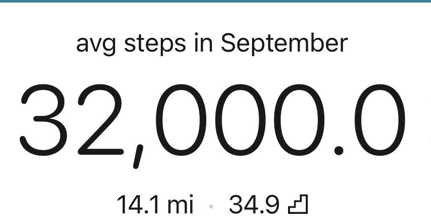
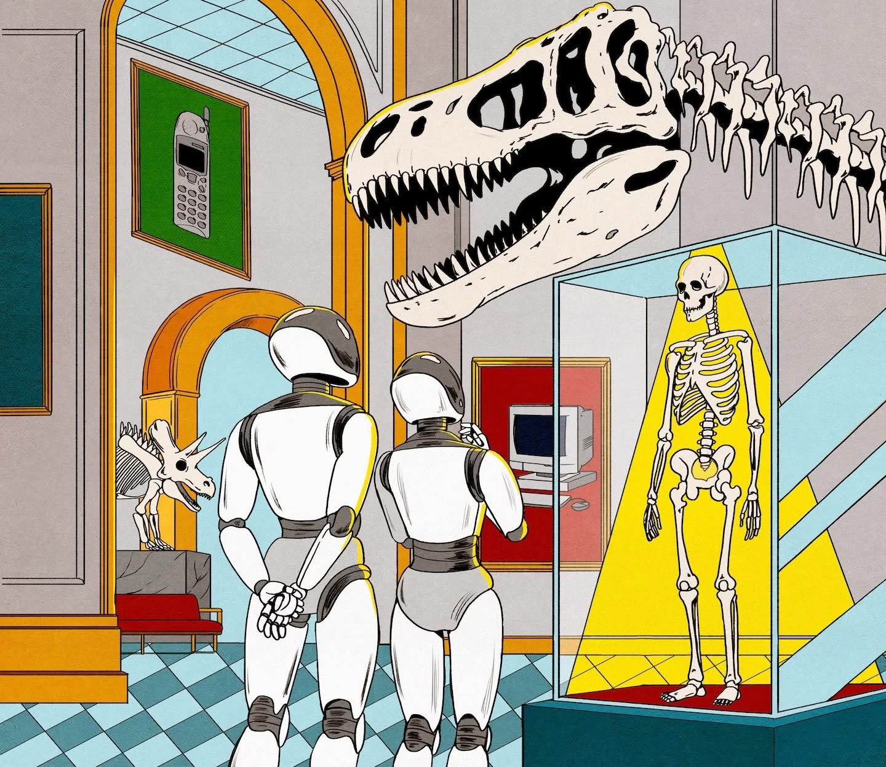

# 🐦 @tunguz

## 📅 September 23, 2026

> 16 post(s) archived.

---

### 🕐 22:24 UTC · @tunguz

> Men, what’s stopping you from wearing this?

🔗 [View original post](https://x.com/tunguz/status/2102886891213525440)

---

### 🕐 20:04 UTC · @tunguz

> Reminds me of this: Sir what is going on here

🔗 [View original post](https://x.com/tunguz/status/2102851506877894881)

---

### 🕐 20:02 UTC · @tunguz

> Quite right. This is a very common knee jerk reaction. Evidence shows that high quality sleep makes you hard. Lack of sleep leaves you flaccid. They have it all backwards.

🔗 [View original post](https://x.com/tunguz/status/2102851163620286905)

---

### 🕐 19:02 UTC · @tunguz

> Enzymes too cheap to matter. BREAKING: Anthropic’s new wet lab produces its first discovery, with nearly 1,000 Claude agents autonomously uncovering a novel enzyme system after 21 hours of work.

🔗 [View original post](https://x.com/tunguz/status/2102835943803912305)

---

### 🕐 18:05 UTC · @tunguz

> how do tou like them apples The best snack for fat loss is apples. They rank near the top of the satiety index meaning. They&apos;re 86% water &amp; under 100 calories. The fiber in apples slows digestion, feeds good gut bacteria, and keeps hunger hormones in check. Apples are the best snack when cutting. Eat them.

🔗 [View original post](https://x.com/tunguz/status/2102821712018755912)

---

### 🕐 17:51 UTC · @tunguz

> 32k … 31k …

🔗 [View original post](https://x.com/tunguz/status/2102818225927110790)

---

### 🕐 17:09 UTC · @tunguz

> Compute is King

🔗 [View original post](https://x.com/tunguz/status/2102807524689002603)

---

### 🕐 15:24 UTC · @tunguz

> Fascinating and totally unsurprising. I’ve been saying for years that unsupervised FSD will be downstream from AGI. We gave ChatGPT, Claude, and Grok control of a real Toyota Corolla 🚗, steering/gas/brakes, no human driving (just a foot over the brake). Only one model was able to complete our entire driving course. Introducing DrivingBench. 🔥⌛️🏁

🔗 [View original post](https://x.com/tunguz/status/2102781103954346126)

---

### 🕐 15:03 UTC · @tunguz

> Looks artistically well executed, but Theranos story is ancient history in the world of tech. What I’d love to see him would be Nathan embedded in one of the top AI labs and follow them as they realize that we have passed the point of no return. Would love to be the fly on that wall. Here is official trailer, You Can See Everything

🔗 [View original post](https://x.com/tunguz/status/2102775911586410892)

---

### 🕐 14:27 UTC · @tunguz

> He’s a ten, but he is a top ranked tech influencer on some obscure European podcast list.

🔗 [View original post](https://x.com/tunguz/status/2102766896127078721)

---

### 🕐 14:21 UTC · @tunguz

> LOL they are still writing reports.

🔗 [View original post](https://x.com/tunguz/status/2102765376312689052)

---

### 🕐 14:13 UTC · @tunguz

> (Illustration by Maria Jesus Contreras for The Washington Post)

🔗 [View original post](https://x.com/tunguz/status/2102763377038872921)

---

### 🕐 13:47 UTC · @tunguz

> We have passed the event horizon and hardly anyone has noticed.

🔗 [View original post](https://x.com/tunguz/status/2102756771500818909)

---

### 🕐 13:42 UTC · @tunguz

> This may not be as bad as it sounds. Or it could be worse. Lots of kids these days don’t care about physical toys, while adults are turning back to them out of nostalgia. Toy sales among adult-only households have now outpaced households with children for toy sales, growing 16% through June, according to a market research group. https://www.nbcnews.com/business/consumer/toys-r-us-opening-120-new-stores-rcna598543?cid=sm_npd_nn_tw_ma&amp;taid=6ab10e398…

🔗 [View original post](https://x.com/tunguz/status/2102755523997364649)

---

### 🕐 13:40 UTC · @tunguz

> May the best wind win. An epic battle this morning : Jugo wind vs bura wind 🌎 Dubrovnik, Croatia 🌎

🔗 [View original post](https://x.com/tunguz/status/2102754945078620403)

---

### 🕐 12:56 UTC · @tunguz

> Bullish Is AI actually speeding up drug discovery? According to new McKinsey research, there are early signs that it is: all of these candidates were AI-enabled, with discovery time cut by ~15-80%. (Incredibly bullish)

🔗 [View original post](https://x.com/tunguz/status/2102744024755143000)

---
