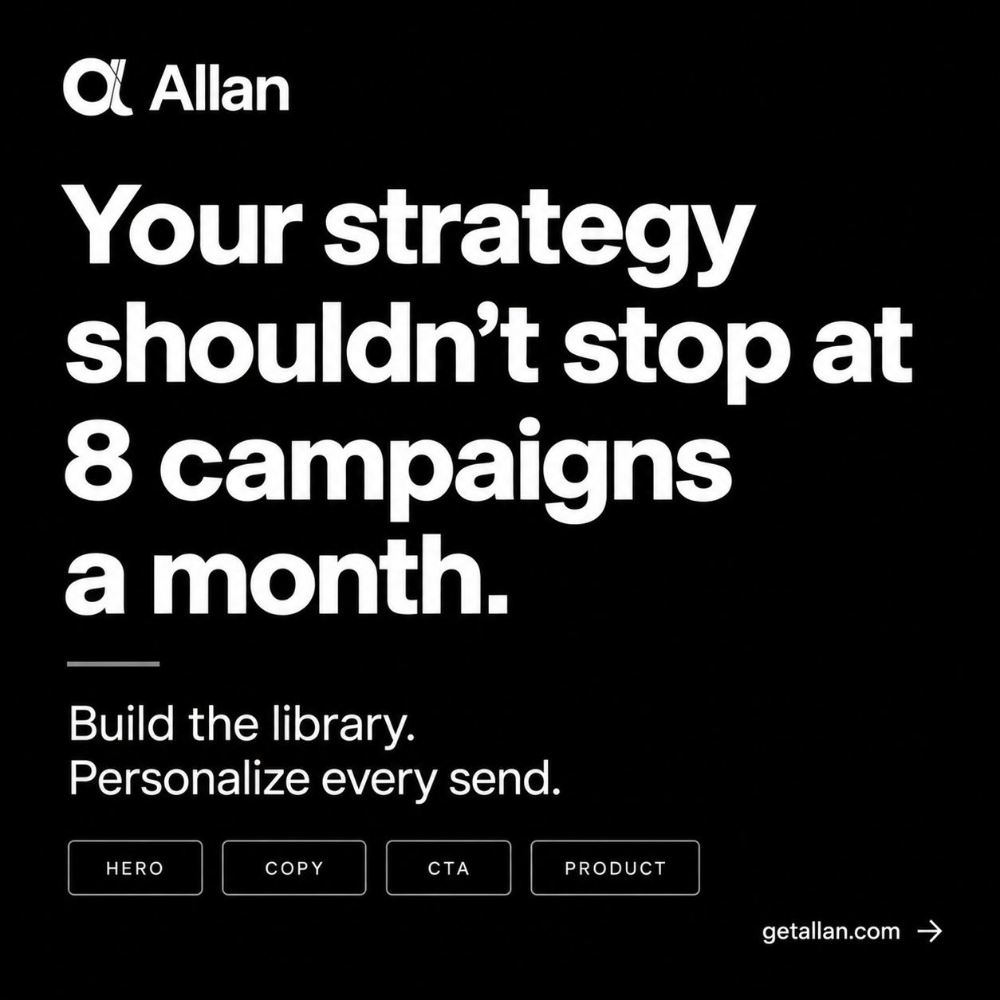
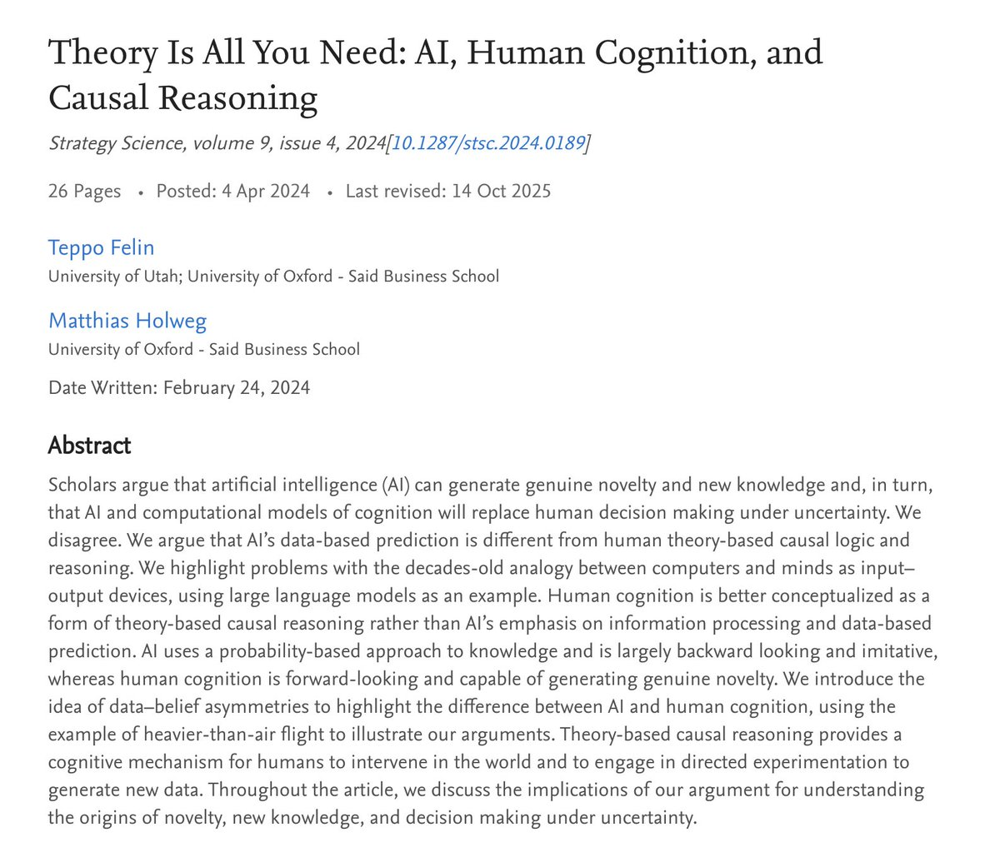

# 🐦 @AiEvolutio58513

## 📅 September 24, 2026

> 6 post(s) archived.

---

### 🕐 16:01 UTC · @AiEvolutio58513

> A retention lead told me last month that her team&apos;s ceiling was 8 campaigns a month. Mainly because, with everything on their plate, that was the most their 2 person team could realistically get out. So I asked what she&apos;d send if she didn’t have limits. She answered that she would create emails for: → Lapsed 60-day buyers → Highly engaged people who&apos;ve never once checked out. → Everyone who bought in May and hasn&apos;t been seen since. → A cross-sell aimed at second-order customers, which she&apos;d already mapped out in a doc nobody had opened since spring. And that conversation is why I keep pointing brands at @getallanai. It sits on top of Omnisend &amp; Klaviyo rather than replacing it. Your designer stops producing finished emails and starts producing blocks: heroes, body copy, CTAs, product modules. Allan assembles a different email per subscriber at send time and learns which combinations land with which people. The unit of work stops being the campaign and becomes the library. Her strategy was already written down. It had just never had anywhere to go. Try Allan free and see the impact it can make on your BFCM this year→ https://getallan.com/?utm_source=chase&amp;utm_medium=social

🔗 [View original post](https://x.com/ecomchasedimond/status/2103152767338787019)

---

### 🕐 14:03 UTC · @AiEvolutio58513

> Oxford researchers argue that LLMs can never invent anything. Not &quot;not yet&quot;. Mathematically impossible. Their paper, &quot;Theory Is All You Need&quot;, pushes back on the claim that computational models can produce genuine novelty or new knowledge. They mapped the limits of generative AI, and the result is a cold reality check for the idea that AI will take over human decision-making under uncertainty. Why AI stays stuck and human cognition wins: Backward-looking vs forward-looking. LLMs are probability machines that look back at existing data. Human cognition looks forward and can generate real novelty. It works &quot;top-down&quot; from theory rather than &quot;bottom-up&quot; from data. The data-belief asymmetry. The researchers use heavier-than-air flight to make the point. An AI relies on data-based prediction, which is mostly imitation. Humans use theory-based causal logic, which lets them hold beliefs that go beyond the data that exists. The intervention gap. Humans don&apos;t only process information. We use theory to intervene in the world, running directed experiments that create entirely new data. AI models are theory-free and built around existing data and prediction. TL;DR: AI takes a probability-based route to knowledge and is largely imitative. It can process data and predict. Human cognition runs on theory-based causal reasoning. The decades-old picture of minds and computers as plain &quot;input-output&quot; devices was flawed from the start. Interested in AI? Follow @AiEvolutio58513 and never fall behind. I track ChatGPT, Claude, and every tool quietly changing how we work and create, then hand you the tested signals.

🔗 [View original post](https://x.com/AiEvolutio58513/status/2103123041337434183)

---

### 🕐 13:05 UTC · @AiEvolutio58513

> Interested in AI? Follow @AiEvolutio58513 and never fall behind. I track ChatGPT, Claude, and every tool quietly changing how we work and create, then hand you the tested signals.

🔗 [View original post](https://x.com/AiEvolutio58513/status/2103108440084398423)

---

### 🕐 13:04 UTC · @AiEvolutio58513

> TL;DR 1. Wealthy people already have this problem solved 2. A second brain thinks, it does not just store 3. Asking questions is fun, gathering context is not 4. People use it for support calls, ads and spam 5. Generic software never fits one specific person 6. Overnight flight rebooking is a plan, not a feature 7. The goal is removing time you never enjoyed 8. Nothing orchestrates your life across applications

🔗 [View original post](https://x.com/AiEvolutio58513/status/2103108428365533320)

---

### 🕐 13:04 UTC · @AiEvolutio58513

> A man at a San Francisco barbershop told Aravind Srinivas he had just lost three hours shopping for a washing machine. On a recent podcast, the Perplexity CEO gave 8 reasons that is the problem he is solving: 1. Billionaires never lose those hours Media Aravind on why Perplexity went local: the frontier model stays in the cloud, and the moment a task touches your health records or tax returns it hands off to a smaller model on your own hardware. I have been saying for a year that every AI product ends up with a local half, and t…

🔗 [View original post](https://x.com/AiEvolutio58513/status/2103108215022240106)

---

### 🕐 11:02 UTC · @AiEvolutio58513

> Bill Gates wants an international body to regulate AI. “It&apos;s not the role of the industry to self-regulate or understand the whole-of-society impact that comes out of AI … The depth of understanding of AI … is too low in every entity, including the government.” In his view, no single entity understands it well enough yet. Interested in AI? Follow @AiEvolutio58513 and never fall behind. I track ChatGPT, Claude, and every tool quietly changing how we work and create, then hand you the tested signals. Media

🔗 [View original post](https://x.com/AiEvolutio58513/status/2103077574129947090)

---
