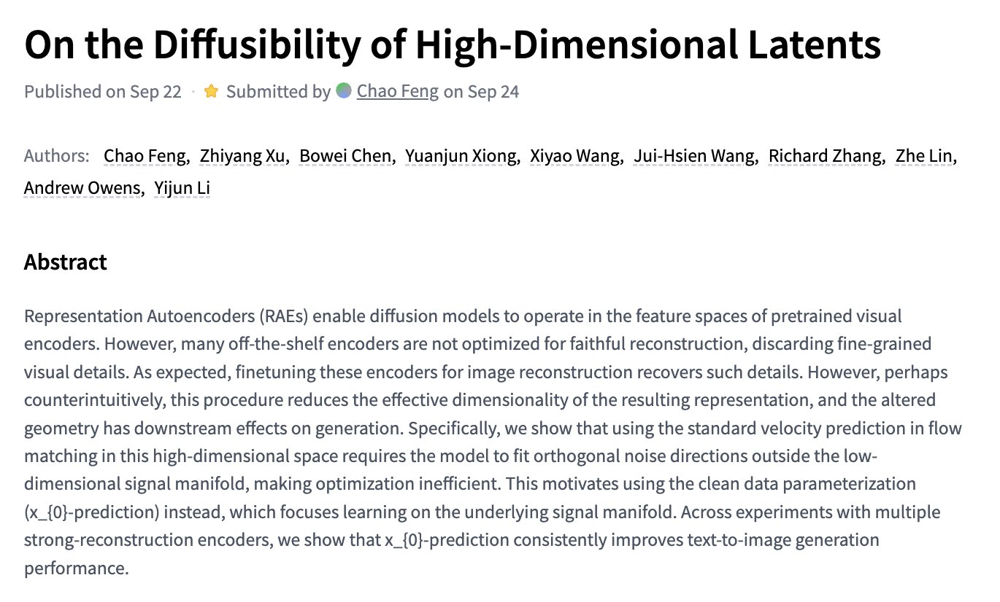

# 🐦 @_akhaliq

## 📅 September 24, 2026

> 3 post(s) archived.

---

### 🕐 19:15 UTC · @_akhaliq

> Pruna-Qwen-Image-2.1 a set of a few-step LoRA adapters that make Qwen-Image-2.1 up to 6.3× faster for image generation and editing Generate or edit images in just 5 or 8 steps instead of 40. Choose 5 steps for maximum speed or 8 steps for the best balance HF workflow: https://huggingface.co/spaces/akhaliq/Pruna-Qwen-Image-2.1 Media

🔗 [View original post](https://x.com/_akhaliq/status/2103201617004949888)

---

### 🕐 18:09 UTC · @_akhaliq

> On the Diffusibility of High-Dimensional Latents paper: https://huggingface.co/papers/2609.28473

🔗 [View original post](https://x.com/_akhaliq/status/2103184974107328677)

---

### 🕐 01:49 UTC · @_akhaliq

> Contrastive Language Models HF: https://huggingface.co/Contrastive-LM Media

🔗 [View original post](https://x.com/_akhaliq/status/2102938541471015137)

---
