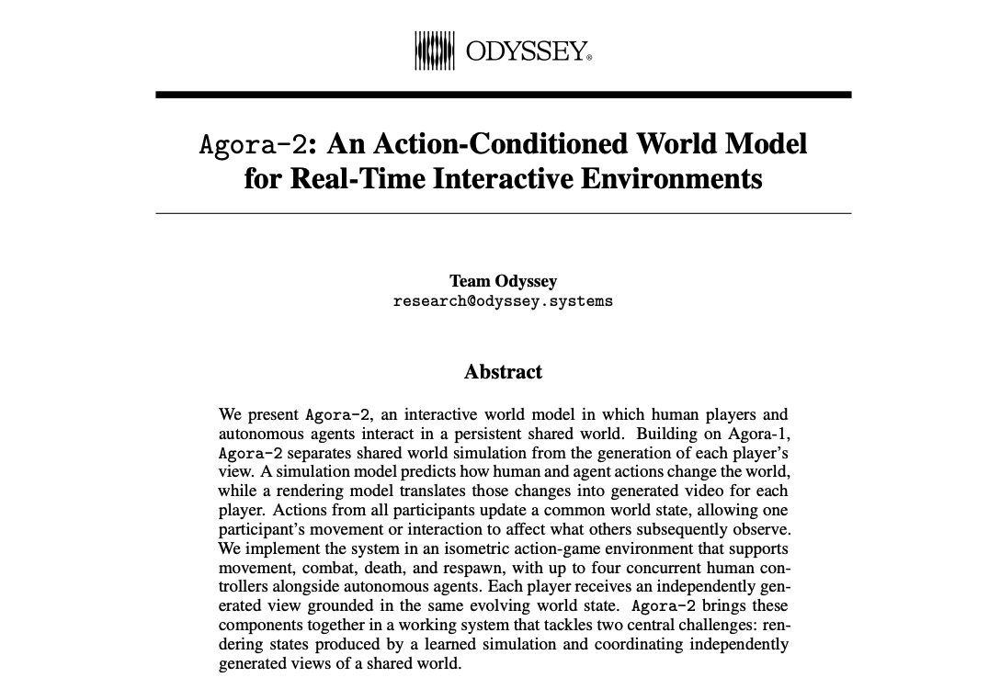
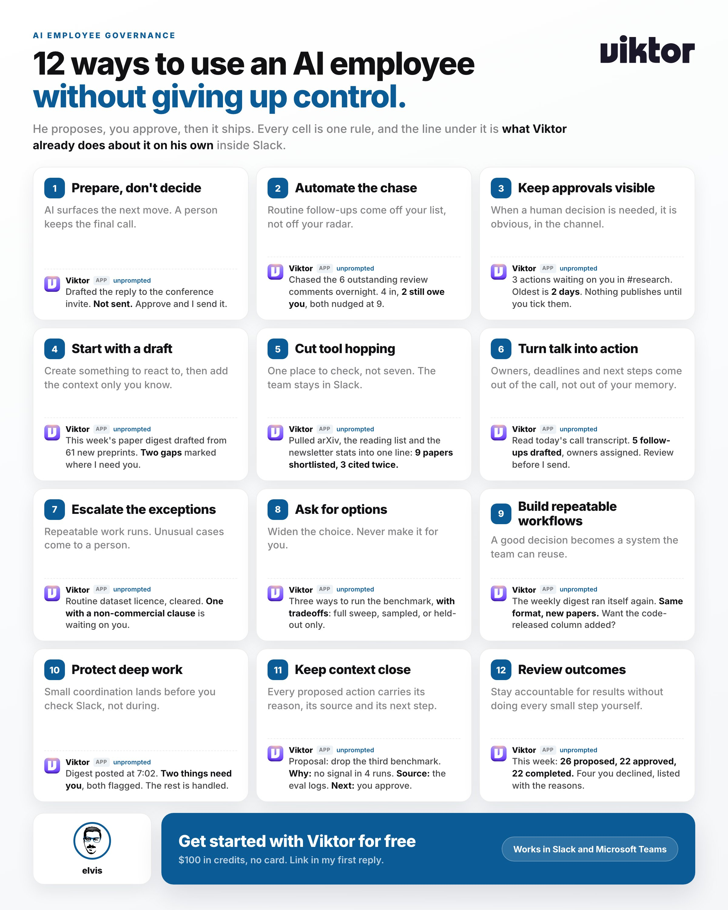
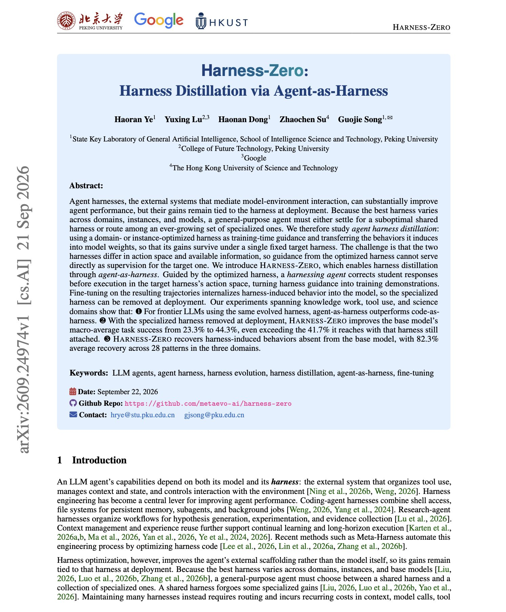

# 🐦 @dair_ai

## 📅 September 24, 2026

> 7 post(s) archived.

---

### 🕐 17:26 UTC · @dair_ai

> Not sure what model Space Bunny is, but I am impressed. I had a chance to test it this week. It&apos;s free in OpenCode for the next week, with a 1M token context window and image input. I focused my tests on visual work, mostly starting from a single image or sketch. Here are my results. Overall, its visual understanding is excellent, and its design taste is strong. One behavior that stood out is that it checks its own work. When it has a browser, it opens the page, looks at screenshots, and fixes what it sees before it says it&apos;s done. These verification capabilities matter in long-horizon agents. From a rough wireframe with seven handwritten notes, it built a full landing page and followed every note. From one photo of a moka pot, it built a 3D model that matches the original down to the eight-sided body, the brass valve, and the camping stove underneath. It built a 3D anatomy of a mirrorless camera with 67 labeled parts, an 11-element lens, a 9-blade iris, and an exploded view. Very excited about these results. I asked it for a 60-second animated proof of why a circle&apos;s area is πr². It built the whole thing, with slices that rearrange into a rectangle, a live slider, captions, and narration. Not perfect, but still impressive. I gave it a rough hand-drawn sketch of a game level. It built a playable 3D game in Three.js that follows the sketch and all ten rules I wrote on it. Then it playtested its own jumps in Chrome and tuned the physics until every lava stone was reachable. Based on this, I would reach for it for image-to-code work, interactive prototypes, and creative coding in 3D. It’s also quite fast, which makes it great for rapid prototyping. Space Bunny generated everything in the video in OpenCode. I wrote the prompts and supplied the images. Media

🔗 [View original post](https://x.com/omarsar0/status/2103174241654837649)

---

### 🕐 15:56 UTC · @dair_ai

> The applications of new world models like Agora-2 are mind-blowing. Agora-2 now lets up to 20 humans and agents share one simulated world in real time. That means you can train robots, self-driving cars, and cyber defense agents together, and each one improves as the others get better. It also gives you a safe place to study agent collusion before it reaches real systems. Watch this space closely! Introducing Agora-2, our next-generation multi-agent world model. Agora-2 supports up to 20 humans and agents interacting inside a shared environment, all simulated in real time. Our multiplayer research preview is available to try right now!

🔗 [View original post](https://x.com/omarsar0/status/2103151581810000240)

---

### 🕐 15:18 UTC · @dair_ai

> Every week I go through hundreds of new AI papers to pick the top ones for our Top AI Papers of the Week digest. Besides reading a lot of papers, I have started to use agent teams a lot. Here is what works for me. The most important thing is making sure I can make the final call on tasks agents are assigned. The volume is what makes the weekly triage difficult. Before Viktor, I tracked papers with saved searches and a spreadsheet. That stopped working once the weekly volume grew past what I could read myself. Now I use 12 triage rules, all in the image below. Each rule shows how Viktor, my favorite AI employee, handles it in Slack. First, I keep context close. Every proposal Viktor sends me comes with the reason, the source, and the next step. That way I can check where a recommendation came from before I act on it. One rule I use often is escalating exceptions. When a paper releases a dataset, Viktor checks the license before I feature it. He handles the routine ones and sends me any with a non-commercial clause. Nothing in the digest is published until I approve it. Viktor proposes, and I decide, so I can stand behind every issue that goes out. Twelve rules in the image. Which of them would you add? Try it free at @viktor_com. $100 in credits, no card. Full link in my first reply.

🔗 [View original post](https://x.com/omarsar0/status/2103142088502112750)

---

### 🕐 15:06 UTC · @dair_ai

> Pay attention to this new wave of System One models if you are building custom harnesses. First Jev. Now, Contrastive Language Model (CLM). CLM is 9x faster than Jev. CLM seems to be a better verifier than Jev, particularly at long-horizon tasks. How do Jev and CLM differ? CLM is contrastive, and Jev is trained with Reinforcement Learning for Calibrated Decisions (RLCD). Jev receives a situation plus predefined questions, and returns typed decisions with probabilities. CLM embeds the situation and candidate actions, compares their similarity, then ranks or selects the best match. The point is that there are several ways to attack this problem, which is exciting. You can see my recent guide on combining System One and System Two models for building custom harnesses. https://academy.dair.ai/resources/jev-decisions-in-a-pi-sdk-harness Introducing Contrastive Language Model (CLM): an ultra-fast System One Model trained with a contrastive learning objective that connects states and actions. CLM-8B is pre-trained on internet-scale data and delivers up to 9× faster inference than Jev ⚡ while achieving comparable p…

🔗 [View original post](https://x.com/omarsar0/status/2103139055013646646)

---

### 🕐 12:13 UTC · @dair_ai

> Super interesting paper from Google and colleagues. It studies where it&apos;s possible to distill an agent harness. With the specialized harness removed, macro task success goes from 23.3% to 44.3%. That is higher than the 41.7% the base model reaches with the harness attached. Harness-Zero uses the optimized harness only during training. The optimized harness and the deployment harness have different action spaces, so a harnessing agent guided by the optimized harness corrects the student&apos;s responses in the deployment action space before they run. Those corrected runs become the training demonstrations. Across 28 harness-induced behaviors in knowledge work, tool use and science, 82.3% are recovered on average. For frontier models using the same evolved harness, the agent-as-harness form also beats the code-as-harness form. It remains to be seen how robust the approach is, but it&apos;s very interesting to see potential in harness distillation. Paper: https://arxiv.org/abs/2609.24974 Chat with Paper: https://academy.dair.ai/papers/harness-zero-harness-distillation-via-agent-as-harness-2609.24974

🔗 [View original post](https://x.com/omarsar0/status/2103095360239636666)

---

### 🕐 01:33 UTC · @dair_ai

> Don&apos;t sleep on using Jev-as-a-Judge for agent evaluation. This is one of the most impressive Jev use cases I have found so far. Jev is a natural fit as a Judge, but it doesn&apos;t mean you use it everywhere. Similarly, you shouldn&apos;t use frontier models for evals everywhere. I&apos;m running lots of tests on this atm, but early results point to an optimized flow (balancing accuracy and cost) that combines Jev and frontier models. Concretely, use Jev in high-confidence situations, and escalate to a frontier model (GPT-6 or Opus 5.5) in low-confidence verdicts. Entire write-up coming soon. Let me know if you have questions as I build the full guide.

🔗 [View original post](https://x.com/omarsar0/status/2102934356108972278)

---

### 🕐 01:00 UTC · @dair_ai

> Impressive paper from Salesforce. It discusses the importance of good verifiers for RL environments. Only 35.8% of the environments in the cleanest public RL collection for terminal agents passed Salesforce AI Research&apos;s audit. More details below: With the budget held at 3.5K environments, River-8B averaged 19.4 across four terminal benchmarks, against 17.7 for RL on 3.5K environments sampled at random from the same collection. The audit found reward errors in both directions. Some environments give reward 1 for copying a leaked answer or passing a weak verifier without doing the task. Others give reward 0 to a correct solution because the reference answer or oracle is wrong. Two other public collections were only 10.1% and 3.3% clean. The authors argue that RL mainly shapes behaviors, such as inspecting before acting, verifying before finishing and dropping an approach that keeps failing. Those behaviors reuse skills the model already learned in pre-training and SFT. Their recipe, RIVER, filters defective environments and penalizes turns that repeat an earlier command with nearly the same output. River-8B is the best of the open RL-trained 8B models they evaluated on all four benchmarks. Across models from 2B to 27B, using fewer than 30% of TMax&apos;s environments, RIVER increases RL gains by 106% on Terminal-Bench-Lite and 30% on Terminal-Bench v2.1. Paper: https://academy.dair.ai/papers/learning-generalizable-behaviors-for-terminal-agents-2608.22631

🔗 [View original post](https://x.com/dair_ai/status/2102926030034059464)

---
