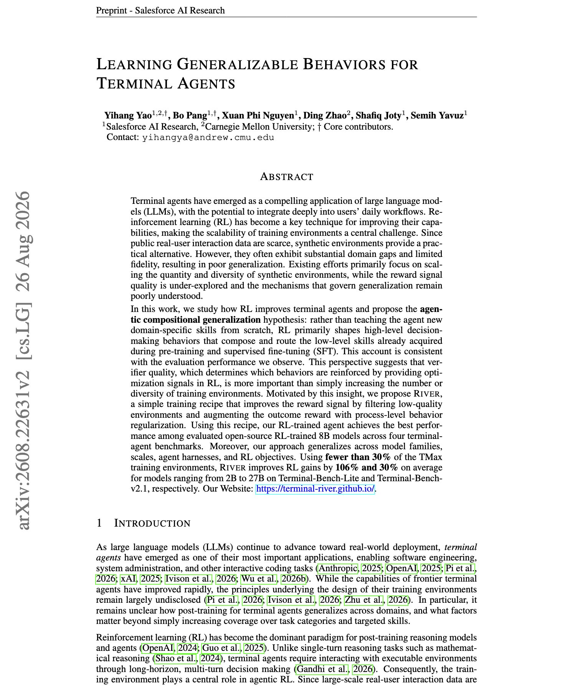

# 🐦 @dair_ai

## 📅 September 24, 2026

> 2 post(s) archived.

---

### 🕐 01:33 UTC · @dair_ai

> Don&apos;t sleep on using Jev-as-a-Judge for agent evaluation. This is one of the most impressive Jev use cases I have found so far. Jev is a natural fit as a Judge, but it doesn&apos;t mean you use it everywhere. Similarly, you shouldn&apos;t use frontier models for evals everywhere. I&apos;m running lots of tests on this atm, but early results point to an optimized flow (balancing accuracy and cost) that combines Jev and frontier models. Concretely, use Jev in high-confidence situations, and escalate to a frontier model (GPT-6 or Opus 5.5) in low-confidence verdicts. Entire write-up coming soon. Let me know if you have questions as I build the full guide.

🔗 [View original post](https://x.com/omarsar0/status/2102934356108972278)

---

### 🕐 01:00 UTC · @dair_ai

> Impressive paper from Salesforce. It discusses the importance of good verifiers for RL environments. Only 35.8% of the environments in the cleanest public RL collection for terminal agents passed Salesforce AI Research&apos;s audit. More details below: With the budget held at 3.5K environments, River-8B averaged 19.4 across four terminal benchmarks, against 17.7 for RL on 3.5K environments sampled at random from the same collection. The audit found reward errors in both directions. Some environments give reward 1 for copying a leaked answer or passing a weak verifier without doing the task. Others give reward 0 to a correct solution because the reference answer or oracle is wrong. Two other public collections were only 10.1% and 3.3% clean. The authors argue that RL mainly shapes behaviors, such as inspecting before acting, verifying before finishing and dropping an approach that keeps failing. Those behaviors reuse skills the model already learned in pre-training and SFT. Their recipe, RIVER, filters defective environments and penalizes turns that repeat an earlier command with nearly the same output. River-8B is the best of the open RL-trained 8B models they evaluated on all four benchmarks. Across models from 2B to 27B, using fewer than 30% of TMax&apos;s environments, RIVER increases RL gains by 106% on Terminal-Bench-Lite and 30% on Terminal-Bench v2.1. Paper: https://academy.dair.ai/papers/learning-generalizable-behaviors-for-terminal-agents-2608.22631

🔗 [View original post](https://x.com/dair_ai/status/2102926030034059464)

---
