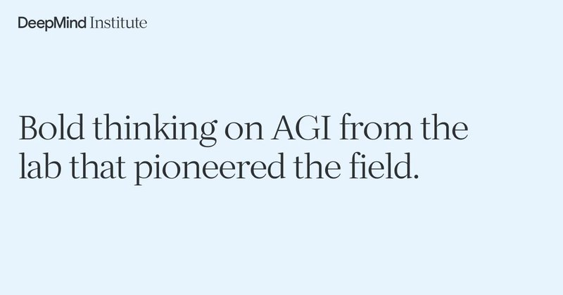

# 🐦 @demishassabis

## 📅 September 24, 2026

> 2 post(s) archived.

---

### 🕐 19:45 UTC · @demishassabis

> Can our TPUs survive and operate in space? Well, we&apos;re going to find out. Project Suncatcher is hitching a ride aboard @SpaceX&apos;s Transporter-18 mission, testing a prototype satellite built in partnership with @planet One small step for TPUs.... Media

🔗 [View original post](https://x.com/sundarpichai/status/2103209164072010051)

---

### 🕐 14:05 UTC · @demishassabis

> Today we have 3 new DeepMind Institute essays: How can we control misbehaviour in agent swarms? How should we orchestrate complex networks of AIs and people? The case for making AGI’s benefits equitably distributed. Get them here -&gt; https://bit.ly/deepmind-institute

🔗 [View original post](https://x.com/ShaneLegg/status/2103123676178866658)

---
