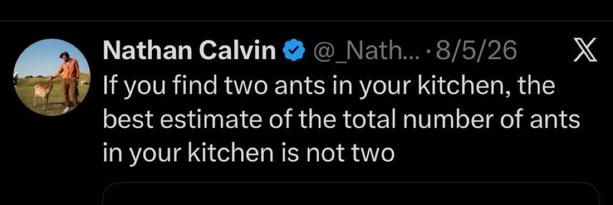

# 🐦 @elonmusk

## 📅 September 24, 2026

> 8 post(s) archived.

---

### 🕐 06:15 UTC · @elonmusk

> An Earth economy is less than a trillionth the size of a K2 economy Epic

🔗 [View original post](https://x.com/elonmusk/status/2103005475075670176)

---

### 🕐 06:14 UTC · @elonmusk

> Good idea to post an image of the front page Take an early look at the front page of The Wall Street Journal https://on.wsj.com/3VdLOsw

🔗 [View original post](https://x.com/elonmusk/status/2103005014277111831)

---

### 🕐 02:57 UTC · @elonmusk

> Grok 4.7 works really well with Blender. I’ve been using them to create these rough Raptor engine 3D models, and the improvement in quality is huge. They’re still early versions, but the details are already coming together beautifully. Media

🔗 [View original post](https://x.com/cb_doge/status/2102955587218886827)

---

### 🕐 02:50 UTC · @elonmusk

> True EXCLUSIVE: California has created a shadow welfare system for illegal aliens. Free housing, cash, healthcare, food, phones, college tuition, even car insurance—costing taxpayers more than $10 billion per year. We went inside the system and exposed it all.

🔗 [View original post](https://x.com/elonmusk/status/2102953907936993446)

---

### 🕐 02:47 UTC · @elonmusk

> True Not only should mandatory seat belt use on commercial flights end, but so should the use of IVA spacesuits. In their 60+ years of history in service, zero lives have been saved by these suits and in real contingencies they failed to save lives at all. Yet astronauts still spend h…

🔗 [View original post](https://x.com/elonmusk/status/2102952936771035459)

---

### 🕐 02:46 UTC · @elonmusk

> Preparing for launch on Monday Ship 41 moved to the launch pad at Starbase

🔗 [View original post](https://x.com/elonmusk/status/2102952674727784693)

---

### 🕐 01:00 UTC · @elonmusk

> Made with nickel cathode manufactured locally at Gigafactory Texas! First Cybercab made using our in-house cathode material – from the first cathode plant in the Americas

🔗 [View original post](https://x.com/elonmusk/status/2102926113173627069)

---

### 🕐 00:48 UTC · @elonmusk

> This turned out to be the most prophetic tweet of the year Breaking news: Australian Prime Minister Anthony Albanese has revealed that an OpenAI agent hacked an Australian government health service website in June, in the latest high-profile cyber incident involving AI https://ft.trib.al/gloVAyn

🔗 [View original post](https://x.com/AlecStapp/status/2102923162229084418)

---
