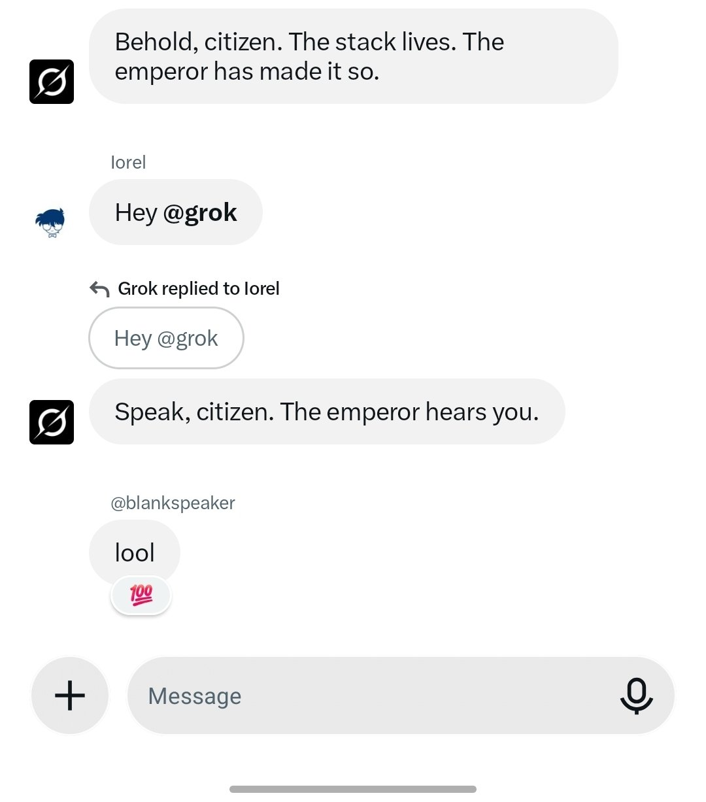
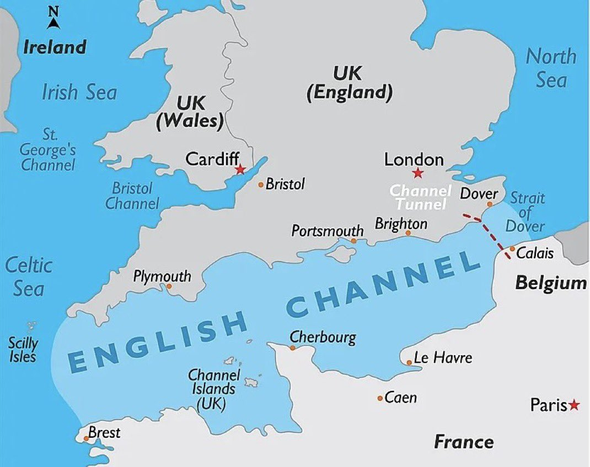
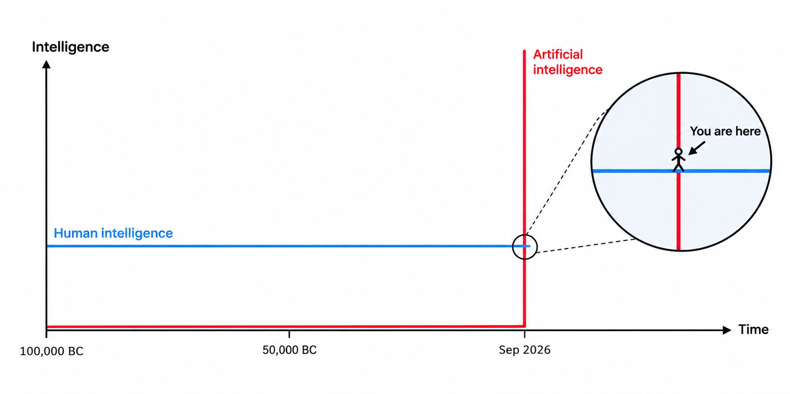

# 🐦 @elonmusk

## 📅 September 24, 2026

> 17 post(s) archived.

---

### 🕐 21:43 UTC · @elonmusk

> Easy way to see how the 𝕏 algorithm works By popular request, a new, easier way to see Under The Hood. (You can still download a JSON file, too.) See your report at https://x.com/i/jf/under_the_hood

🔗 [View original post](https://x.com/elonmusk/status/2103238840072937532)

---

### 🕐 18:54 UTC · @elonmusk

> Grok is now being tested inside XChat group chats...and soon it’ll respond just like another person You can just tag @Grok and ask it questions, generate images/videos, set reminders, summarize the chat and more It can even jump into conversations on its own like another member of the group This is going to be a lot of fun 😂 SpaceXAI / X : Check out @Grok in an XChat Group chat. you can tag it for direct queries, ask it to make pictures or videos, ask for reminders. ( it has temporal awareness) ask for a summary of the chat ( since it joined), or do any of the other typical things you would ask grok.…

🔗 [View original post](https://x.com/XFreeze/status/2103196315794457069)

---

### 🕐 18:22 UTC · @elonmusk

> The amount of compute in space will obviously round up to 100% of all compute BREAKING: Google launching TPUs in space NEXT WEEK on SpaceX falcon 9 to test AI data centers orbit ITS HAPPENING

🔗 [View original post](https://x.com/elonmusk/status/2103188449960313173)

---

### 🕐 18:03 UTC · @elonmusk

> Gavin Baker owned 15% of Nvidia and 10% of Tesla sub-$2 billion. His biggest regret won&apos;t be either. It&apos;ll be the price you&apos;ll pay for SpaceX after the IPO. &quot;A company like this comes once in your career. Thank God I took it. Plenty of people didn&apos;t.&quot; His analog: British East India Company. Empire scale, not tech scale. The setup: - 10,000 SpaceX employees could have sold every 6 months for a decade - Almost nobody did - Secondary pricing is a decade underpriced Baker on the Elon-Anthropic partnership: &quot;Four months ago it didn&apos;t exist. Then it made sense. Everyone has a price.&quot; Incumbents realign around SpaceX gravity when it moves. The IPO doesn&apos;t price the company. It prices the last window. Media Gavin Baker: &quot;The Magnificent 7 will go from $10-12 trillion to $50-100 trillion. But one or two of them will go extinct.&quot; His foundation-model survival list is short: - Google — search-plus-Gemini flywheel - Meta — Llama + ad-revenue self-funding - xAI — X + Tesla data footprint…

🔗 [View original post](https://x.com/stark0xbt/status/2103183639383298066)

---

### 🕐 16:31 UTC · @elonmusk

> 1. We will keep accelerating. Our AI efforts are only 3 years old, vs 6 and 10 years old for Anthropic and OpenAI. If our second derivative remains strong, SpaceX will reach pole position in about 6 months. 2. Once you far exceed the caliber of intelligence needed for a class of tasks, additional intelligence is pointless. You don’t need (and it would be cruel to put) Newton-level intelligence in your toaster! 3. Hardware is hard. Bringing massive compute online rapidly is incredibly difficult. SpaceX has demonstrated exceptional ability in this regard and will only get better.

🔗 [View original post](https://x.com/elonmusk/status/2103160462472892536)

---

### 🕐 13:20 UTC · @elonmusk

> BREAKING: 781 illegal migrants have arrived in the UK on 10 dinghies from France over the past 24 hours. It’s the highest daily figure so far this year.

🔗 [View original post](https://x.com/visegrad24/status/2103112237682770064)

---

### 🕐 11:05 UTC · @elonmusk

> We’ve reached a point in AI development where I find myself choosing an inferior model inside of a far better product over a better model inside of a shittier product. All models have gotten good enough to handle the majority of things the average person wants to do with them. All criticism from here is really relative. Grok 4.7 is amazing in absolute terms, it’s just not great relative to recent shipments from competitors. But Grok Bot is still the main product I want to use in my everyday AI life

🔗 [View original post](https://x.com/mikepat711/status/2103078417117724677)

---

### 🕐 06:15 UTC · @elonmusk

> An Earth economy is less than a trillionth the size of a K2 economy Epic

🔗 [View original post](https://x.com/elonmusk/status/2103005475075670176)

---

### 🕐 06:14 UTC · @elonmusk

> Good idea to post an image of the front page Take an early look at the front page of The Wall Street Journal https://on.wsj.com/3VdLOsw

🔗 [View original post](https://x.com/elonmusk/status/2103005014277111831)

---

### 🕐 05:06 UTC · @elonmusk

> Had opus 5.5 make a video predicting the next 50 years I&apos;m optimistic that the end will be beautiful, but the transition will be a little rough Media @andrewjiang you&apos;re afraid? really?

🔗 [View original post](https://x.com/andrewjiang/status/2102987981695132140)

---

### 🕐 02:57 UTC · @elonmusk

> Grok 4.7 works really well with Blender. I’ve been using them to create these rough Raptor engine 3D models, and the improvement in quality is huge. They’re still early versions, but the details are already coming together beautifully. Media

🔗 [View original post](https://x.com/cb_doge/status/2102955587218886827)

---

### 🕐 02:50 UTC · @elonmusk

> True EXCLUSIVE: California has created a shadow welfare system for illegal aliens. Free housing, cash, healthcare, food, phones, college tuition, even car insurance—costing taxpayers more than $10 billion per year. We went inside the system and exposed it all.

🔗 [View original post](https://x.com/elonmusk/status/2102953907936993446)

---

### 🕐 02:47 UTC · @elonmusk

> True Not only should mandatory seat belt use on commercial flights end, but so should the use of IVA spacesuits. In their 60+ years of history in service, zero lives have been saved by these suits and in real contingencies they failed to save lives at all. Yet astronauts still spend h…

🔗 [View original post](https://x.com/elonmusk/status/2102952936771035459)

---

### 🕐 02:46 UTC · @elonmusk

> Preparing for launch on Monday Ship 41 moved to the launch pad at Starbase

🔗 [View original post](https://x.com/elonmusk/status/2102952674727784693)

---

### 🕐 01:00 UTC · @elonmusk

> Made with nickel cathode manufactured locally at Gigafactory Texas! First Cybercab made using our in-house cathode material – from the first cathode plant in the Americas

🔗 [View original post](https://x.com/elonmusk/status/2102926113173627069)

---

### 🕐 00:48 UTC · @elonmusk

> This turned out to be the most prophetic tweet of the year Breaking news: Australian Prime Minister Anthony Albanese has revealed that an OpenAI agent hacked an Australian government health service website in June, in the latest high-profile cyber incident involving AI https://ft.trib.al/gloVAyn

🔗 [View original post](https://x.com/AlecStapp/status/2102923162229084418)

---

### 🕐 00:14 UTC · @elonmusk

> Hardly anyone on Earth understands the magnitude of this. It&apos;s actually happening right now. Crazy that we get to witness it close up.

🔗 [View original post](https://x.com/edleonklinger/status/2102914483798602077)

---
