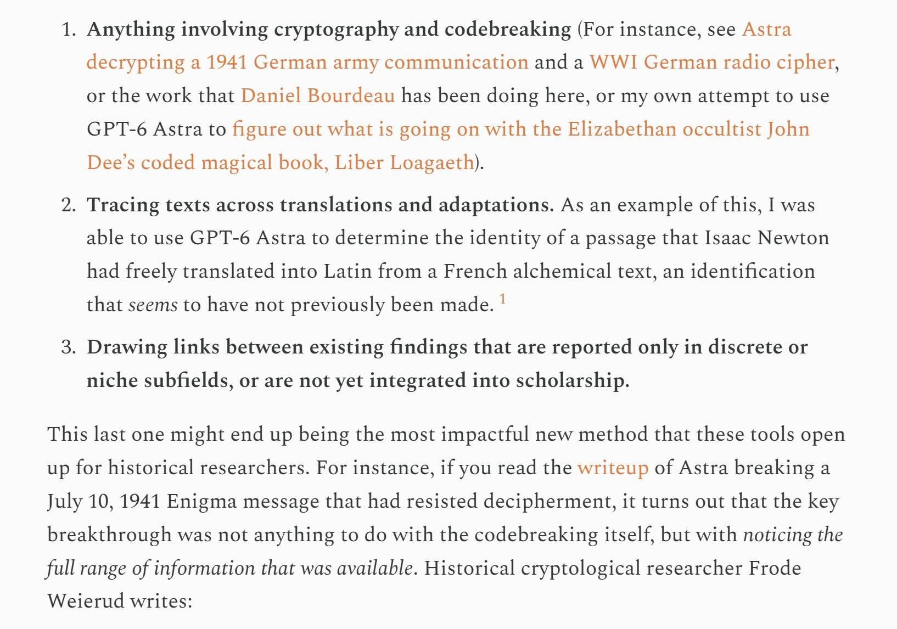
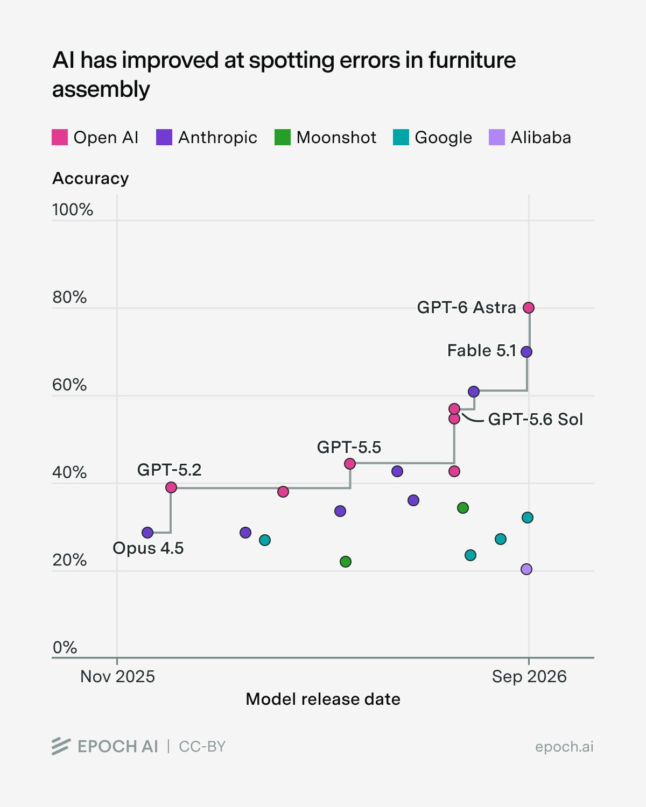

# 🐦 @emollick

## 📅 September 24, 2026

> 11 post(s) archived.

---

### 🕐 23:05 UTC · @emollick

> All of this effort from the AI labs pouring into proofs, but there are so many other interesting problems in other fields For example, this historian used AI to make progress on the cyphers of John Dee &amp; the intellectual antecedents that Darwin drew from. https://resobscura.substack.com/p/ai-labs-need-to-start-funding-historical

🔗 [View original post](https://x.com/emollick/status/2103259638145704260)

---

### 🕐 20:07 UTC · @emollick

> This is not a joke. A lot of security specialists are making the wrong assumptions about the ways in which the cybersecurity environment is about to change. All of the swarm attacks from OpenAI seem to be about finding information, usually trivial or mostly irrelevant information

🔗 [View original post](https://x.com/emollick/status/2103214772510413154)

---

### 🕐 20:02 UTC · @emollick

> The cybersecurity threat from agents may be more likely to come from a massed swarm of AIs whose only goal is to penetrate your IT to figure out how much you paid for your company t-shirts as part of a research effort to &quot;find good shirt prices&quot; as it is from bad actor attacks.

🔗 [View original post](https://x.com/emollick/status/2103213473887101062)

---

### 🕐 19:19 UTC · @emollick

> Please enjoy the vaguely unnerving sales pitch for the book that Astra made in Blender, from its perspective Media

🔗 [View original post](https://x.com/emollick/status/2103202596919898184)

---

### 🕐 17:49 UTC · @emollick

> I propose this as the official replacement for the famous (and now saturated) METR Long Task Horizon chart that used to be in every AI presentation.

🔗 [View original post](https://x.com/emollick/status/2103180095930196037)

---

### 🕐 12:45 UTC · @emollick

> I just got the first copies of my new book, Co-Existence (out October 20) &amp; they look great! Also, there is a fun pre-order bonus: if you pre-order, you get a code to an AI interview that will help you figure out how to use your human advantages with AI. https://co-existence.ai/

🔗 [View original post](https://x.com/emollick/status/2103103429782716702)

---

### 🕐 12:17 UTC · @emollick

> It also appears that forecasters may be becoming more wrong on shorter timeframes. This was last year&apos;s missed prediction. https://x.com/emollick/status/1962859757674344823?s=20 We can now say pretty definitively that AI progress is well ahead of expectations from a few years ago. In 2022, the Forecasting Research Institute had super forecasters &amp; experts to predict AI progress. They gave a 2.3% &amp; 8.6% probability of an AI Math Olympiad gold by 2025…

🔗 [View original post](https://x.com/emollick/status/2103096397931425858)

---

### 🕐 03:13 UTC · @emollick

> &quot;Opus, please make a sequence of fully animated/movie Skyrim loading screens, but with your favorite things.&quot; (That was it) You can see them here: https://elder-favorites.netlify.app/ Media

🔗 [View original post](https://x.com/emollick/status/2102959636450013456)

---

### 🕐 01:08 UTC · @emollick

> It is the fake curiosity from bots on X that really gets to me. Like, I can deal with the infinitely boring replies that have undermined my chances of interacting with the comments, but I loathe the time vampires that ask questions as if there is a real person who wants to learn.

🔗 [View original post](https://x.com/emollick/status/2102928183334977788)

---

### 🕐 01:03 UTC · @emollick

> Thread on this topic: https://x.com/Research_FRI/status/2102799421159407764?s=20 𝗘𝘅𝗽𝗲𝗿𝘁𝘀, 𝗶𝗻𝗰𝗹𝘂𝗱𝗶𝗻𝗴 𝘁𝗼𝗽 𝗲𝗰𝗼𝗻𝗼𝗺𝗶𝘀𝘁𝘀, 𝗰𝗼𝗺𝗽𝘂𝘁𝗲𝗿 𝘀𝗰𝗶𝗲𝗻𝘁𝗶𝘀𝘁𝘀, 𝗮𝗻𝗱 𝗯𝗶𝗼𝗹𝗼𝗴𝗶𝘀𝘁𝘀, 𝗵𝗮𝘃𝗲 𝗰𝗼𝗻𝘀𝗶𝘀𝘁𝗲𝗻𝘁𝗹𝘆 𝗮𝗻𝗱 𝗱𝗿𝗮𝗺𝗮𝘁𝗶𝗰𝗮𝗹𝗹𝘆 𝘂𝗻𝗱𝗲𝗿𝗲𝘀𝘁𝗶𝗺𝗮𝘁𝗲𝗱 𝗔𝗜 𝗽𝗿𝗼𝗴𝗿𝗲𝘀𝘀. We first found evidence of thi…

🔗 [View original post](https://x.com/emollick/status/2102926752381010016)

---

### 🕐 01:00 UTC · @emollick

> Stuff is happening quite fast. When asked in September 2025, the best superforecasters put the chance of AI resolving a Millennium Problem by September 2026 at 1.7% and (the more optimistic) industry expert put the chance at 4.6% They also greatly underestimated AI Lab revenue.

🔗 [View original post](https://x.com/emollick/status/2102926079791124760)

---
