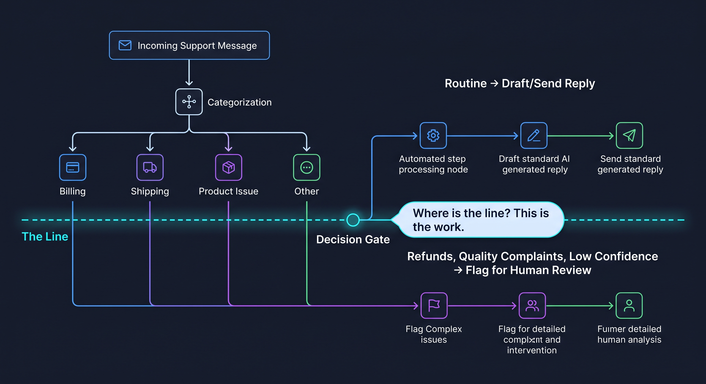

# 🐦 @joaomdmoura

## 📅 September 24, 2026

> 1 post(s) archived.

---

### 🕐 16:00 UTC · @joaomdmoura

> Before an agent answers a single support ticket, someone has to sit down and write. That writing is the real project. The model can already read a message, tag it, draft a reply and flag the messy ones. What it cannot guess is where your team draws the lines. Which messages count as routine. When a complaint is about quality. How unsure is too unsure. Someone has to write out what done looks like for that one job, clearly enough to run unsupervised. Then it knows that job. Ask it to also flag who is about to churn and it cannot. One job, one written definition of done. Then the next.

🔗 [View original post](https://x.com/joaomdmoura/status/2103152526547902566)

---
