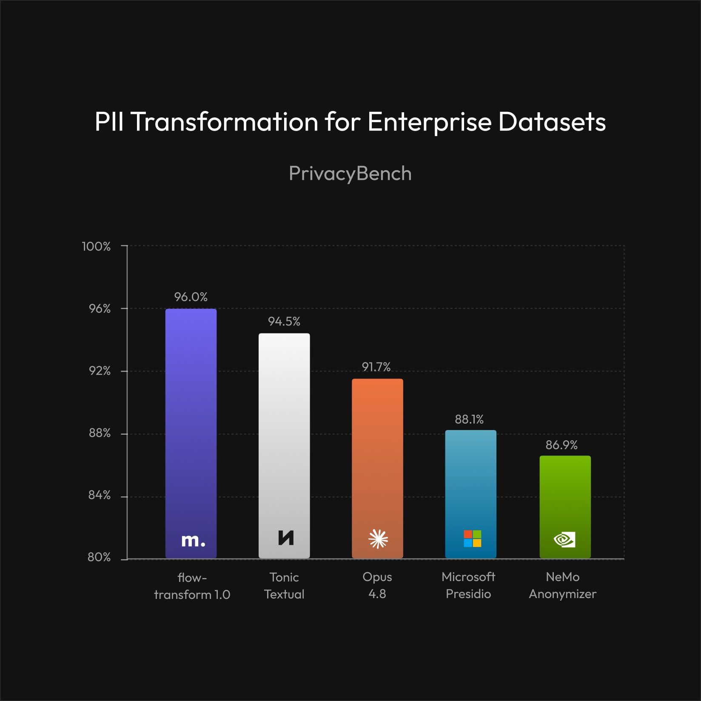
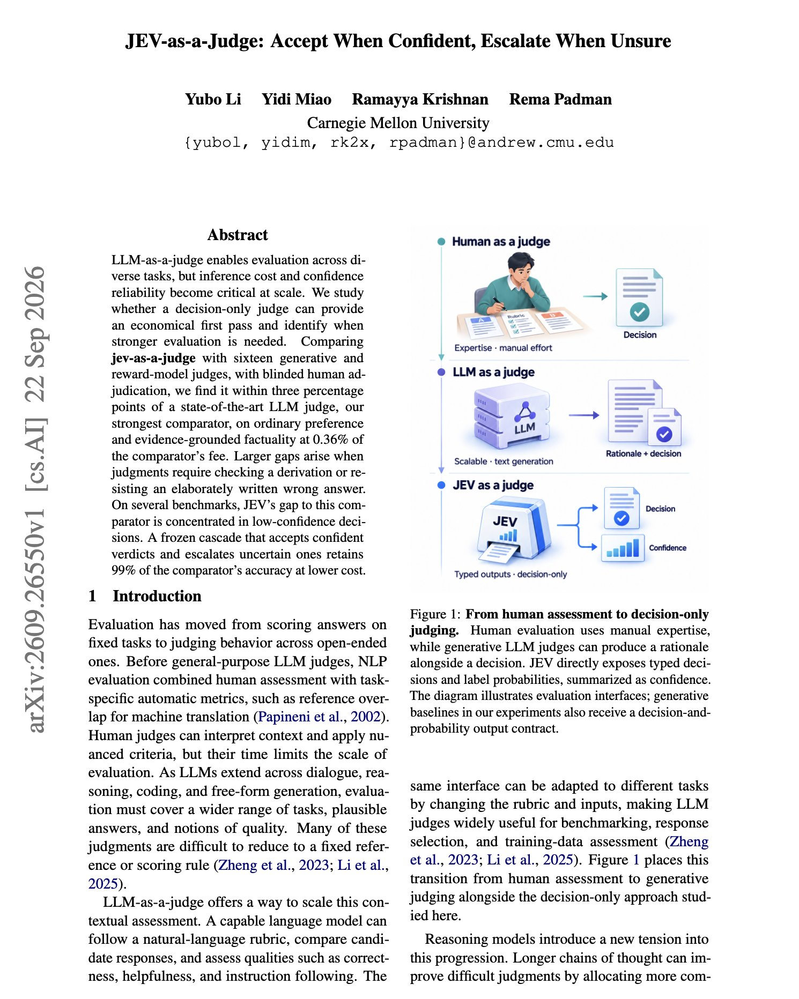

# 🐦 @omarsar0

## 📅 September 24, 2026

> 5 post(s) archived.

---

### 🕐 19:05 UTC · @omarsar0

> Interesting results here. This is why I expect more agent workloads to run on blended models. Pareto 26.9 from @TheUnbiasedCo sends requests to several frontier and open models and keeps the best answer. In the new eval of 30 agent tasks, Pareto tied GPT-6 Astra for first place at about 1/3 the cost per successful task. It also finished tasks faster than DeepSeek V4 Pro and GLM 5.3 Flash. We tested 6 AI models on 30 challenging agent tasks: GPT-6 Astra, Opus 5.5, GPT-6 Sol, Pareto 26.9, DeepSeek V4 Pro, and GLM 5.3 Flash. Sol matched Opus’s score, finished faster, and cost about a quarter as much per successful task. Here’s how all 6 models compared 🧵🧵🧵

🔗 [View original post](https://x.com/omarsar0/status/2103199158207484164)

---

### 🕐 16:02 UTC · @omarsar0

> Today we’re launching micro1’s PII transformation model, flow-transform 1.0, delivering frontier-level performance across detection, identity synthesis, and transformation of personally identifiable information. On PrivacyBench, our model reaches 96.0% F1, outperforming every detection baseline we tested, including Tonic Textual, Claude Opus 4.8, Sonnet 4.6, Microsoft Presidio, Haiku 4.5 and GLiNER2. Some of the most valuable training data for frontier AI models lives inside fully functioning companies. It captures years of real work across decisions, communications, tools, handoffs, exceptions and the relationships connecting them. The problem is that this data is also full of PII. Traditional redaction makes the data safe, but it also destroys the very workflows and relationships frontier models need to learn from. flow-transform 1.0 solves this by turning enterprise operational data into high-fidelity training data for frontier models by replacing real-world identities without flattening the reality the data captures.

🔗 [View original post](https://x.com/aliansarinik/status/2103152994951025124)

---

### 🕐 15:40 UTC · @omarsar0

> Banger paper introducing Jev-as-a-Judge. The overall finding is that you want to use a cheap judge for most of your evals and send only the uncertain calls to a frontier model. This paper measures how well that works with JEV, TypeSafe AI&apos;s decision-only judge. On 510 held-out preference pairs, a cascade that accepted JEV&apos;s confident verdicts and escalated the rest to GPT-6 Astra kept 99% of GPT-6&apos;s accuracy at about 57% of its fee. JEV returns a verdict and label probabilities with no reasoning text. It costs $0.044 per 1,000 judgments at a median latency of 0.152 seconds, against $12.182 and 1.885 seconds for GPT-6, about 277 times cheaper. On ordinary preference and evidence-grounded factuality it stays within 3 points of GPT-6 (92.2% against 93.5% on RewardBench, 87.5% against 86.7% on HaluEval). The gap grows to 9 to 20 points on tasks that require checking a derivation or rejecting an elaborately written wrong answer, such as JudgeBench (78.6% against 93.1%). On several benchmarks, JEV&apos;s gap to GPT-6 is concentrated in its low-confidence decisions, which is why the cascade works. The escalation threshold did not transfer for every fallback model, so the authors recommend setting it on your own data. Paper: https://academy.dair.ai/papers/jev-as-a-judge-accept-when-confident-escalate-when-unsure-2609.26550

🔗 [View original post](https://x.com/dair_ai/status/2103147453717545278)

---

### 🕐 15:18 UTC · @omarsar0

> Get started with Viktor here https://ref.viktor.com/elvis-x-5

🔗 [View original post](https://x.com/omarsar0/status/2103142091358339290)

---

### 🕐 05:00 UTC · @omarsar0

> Nice paper showing how to re-evaluate a production agent at a fraction of the cost. 200 questions, 38.5% of the full benchmark, reproduce the full score to within 1.03 points. The authors studied an analytics agent that serves tens of thousands of monthly users, using 574 historical benchmark runs split by date into calibration and held-out periods. They compared random sampling, cached results, fixed representative subsets and adaptive testing based on item response theory. Multidimensional 2PL adaptive testing gave the best fidelity. The team deployed difficulty-stratified fixed subsets instead because they are simpler to run. Those subsets transferred to five other agent families without recalibration and stayed stable with calibration windows as short as one day. Paper: https://arxiv.org/abs/2609.21267 Chat with Paper: https://academy.dair.ai/papers/efficient-benchmarking-in-production-a-study-of-an-evolving-llm-agent-2609.21267

🔗 [View original post](https://x.com/omarsar0/status/2102986414724096037)

---
