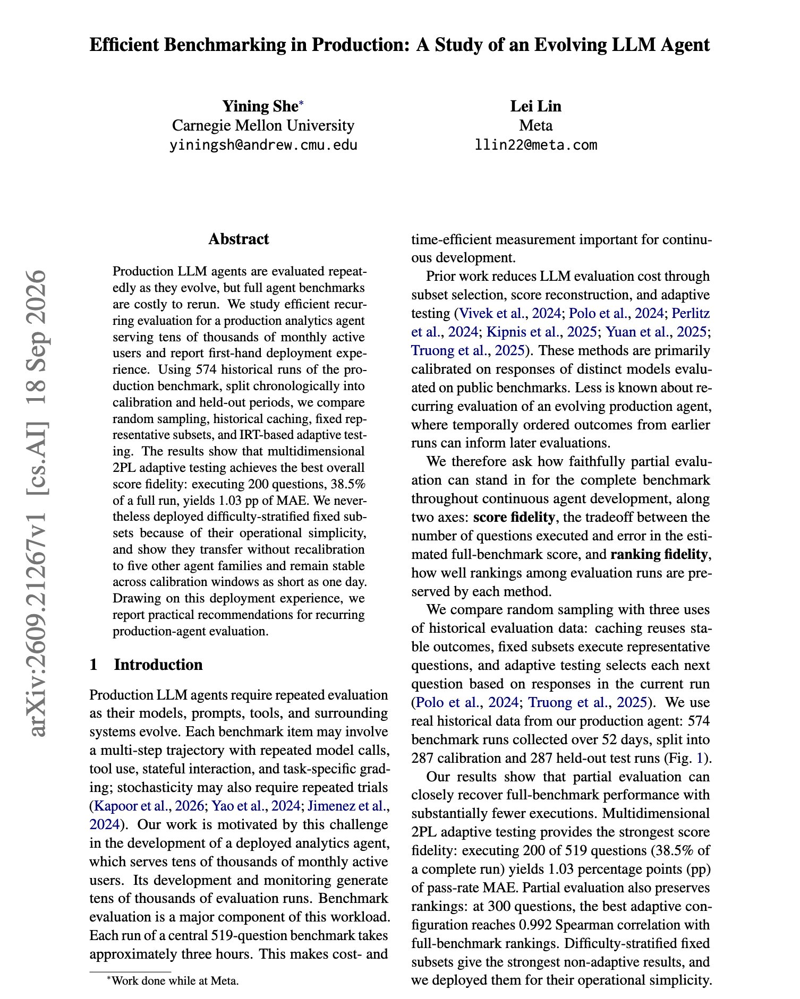

# 🐦 @omarsar0

## 📅 September 24, 2026

> 1 post(s) archived.

---

### 🕐 05:00 UTC · @omarsar0

> Nice paper showing how to re-evaluate a production agent at a fraction of the cost. 200 questions, 38.5% of the full benchmark, reproduce the full score to within 1.03 points. The authors studied an analytics agent that serves tens of thousands of monthly users, using 574 historical benchmark runs split by date into calibration and held-out periods. They compared random sampling, cached results, fixed representative subsets and adaptive testing based on item response theory. Multidimensional 2PL adaptive testing gave the best fidelity. The team deployed difficulty-stratified fixed subsets instead because they are simpler to run. Those subsets transferred to five other agent families without recalibration and stayed stable with calibration windows as short as one day. Paper: https://arxiv.org/abs/2609.21267 Chat with Paper: https://academy.dair.ai/papers/efficient-benchmarking-in-production-a-study-of-an-evolving-llm-agent-2609.21267

🔗 [View original post](https://x.com/omarsar0/status/2102986414724096037)

---
