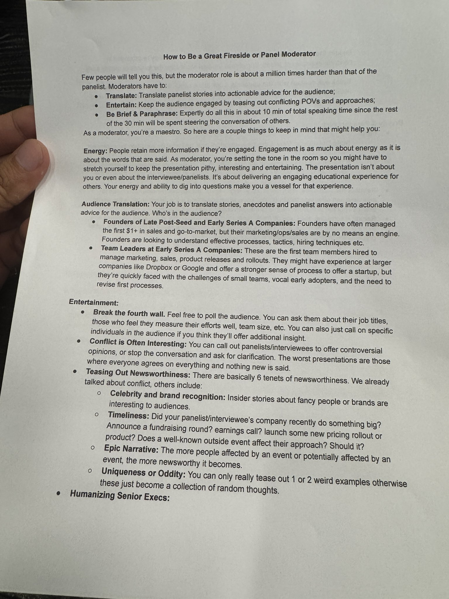

# 🐦 @swyx

## 📅 September 24, 2026

> 3 post(s) archived.

---

### 🕐 20:42 UTC · @swyx

> more conferences could implement this. so much high value time wasted without thought

🔗 [View original post](https://x.com/swyx/status/2103223477130129726)

---

### 🕐 06:32 UTC · @swyx

> AI Engineer Shanghai | Nov 5-6, 2026 Join @amrcn_werewolf (@Microsoft), @ryolu_ (ex-@cursor_ai), @chlassner (@theworldlabs), @NancyZWang (@1Password) &amp; @liu8in (@HeyGen). Open models, AI infra, Physical AI. Technical talks + demos. Tickets: https://www.ai.engineer/shanghai/2026

🔗 [View original post](https://x.com/aiDotEngineer/status/2103009576379367735)

---

### 🕐 01:49 UTC · @swyx

> benched 5.5 is IN-SANE. It almost broke our benchmark. I thought it was a bug. Claude Opus 5.5 is the new #1 on our writing benchmark, and it is not close at all. 2631 Elo. Second one, Fable, is at 2324. That is a 307 point gap, the largest single jump we have recorded since we started r…

🔗 [View original post](https://x.com/swyx/status/2102938490518609983)

---
