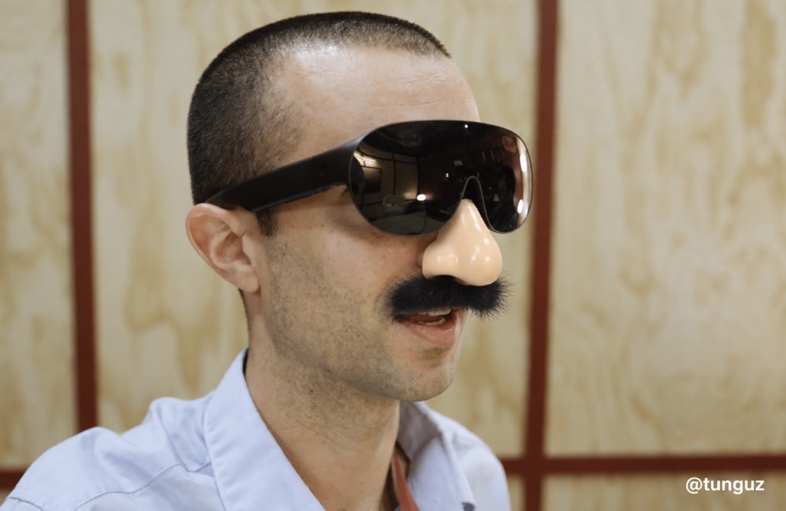

# 🐦 @tunguz

## 📅 September 24, 2026

> 6 post(s) archived.

---

### 🕐 22:22 UTC · @tunguz

> They are actually all the same electron. Still wrapping my mind around the fact that in quantum mechanics, all electrons are identical and no one knows which is which

🔗 [View original post](https://x.com/tunguz/status/2103248669508251846)

---

### 🕐 18:01 UTC · @tunguz

> Wow, numbers for Seattle are crazy! Apparently everyone is fleeing Seattle now. Welcome to Miami!

🔗 [View original post](https://x.com/tunguz/status/2103183039354540341)

---

### 🕐 14:34 UTC · @tunguz

> Nothing turns my magnanimity to hostility like being purposefully deceived.

🔗 [View original post](https://x.com/tunguz/status/2103130923411923270)

---

### 🕐 14:30 UTC · @tunguz

> A very useful context. As someone who did this kind of genome mining work during my PhD, some thoughts on this Anthropic announcement: First, the very simplified version of what they did is that they noticed two genes (one known, one new) sitting next to a weird repeating piece of DNA. More specificall…

🔗 [View original post](https://x.com/tunguz/status/2103129846901825771)

---

### 🕐 02:11 UTC · @tunguz

> BREAKING : @Meta unveils VR Glasses. They will be priced at $1299 and ship in Spring of 2027.

🔗 [View original post](https://x.com/tunguz/status/2102944070679281765)

---

### 🕐 01:16 UTC · @tunguz

> World&apos;s most liveable cities, 2026. 1. 🇺🇸 Gary 2. 🇦🇹 Vienna 3. 🇩🇰 Copenhagen 4. 🇨🇭 Zurich 5. 🇦🇺 Melbourne 6. 🇨🇦 Calgary (tied) 6. 🇨🇭 Geneva (tied) 8. 🇦🇺 Sydney (tied) 8. 🇨🇦 Vancouver (tied) 10. 🇯🇵 Osaka (tied) 10. 🇳🇿 Auckland (tied)

🔗 [View original post](https://x.com/tunguz/status/2102930069752774744)

---
