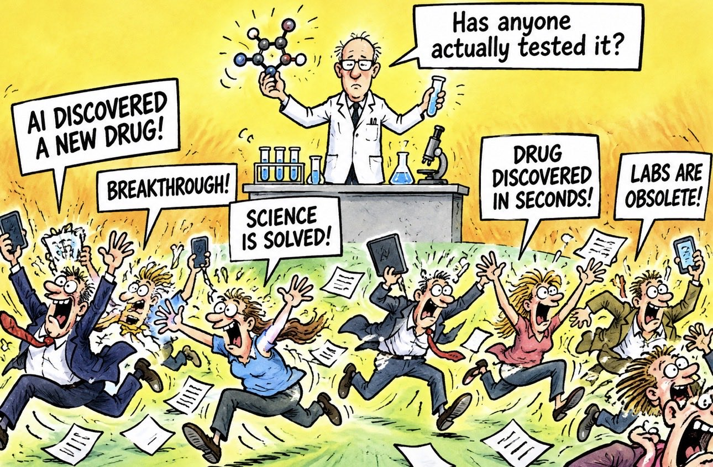

# 🐦 @ylecun

## 📅 September 24, 2026

> 2 post(s) archived.

---

### 🕐 15:18 UTC · @ylecun

> I am looking to hire PhD students, post-docs, and ML researchers in our Paris office interested in collaborating on fundamental research in AI model safety, not safety rules, not AI policy, not post hoc guardrails, not RLHF. We also have offices in Singapore, NYC, and Montreal. @amilabs #aisafety

🔗 [View original post](https://x.com/pascalefung/status/2103141972936454489)

---

### 🕐 09:11 UTC · @ylecun

> I’m a scientist. I need to say this because the AI hype is getting ridiculous. AI can design a molecule in seconds. That doesn’t mean it discovered a drug. It discovered something we scientists have never been short of: Something to test. Someone still has to make it. Run the experiment. Measure whether it works. Check whether it’s toxic. And ultimately prove it works in the real world. AI hype tells us: “Prediction is discovery.” “Simulation is experimentation.” “Generating a molecule is developing a drug.” It isn’t. AI is making ideas incredibly cheap. But every new idea creates something AI cannot generate: Evidence. And the more hypotheses AI produces, the more experiments we’re going to need. That’s the irony nobody seems to be talking about. AI may not make laboratories obsolete. It may make them more valuable than ever. You can speedrun the thinking. You can’t speedrun reality.

🔗 [View original post](https://x.com/simonmaechling/status/2103049751302148544)

---
