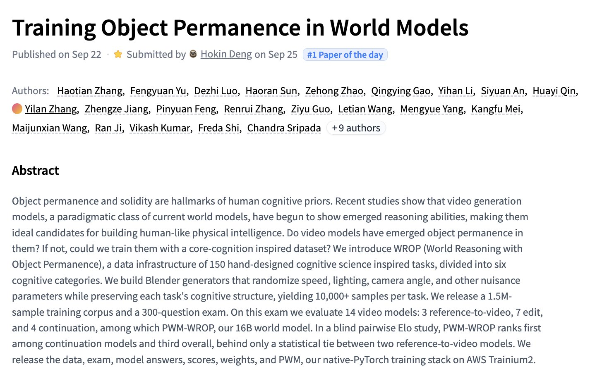

# 🐦 @_akhaliq

## 📅 September 25, 2026

> 3 post(s) archived.

---

### 🕐 20:13 UTC · @_akhaliq

> Qwen-Image-2.1-viggle-turbo v0.2 is out on Hugging Face Text-to-image and image editing in 6 steps about 5× faster than the 40-step Qwen-Image-2.1 model: https://huggingface.co/Viggle/Qwen-Image-2.1-viggle-turbo Media

🔗 [View original post](https://x.com/_akhaliq/status/2103578627359268987)

---

### 🕐 17:42 UTC · @_akhaliq

> Training Object Permanence in World Models paper: https://huggingface.co/papers/2609.28654

🔗 [View original post](https://x.com/_akhaliq/status/2103540737656918351)

---

### 🕐 14:00 UTC · @_akhaliq

> The Pruna-Qwen-Image-2.1 Space is now live! You can now test our few-step LoRA adapters for Qwen-Image-2.1 by @Alibaba_Qwen directly in your browser, no setup or code required. - 5 steps for maximum speed - 8 steps for the best balance of speed and quality - Text-to-image and image editing support Put it to the test and show us the results. B𝘦𝘵𝘵𝘦𝘳 𝘷𝘦𝘳𝘴𝘪𝘰𝘯𝘴 𝘰𝘯 𝘵𝘩𝘦 𝘸𝘢𝘺. 🚀 Test the Pruna-Qwen-Image-2.1 Space on @huggingface by @_akhaliq: https://huggingface.co/spaces/PrunaAI/Pruna-Qwen-Image-2.1 Check Pruna-Qwen-Image-2.1: https://huggingface.co/PrunaAI/Pruna-Qwen-Image-2.1 Media

🔗 [View original post](https://x.com/PrunaAI/status/2103484773930807602)

---
