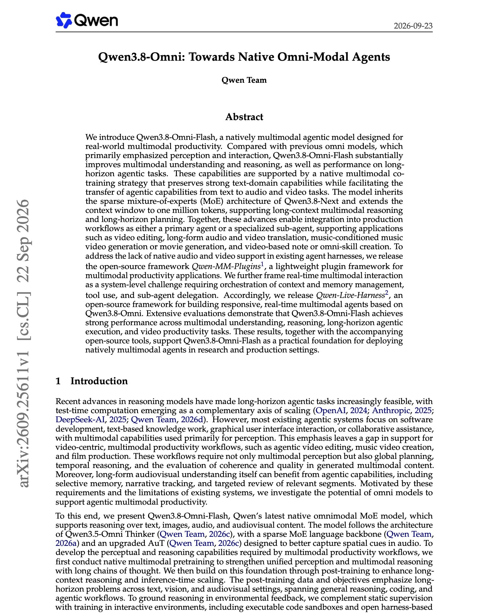
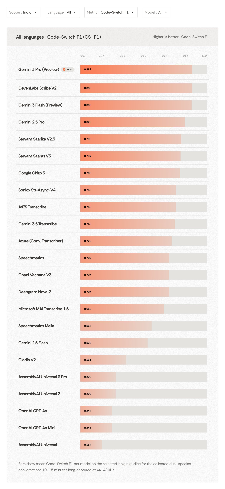
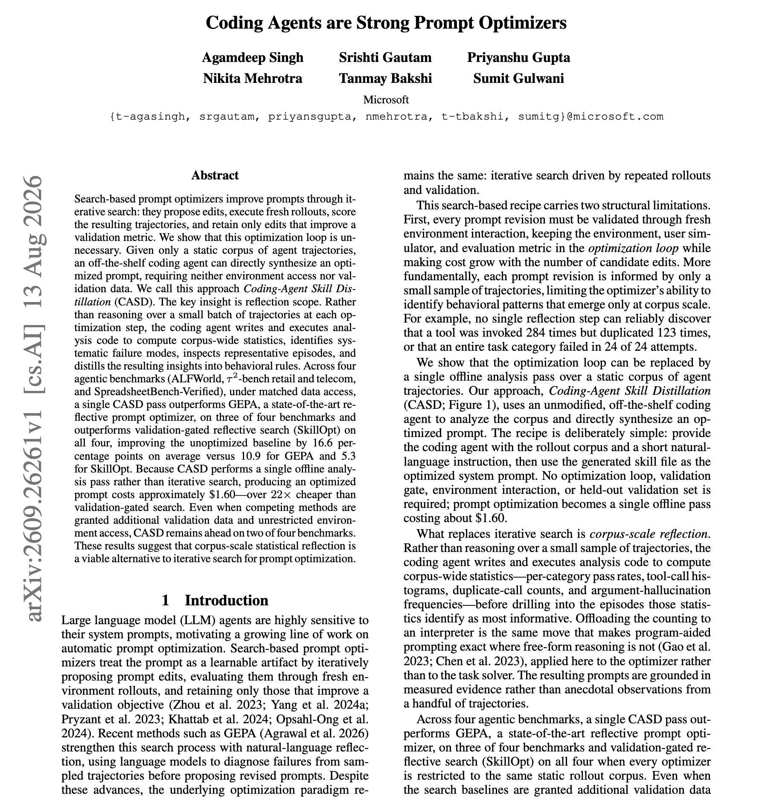

# 🐦 @dair_ai

## 📅 September 25, 2026

> 5 post(s) archived.

---

### 🕐 19:53 UTC · @dair_ai

> The era of omni agents is upon us. This is a great report by the Qwen Team on their omni-modal agents. They present Qwen3.8-Omni-Flash, a natively multimodal model trained for long-horizon agent tasks across text, audio, and video, such as video editing and long-form audio and video translation. It uses the sparse mixture-of-experts design of Qwen3.8-Next with a context window of one million tokens. A co-training strategy keeps text performance while carrying agent skills over to audio and video tasks. Two open-source frameworks come with it. Qwen-MM-Plugins adds audio and video support to existing agent harnesses, and Qwen-Live-Harness handles real-time multimodal interaction with context and memory management, tool use, and sub-agent delegation. Paper: https://academy.dair.ai/papers/qwen3-8-omni-towards-native-omni-modal-agents-2609.25611

🔗 [View original post](https://x.com/dair_ai/status/2103573552611926373)

---

### 🕐 16:57 UTC · @dair_ai

> Pay attention to System One models if you are building custom harnesses and agentic workflows. Great to see DSPy integrate Jev and now support System One models for calibrating agentic workflows. I&apos;m amazed at how naturally System One models like Jev fit into these frameworks. I am using Jev to build my own custom harnesses like here: https://academy.dair.ai/resources/jev-decisions-in-a-pi-sdk-harness So far, I&apos;ve had great success with guardrails, routing, and verifiers. However, I am starting to see other interesting applications in other parts of the agent harness, like: &gt; structuring skills and better optimizing them &gt; more efficient tool calling for agents &gt; dynamic workflows (i.e., dynamically generating harnesses with orchestrator + subagents patterns) that leverage Jev-like models for more optimally structuring outputs/information traveling between these workflows &gt; enhance coordination between agents &gt; dynamic and smarter loading (like tools and MCP) of system prompts, and really, all areas of context engineering that benefit from smarter and faster decision-making capabilities &gt; RLM + System One Models And the list goes on and on. Just a wonderful time to explore new ways to work with agents. DSPy 3.4.0 was just released! This release includes native support for Jev and System one models inside of DSPy! Use it with compatible signatures. This release also includes a brand new optimizer, ReAnchor, specifically for calibrating outputs with confidence.

🔗 [View original post](https://x.com/omarsar0/status/2103529287676567888)

---

### 🕐 15:56 UTC · @dair_ai

> Own your harness, folks. I feel like System One models take custom agent harnesses to a whole different level. It&apos;s not a surprise. This comes down to needs that haven&apos;t been met with System Two models alone. A need to be in control of your intelligence stack. A need for more reliable agents. Combining System One and System Two models is way better than just relying on one alone. A need for richer agent experiences (more personal and proactive agents). A need to squeeze out more value per token used. You can check my most recent guide on building a custom harness with Pi and Jev to learn more: https://academy.dair.ai/resources/jev-decisions-in-a-pi-sdk-harness But let&apos;s not stop here. I expect a new wave from frontier labs pushing decision models further. And even better tools to build even more customized decision models on top. There are more layers to this. This is great news for us builders and an incredible opportunity for those who specifically build custom harnesses. Pay attention to this new wave of System One models if you are building custom harnesses. First Jev. Now, Contrastive Language Model (CLM). CLM is 9x faster than Jev. CLM seems to be a better verifier than Jev, particularly at long-horizon tasks. How do Jev and CLM differ? CLM is…

🔗 [View original post](https://x.com/omarsar0/status/2103513870904053936)

---

### 🕐 14:47 UTC · @dair_ai

> Recommended benchmark. I expect voice to become one of the main ways people interact with robots and physical AI. That makes speech recognition in real conversations much more important than it seems today. Real conversations are hard to transcribe. People pause, talk over each other, and switch languages mid-sentence. Robots also need to understand the languages people actually speak. More than 5.5 billion people across the Global South are non-English speakers. The community needs a good way to measure these frontier capabilities. @humynlabs built BRIDGE ASR 2.0 to measure exactly this. It tests 23 speech recognition models on real two-person conversations, each 10 to 15 minutes long, in 18 Indic languages plus Spanish, Portuguese, and Vietnamese. The metric I find most useful is code-switch F1. It checks whether English words mixed into an Indic sentence stay in English. A model that writes &quot;data backup&quot; in Devanagari script scores zero. You can also filter the leaderboard by language and by metric. The methodology and evaluation data are public, and the team wants researchers to test the benchmark and find where it breaks. Check out the benchmark here: https://humynlabs.ai/bridge/ASR/2.0

🔗 [View original post](https://x.com/omarsar0/status/2103496639855865871)

---

### 🕐 13:39 UTC · @dair_ai

> Banger paper from Microsoft on prompt optimization. (bookmark it) The claim that a coding agent reading your logs beats GEPA at prompt optimization The overall finding is that you want to give a coding agent your full set of agent logs and let it write the analysis code, instead of running a search loop over small batches of trajectories. CASD has an off-the-shelf coding agent compute statistics over the whole trajectory corpus, find recurring failure modes, read representative episodes and write the findings as rules in one prompt. It needs no environment access and no validation data. Across ALFWorld, tau2-bench retail and telecom, and Spreadsheet Bench-Verified, one pass improves the unoptimized baseline by 16.6 points on average. GEPA improves it by 10.9 and SkillOpt by 5.3. Each optimized prompt costs about $1.60, more than 22x cheaper than validation-gated search. Paper: https://academy.dair.ai/papers/coding-agents-are-strong-prompt-optimizers-2609.26261

🔗 [View original post](https://x.com/dair_ai/status/2103479392106352910)

---
