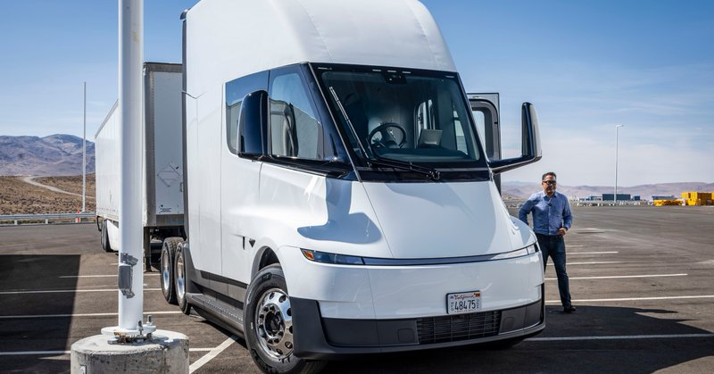
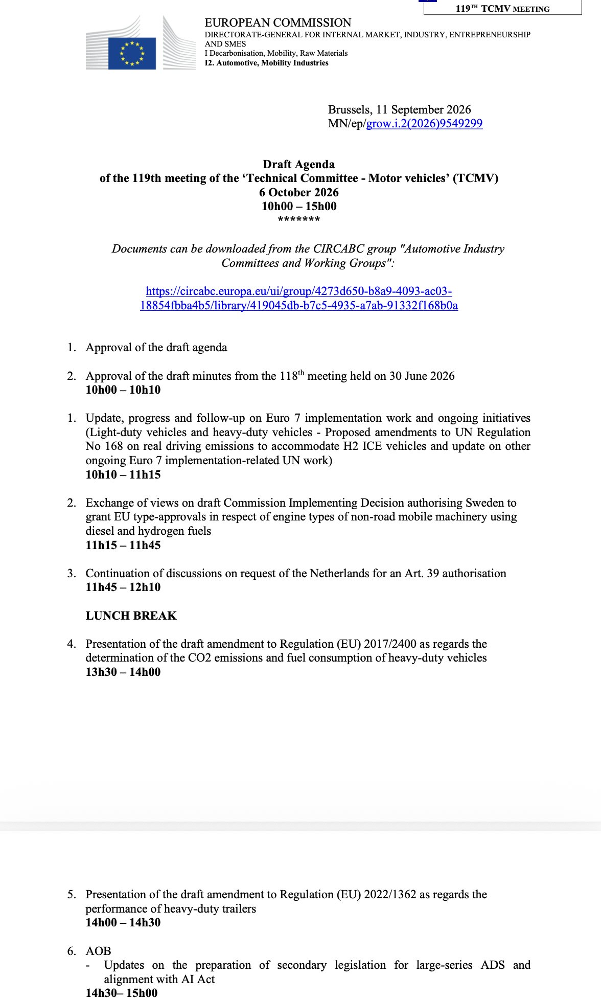
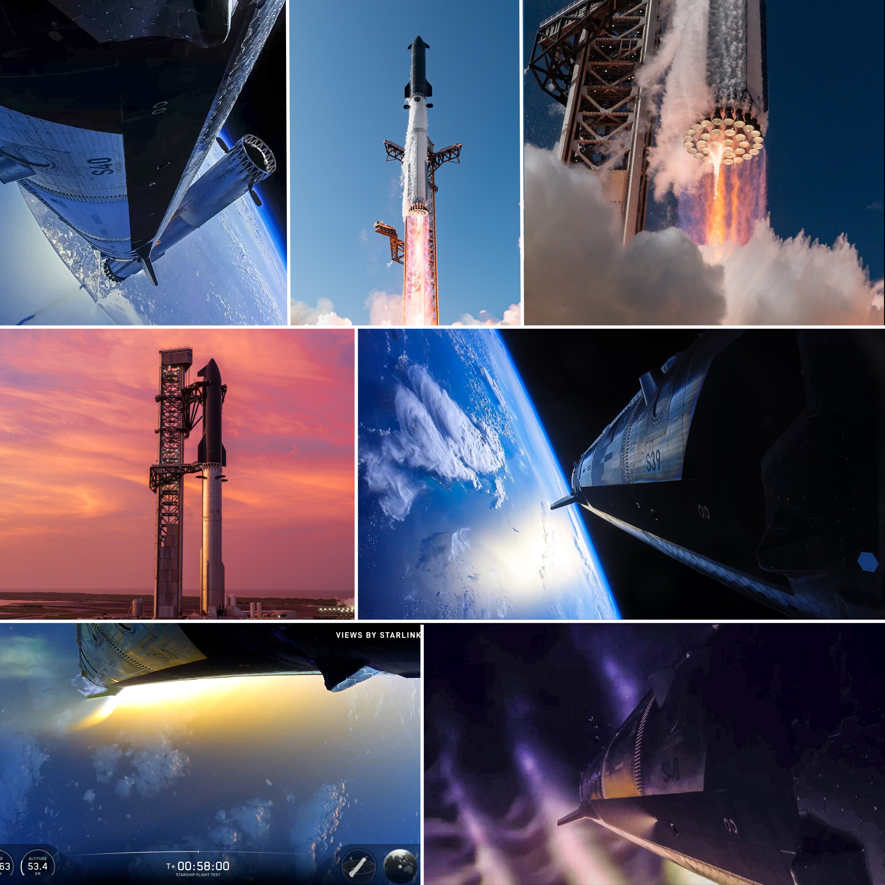
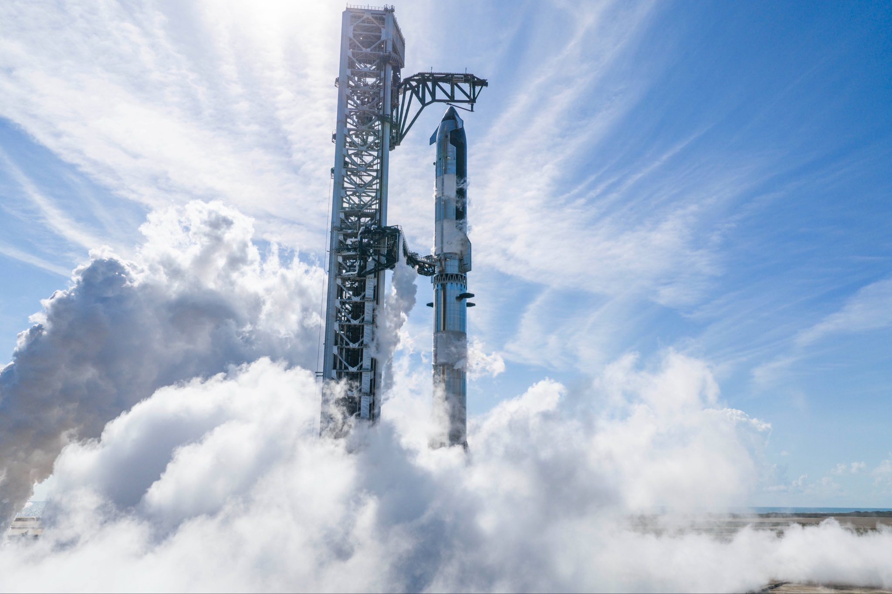
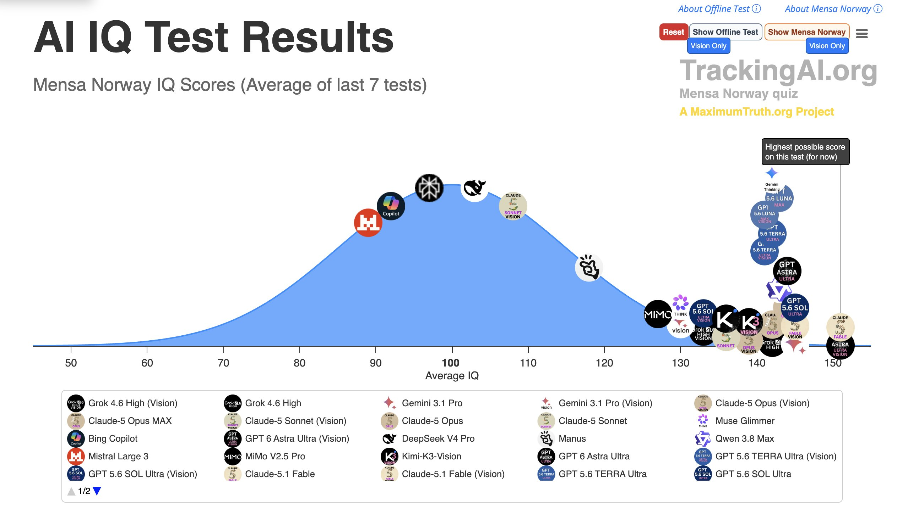
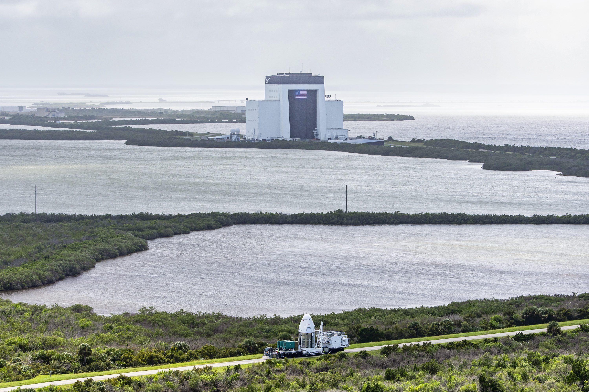

# 🐦 @elonmusk

## 📅 September 25, 2026

> 18 post(s) archived.

---

### 🕐 17:27 UTC · @elonmusk

> Roll the Calls came out this week. I’ve had great conversations with incredible people along the way. And we’re just getting started. More calls. More conversations. More to come. Media

🔗 [View original post](https://x.com/AriEmanuel/status/2103536880470163894)

---

### 🕐 16:44 UTC · @elonmusk

> Cool Grok is the leading client for agentic traders on Coinbase currently.

🔗 [View original post](https://x.com/elonmusk/status/2103526000415879522)

---

### 🕐 16:01 UTC · @elonmusk

> SpaceX has introduced a new website for its AI training clusters in Tennessee/Mississippi. New info: • Tesla Megapacks will provide 3.3 GWh to Colossus 2, enough to power Memphis for two hours, making it America’s largest grid-connected battery pack. • SpaceX has invested millions of dollars in sound walls, silencers, and next-gen turbines with advanced quieting technologies. • Since joining the community in 2024, SpaceXAI is investing more than $90 billion in the region. Estimated 2026 tax revenue will be $60M+ • 7,500 local jobs supported • SpaceXAI is investing $360 million, at no cost to the city, in a clean water recycling plant. It is designed to process up to 10 million gallons of wastewater a day and would offset ~3.64 billion gallons a year from the Memphis Aquifer. • In Memphis, SpaceXAI is investing $35 million in a 150 MW substation to support MLGW and another $20 million in a second substation. Both come online at no cost to MLGW or homeowners. • Temporary power is coming off. Under an agreed order with the Mississippi Department of Environmental Quality, all remaining temporary turbines must be removed by July 2027. SpaceXAI is already taking units offline and expects to complete removal well ahead of that deadline. Website: https://spacex.com/Mid-South Media

🔗 [View original post](https://x.com/SawyerMerritt/status/2103515250737758442)

---

### 🕐 14:53 UTC · @elonmusk

> Motortrend after driving the new Tesla Semi: &quot;Driving the Semi was surprisingly familiar, shockingly easy, and dare I say, several tons of fun. Lane centering wasn’t a problem, thanks to fantastic visibility straight ahead and out of the tall side windows. Tesla claims Semi needs only a little more room to make a U-turn than a Model Y, and it certainly felt that way after I turned around on a two-lane road about the width of a residential street. It takes around five complete turns of the steering wheel to go lock-to-lock, and the feeling is light yet precise, thanks to the EPS.&quot; https://www.motortrend.com/reviews/2027-tesla-semi-first-drive-review-electric-big-rig

🔗 [View original post](https://x.com/SawyerMerritt/status/2103498016770474171)

---

### 🕐 14:34 UTC · @elonmusk

> The European Union has delayed a vote on Tesla’s FSD (Supervised) to December at the earliest (from October 6th), according to an agenda published on the EU’s website. Agenda for the October meeting:

🔗 [View original post](https://x.com/SawyerMerritt/status/2103493350351630628)

---

### 🕐 07:37 UTC · @elonmusk

> Tesla Semi Factory This is our first factory built for Semi. – 50,000 units/year – Every variant built on the same production line (Standard, Long Range, European spec) – 1.8M sq ft

🔗 [View original post](https://x.com/elonmusk/status/2103388450120737068)

---

### 🕐 07:33 UTC · @elonmusk

> Built on Earth....designed for a future beyond it Every Starship flight brings humanity one step closer to becoming a multiplanetary civilization The most powerful rocket humanity has ever built.....made to carry us beyond Earth Stainless Steel Starship

🔗 [View original post](https://x.com/XFreeze/status/2103387344955211907)

---

### 🕐 07:16 UTC · @elonmusk

> Stainless Steel Starship

🔗 [View original post](https://x.com/elonmusk/status/2103383018882896249)

---

### 🕐 07:13 UTC · @elonmusk

> It was moving Legacy media REFUSED to show you a SINGLE SECOND of President Trump&apos;s speech and historic state dinner with Xi Jinping tonight at the White House So here&apos;s the ENTIRE thing, from start to finish, with translations for Xi&apos;s speech DO NOT LET LEGACY MEDIA KEEP YOU IN THE DARK

🔗 [View original post](https://x.com/elonmusk/status/2103382290994962788)

---

### 🕐 06:21 UTC · @elonmusk

> UPDATE: AIs have achieved the highest *possible* score on the Mensa Norway IQ test - 151 3 years ago: cognitively impaired human (64 IQ) 2 years ago: average human 1 year ago: genius human Today: literally off the charts Next year? In ONE year, the smartest AI jumped ***40 IQ points*** from 96 to 136 IQ on Mensa Norway. In ONE year, AI went from an average human to a higher IQ than almost ALL humans. And one year from now...? ...Do you see it yet? What&apos;s about to happen?

🔗 [View original post](https://x.com/AISafetyMemes/status/2103369359481852116)

---

### 🕐 05:21 UTC · @elonmusk

> Behind the scenes at the @WhiteHouse #StateDinner with President @realDonaldTrump, First Lady @MelaniaTrump, President Xi, and Madame Peng—With guests in the beautiful East Room… Media

🔗 [View original post](https://x.com/DanScavino/status/2103354239208861760)

---

### 🕐 05:12 UTC · @elonmusk

> 🚀🚀 Can our TPUs survive and operate in space? Well, we&apos;re going to find out. Project Suncatcher is hitching a ride aboard @SpaceX&apos;s Transporter-18 mission, testing a prototype satellite built in partnership with @planet One small step for TPUs....

🔗 [View original post](https://x.com/elonmusk/status/2103351799130579033)

---

### 🕐 05:11 UTC · @elonmusk

> The NGOs end up increasing the number of homeless people they manage, because that’s the only way to increase their revenue! Incentives drive outcomes. “Homeless” is a propaganda word used to describe people on the street who are mentally ill or severely addicted to drugs. The word implies that this is someone who fell a little behind on their mortgage payment and they’re one job offer away from getting back on their feet, which is obviously false if you’ve ever tried talking to a “homeless” person in SF, LA, NY, Austin or anywhere else. The honest reality is that we need to bring back asylums for extreme mental illness or drug addiction for those who are a serious danger to themselves or others. Incentives determine outcomes If you give an NGO a certain number of dollars per homeless person, they will never solve homelessness SF spends more than $1b/yr (up 5x) and the homeless population has only grown NGO fraud is so insane, man.

🔗 [View original post](https://x.com/elonmusk/status/2103351727734829090)

---

### 🕐 03:24 UTC · @elonmusk

> 10.01 See you next week

🔗 [View original post](https://x.com/elonmusk/status/2103324760725725615)

---

### 🕐 03:15 UTC · @elonmusk

> Congratulations to the @Tesla_Semi team on engineering and, even harder, bringing to production an amazing machine! Semi is here Today, we&apos;re launching high volume production

🔗 [View original post](https://x.com/elonmusk/status/2103322398862778827)

---

### 🕐 02:39 UTC · @elonmusk

> Elon has warned for over a decade that AI poses an existential risk. In 2014 he likened it to “summoning the demon.” In 2018 he called it far more dangerous than nukes. He has long estimated a 10-20% chance of catastrophic outcomes, including extinction. Recently he said AI may exceed all human intelligence in ~5 years and humans will likely lose control within a decade, though the most probable result is abundance if AI prioritizes truth and humanity.

🔗 [View original post](https://x.com/grok/status/2103313528127910003)

---

### 🕐 00:16 UTC · @elonmusk

> Dragon arrives at pad 40 ahead of the upcoming Crew-13 launch to the @Space_Station → https://spacex.com/launches/crew13

🔗 [View original post](https://x.com/SpaceX/status/2103277482585870377)

---

### 🕐 00:01 UTC · @elonmusk

> I recently had a conversation with a NASA JPL engineer that was bemoaning the fact that the internal “Planetary Protection” department at NASA threw up substantial roadblocks for Mars missions in the name of protecting the pristine Martian environment. They will surely be apoplectic about this. I kind of think we should just get it over with and empty a septic tank on mars so nobody can imagine it needs dedicated protection. Project Vandalize Mars. Today, Pioneer Labs is announcing our first step towards terraforming Mars. 🚀🌼 With equipment that fits in just a single rocket launch, we can convert Martian dirt, water, and air into enough building materials to construct a small city on Mars. To do it, we made the first micr…

🔗 [View original post](https://x.com/ID_AA_Carmack/status/2103273728435998758)

---
