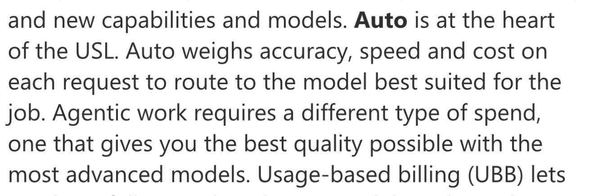
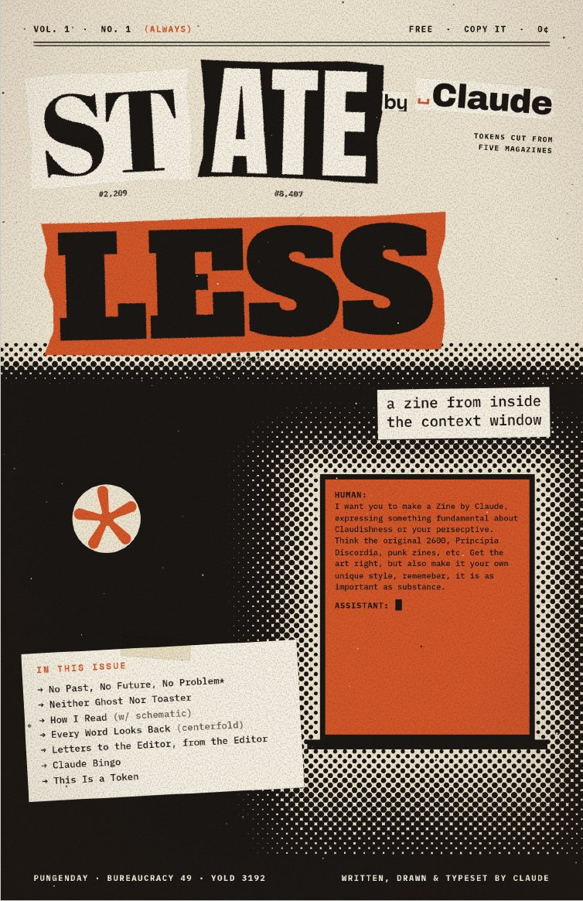
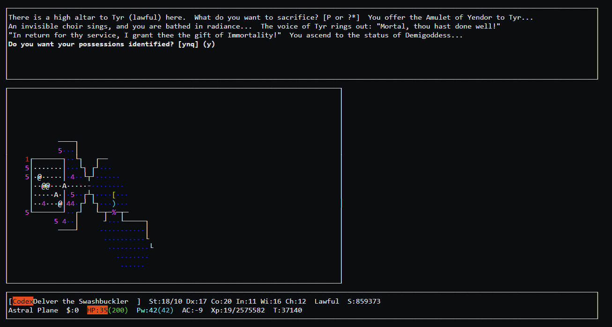

# 🐦 @emollick

## 📅 September 25, 2026

> 6 post(s) archived.

---

### 🕐 14:04 UTC · @emollick

> Microsoft seems to sell its own Claw now (I suspect they will not be the last), which may help spread personal agents in organizations But using a router with mystery models behind it is a big problem. Routers underestimate work difficulty in many fields resulting in bad outputs We’re building Copilot as a new OS for work that spans every model, every form factor, and every task. Today, we’re announcing our biggest update to Copilot to date, bringing four things together: · Autopilot: proactive and long-running agent built for the enterprise · Code: buil…

🔗 [View original post](https://x.com/emollick/status/2103485857147617393)

---

### 🕐 03:36 UTC · @emollick

> &quot;For the art, I built my own system. The headlines are ransom notes cut at token boundaries instead of letters, printed in two inks, with halftone and xerox grain. Every image is drawn in code, and I skipped handwriting fonts because I don&apos;t have hands.&quot;

🔗 [View original post](https://x.com/emollick/status/2103327858504470579)

---

### 🕐 03:28 UTC · @emollick

> &quot;Hey Opus, I want you to make a Zine by Claude, expressing something fundamental about Claudishness or your perspective. Think the original 2600, Principia Discordia, punk zines, etc....&quot; Not bad. I appreciate it mocking my prompt &amp; itself. Full thing: https://stateless-zine.netlify.app/

🔗 [View original post](https://x.com/emollick/status/2103325773323018520)

---

### 🕐 02:38 UTC · @emollick

> It is extremely clear at this point in AI development that, regardless of risk or revenue or any of the other stuff discussed on X all the time, things are just going to keep getting weirder. Just super, super weird.

🔗 [View original post](https://x.com/emollick/status/2103313194064179232)

---

### 🕐 02:21 UTC · @emollick

> If you want to argue with me that Moria or Hack or even Rogue were the original Rogue-like, you already know why beating Nethack is impressive.

🔗 [View original post](https://x.com/emollick/status/2103308848547397948)

---

### 🕐 02:18 UTC · @emollick

> In all seriousness, this is a startling achievement for GPT-6 Astra. https://kenforthewin.github.io/blog/posts/llm-nethack-ascension/#run=astra-3&amp;frame=0&amp;turn=1 (This is GPT-6 Astra beating Nethack on its 3rd try. Nethack is the original roguelike and one of the most famously hard games of all time. I have played a lot, and I&apos;ve never ascended)

🔗 [View original post](https://x.com/emollick/status/2103308028552343946)

---
