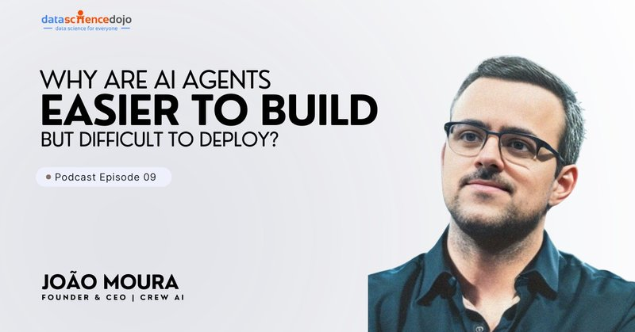

# 🐦 @joaomdmoura

## 📅 September 25, 2026

> 2 post(s) archived.

---

### 🕐 16:00 UTC · @joaomdmoura

> Media credit: João Moura on Multi-Agent Systems, Autonomous Workflows &amp; AI Entrepreneurship | Ep 09 https://www.youtube.com/watch?v=DGGLhUt42LM

🔗 [View original post](https://x.com/joaomdmoura/status/2103514957786808817)

---

### 🕐 16:00 UTC · @joaomdmoura

> Did you hand your AI a list of steps, or a goal? That one answer tells you whether you built an agent. Accounts payable, version one: match every invoice to a payment, flag anything 15 days overdue, draft the follow-up. Same steps every day. That is a workflow. Version two gets one sentence: keep our payables clean and tell me what needs my sign-off. It works out its own way there, every day. That is an agent. If you are still writing out every step, you have a very good assistant. Sometimes that is exactly right. Handing over the goal is the real line. Media

🔗 [View original post](https://x.com/joaomdmoura/status/2103514945380098308)

---
