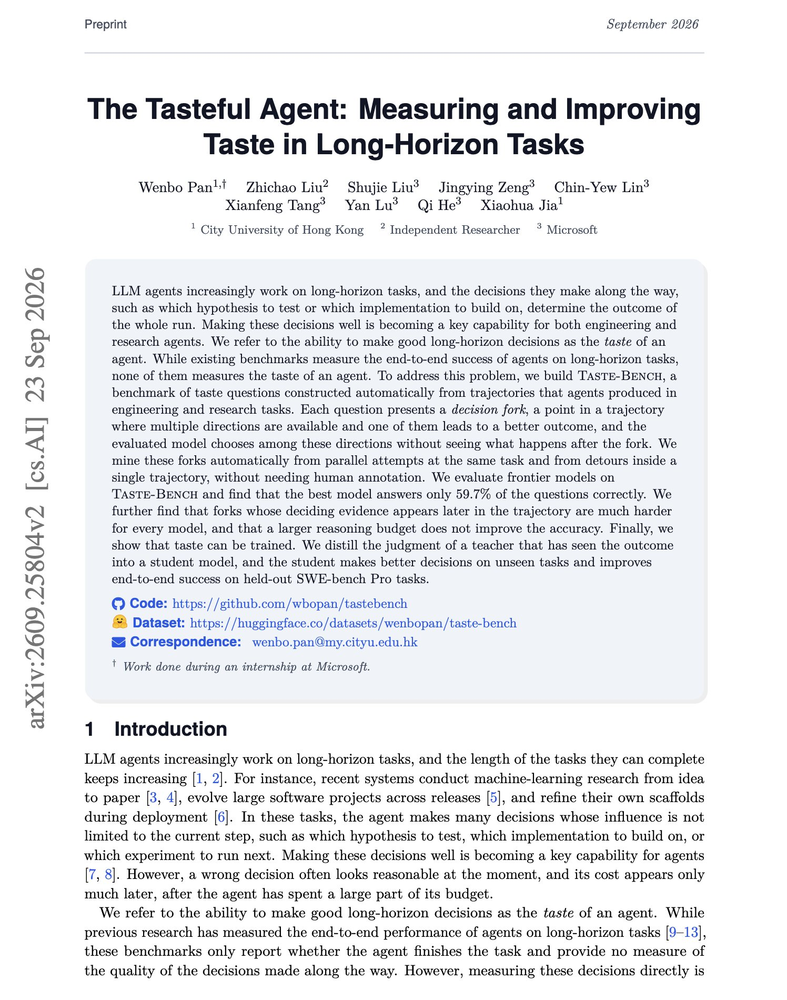

# 🐦 @omarsar0

## 📅 September 25, 2026

> 2 post(s) archived.

---

### 🕐 13:35 UTC · @omarsar0

> Banger paper from Microsoft and colleagues. We talk about human taste being important in this AI era. But for recursive self-improvement, an agent&apos;s taste also matters. The big question is: How often do frontier agents pick the better direction at a decision point in a long task? It&apos;s apparently just under 60% of the time, according to Taste-Bench. In this benchmark, each question shows a point in a trajectory where several directions are open, and one leads to a better outcome. The forks are mined automatically from parallel attempts and detours in engineering and research runs. The best model answers 59.7% correctly. Forks whose deciding evidence appears later in the trajectory are much harder, and a larger reasoning budget does not raise accuracy. The authors then distill a teacher&apos;s judgment of the outcome into a student model, which improves end-to-end success on held-out SWE-bench Pro tasks. Paper: https://arxiv.org/abs/2609.25804 Chat with Paper: https://academy.dair.ai/papers/the-tasteful-agent-measuring-and-improving-taste-in-long-horizon-tasks-2609.25804

🔗 [View original post](https://x.com/omarsar0/status/2103478384584278502)

---

### 🕐 13:19 UTC · @omarsar0

> AI has sparked a new era of learning. Jamie earned 12 advanced degrees while growing Crimson Education. But learning while building is a skill in itself. Traditional school doesn’t offer much of this, but with AI being this good, nothing should stop you. It was surreal to see my academic adventures on the front page of the @nytimes Here’s how I built Crimson Education almost entirely while at universities:

🔗 [View original post](https://x.com/omarsar0/status/2103474594430746971)

---
