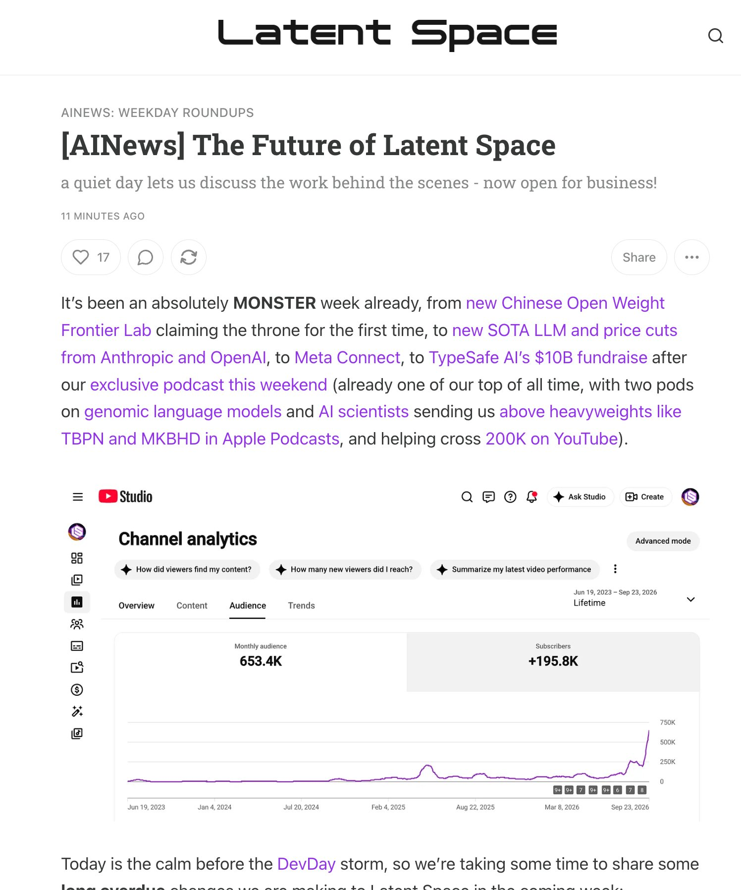

# 🐦 @swyx

## 📅 September 25, 2026

> 1 post(s) archived.

---

### 🕐 05:49 UTC · @swyx

> In Jan this year I called my content strategy shot: &quot;Scaling without Slop&quot;. It&apos;s finally starting to work. It took us 3 years to reach our first 100k on youtube. It only took 1.2 months for the next 100k. Similar other metrics on AEO/SEO/subscriber traction and have a lot of New Media ideas that I&apos;m excited to pursue. officially giving notice of the next phase of Latent Space, AINews, and what the rest of swyx inc has been cooking below [AINews] The Future of Latent Space https://www.latent.space/p/ainews-the-future-of-latent-space - Plans for AINews v3 - Plans for a new home! - We are open for business - and @supabase are our first sponsors!

🔗 [View original post](https://x.com/swyx/status/2103361254433993165)

---
