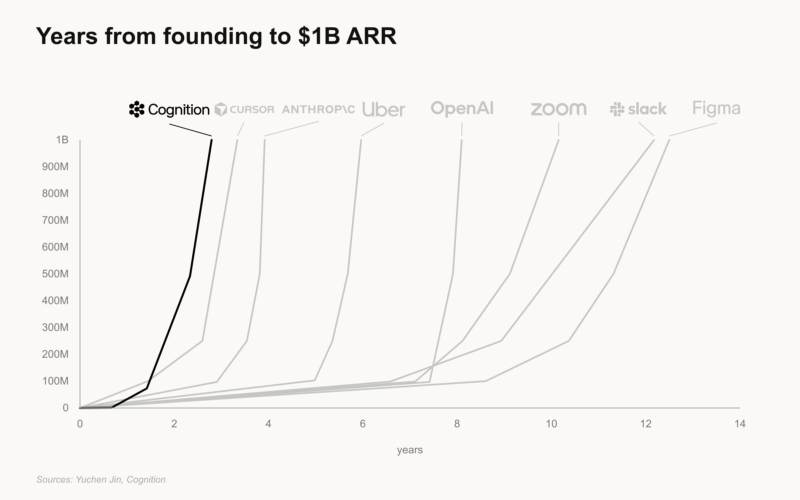

# 🐦 @swyx

## 📅 September 25, 2026

> 5 post(s) archived.

---

### 🕐 16:21 UTC · @swyx

> adding Cognition’s growth to a chart that circulated last year (h/t @Yuchenj_UW), you can see that execution speed defines the company this should not surprise those who saw Scott’s childhood mathcounts video, but hard to fully appreciate until seen in the context of the greats Cognition has crossed $1B in annualized revenue run rate. This milestone belongs to our customers. Here&apos;s how a few of them are building with Devin.

🔗 [View original post](https://x.com/absoluttig/status/2103520198481645945)

---

### 🕐 15:06 UTC · @swyx

> Here&apos;s the talk I gave at AI Engineer Paris: I announce /retro and /pr, and talk about how to get more PR&apos;s through your org faster by: - Stopping the slop - Making PR&apos;s easier to review (with /pr) https://www.youtube.com/watch?v=g0vqT_wZtXA&amp;t=26238s

🔗 [View original post](https://x.com/mattpocockuk/status/2103501498361798983)

---

### 🕐 15:01 UTC · @swyx

> Cognition has crossed $1B in annualized revenue run rate. This milestone belongs to our customers. Here&apos;s how a few of them are building with Devin. Media

🔗 [View original post](https://x.com/cognition/status/2103500168951955718)

---

### 🕐 14:13 UTC · @swyx

> i guess this is as good a time as ever to say that i started a new role @latentspacepod over a month ago 🫡 scaling the business side of things, managing sponsorships, and wrangling ops (we are very much open for business, so if you want to sponsor, hmu 💖) In Jan this year I called my content strategy shot: &quot;Scaling without Slop&quot;. It&apos;s finally starting to work. It took us 3 years to reach our first 100k on youtube. It only took 1.2 months for the next 100k. Similar other metrics on AEO/SEO/subscriber traction and have a lot of New …

🔗 [View original post](https://x.com/adlinzainal/status/2103487955050660277)

---

### 🕐 05:49 UTC · @swyx

> In Jan this year I called my content strategy shot: &quot;Scaling without Slop&quot;. It&apos;s finally starting to work. It took us 3 years to reach our first 100k on youtube. It only took 1.2 months for the next 100k. Similar other metrics on AEO/SEO/subscriber traction and have a lot of New Media ideas that I&apos;m excited to pursue. officially giving notice of the next phase of Latent Space, AINews, and what the rest of swyx inc has been cooking below [AINews] The Future of Latent Space https://www.latent.space/p/ainews-the-future-of-latent-space - Plans for AINews v3 - Plans for a new home! - We are open for business - and @supabase are our first sponsors!

🔗 [View original post](https://x.com/swyx/status/2103361254433993165)

---
