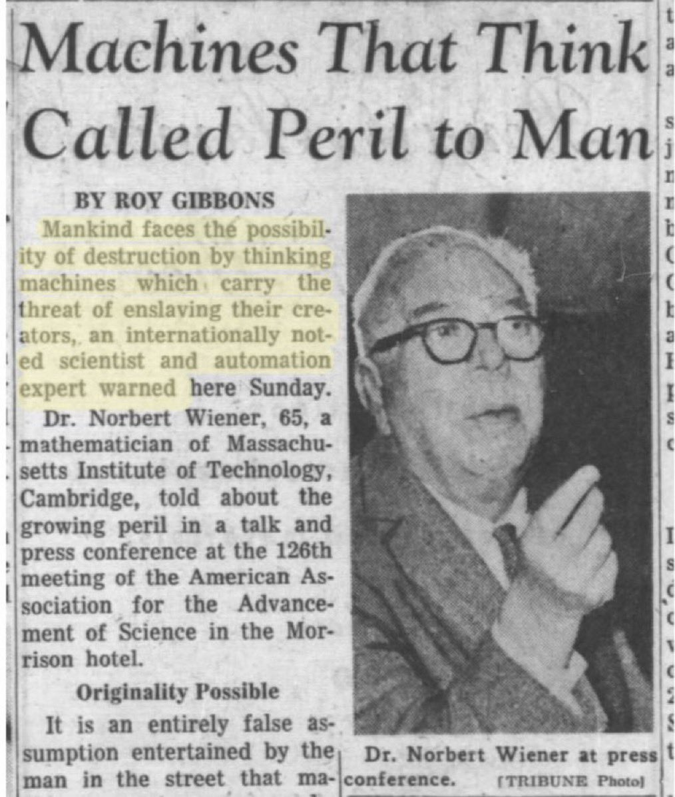

# 🐦 @ylecun

## 📅 September 25, 2026

> 2 post(s) archived.

---

### 🕐 11:00 UTC · @ylecun

> &quot;We can be humble and live a good life with the aid of the machines, or be arrogant and die.&quot; - Dr. Norbert Wiener, 1949 https://newsletter.pessimistsarchive.org/p/the-original-ai-doomer-dr-norbert

🔗 [View original post](https://x.com/PessimistsArc/status/2103439522314756181)

---

### 🕐 06:54 UTC · @ylecun

> Jensen Huang: don’t mistake engineering vocabulary for evidence of a machine mind. AI is still software, not a human mind inside a machine. &quot;We can&apos;t make jokes about all this stuff, we&apos;re scaring the American public.&quot; Words like “spawn,” “parent,” “child,” and “kill” have existed in computing for decades; Giving those same mechanisms human characteristics today because of AI is unnecessary and misleading. ---- From &quot;The Ezra Klein Show + New York Times Opinion + New York Times Podcasts&quot; YouTube channel, (full video link in comment) Media

🔗 [View original post](https://x.com/rohanpaul_ai/status/2103377602216116254)

---
