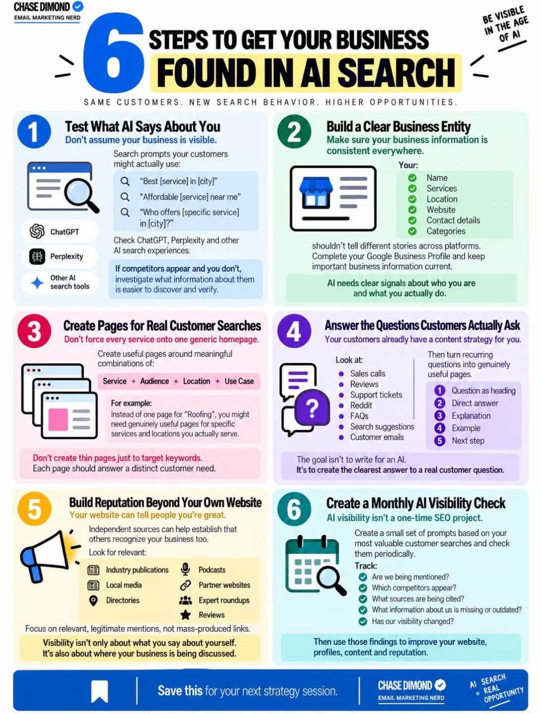
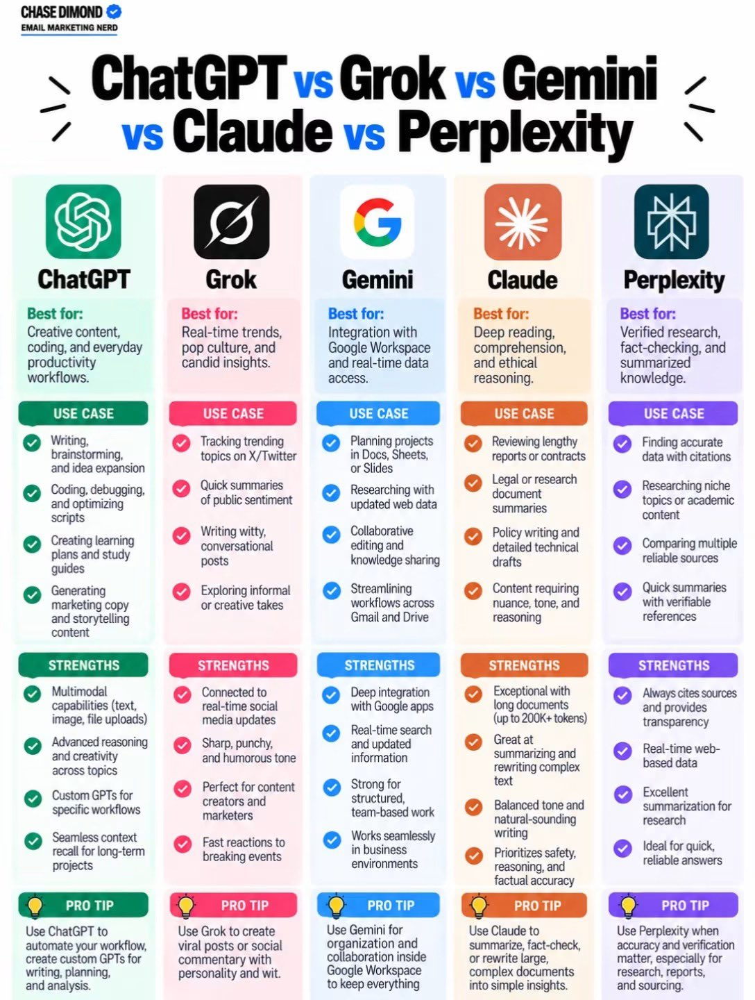

# 🐦 @AiEvolutio58513

## 📅 September 26, 2026

> 8 post(s) archived.

---

### 🕐 22:50 UTC · @AiEvolutio58513

> 6 Steps To Get Your Business Found In AI Search:

🔗 [View original post](https://x.com/ecomchasedimond/status/2103980470405124444)

---

### 🕐 15:09 UTC · @AiEvolutio58513

> ChatGPT Vs Grok Vs Gemini Vs Claude Vs Perplexity: Which one do you use the most?

🔗 [View original post](https://x.com/ecomchasedimond/status/2103864424276901907)

---

### 🕐 14:03 UTC · @AiEvolutio58513

> The best use of AI I have seen all year. Media

🔗 [View original post](https://x.com/AiEvolutio58513/status/2103847841462714695)

---

### 🕐 13:00 UTC · @AiEvolutio58513

> Interested in AI? Follow @AiEvolutio58513 and never fall behind. I track ChatGPT, Claude, and every tool quietly changing how we work and create, then hand you the tested signals.

🔗 [View original post](https://x.com/AiEvolutio58513/status/2103832205516804554)

---

### 🕐 13:00 UTC · @AiEvolutio58513

> TL;DR 1. She admits nobody knows the twenty year picture 2. The cloud is physical and it runs on power 3. One open model cost 25 tons of carbon dioxide 4. The bigger problem is that nobody publishes this 5. Datasets contain strangers who share your name 6. Artists needed proof before they could sue 7. Facial recognition put an innocent woman in custody 8. Image models make every lawyer a white man

🔗 [View original post](https://x.com/AiEvolutio58513/status/2103832193948877159)

---

### 🕐 13:00 UTC · @AiEvolutio58513

> Sasha Luccioni has been an AI researcher for over a decade and works at Hugging Face. A stranger emailed to say her work was going to end humanity. 1. Nobody knows what happens in twenty years Media I wrote about the state of AI, why I’m concerned about the next few years, and the choices we need to make to keep the future in humanity’s hands. An Alien Mind: https://openai.com/index/an-alien-mind/

🔗 [View original post](https://x.com/AiEvolutio58513/status/2103831998024540325)

---

### 🕐 10:57 UTC · @AiEvolutio58513

> Interested in AI? Follow @AiEvolutio58513 and never fall behind. I track ChatGPT, Claude, and every tool quietly changing how we work and create, then hand you the tested signals.

🔗 [View original post](https://x.com/AiEvolutio58513/status/2103801033252344009)

---

### 🕐 10:57 UTC · @AiEvolutio58513

> A Neuralink patient moving the cursor and playing chess with nothing but thought. 🧠 No hands, no controller. A brain, an implant, and a chessboard. Media

🔗 [View original post](https://x.com/AiEvolutio58513/status/2103801021365706872)

---
