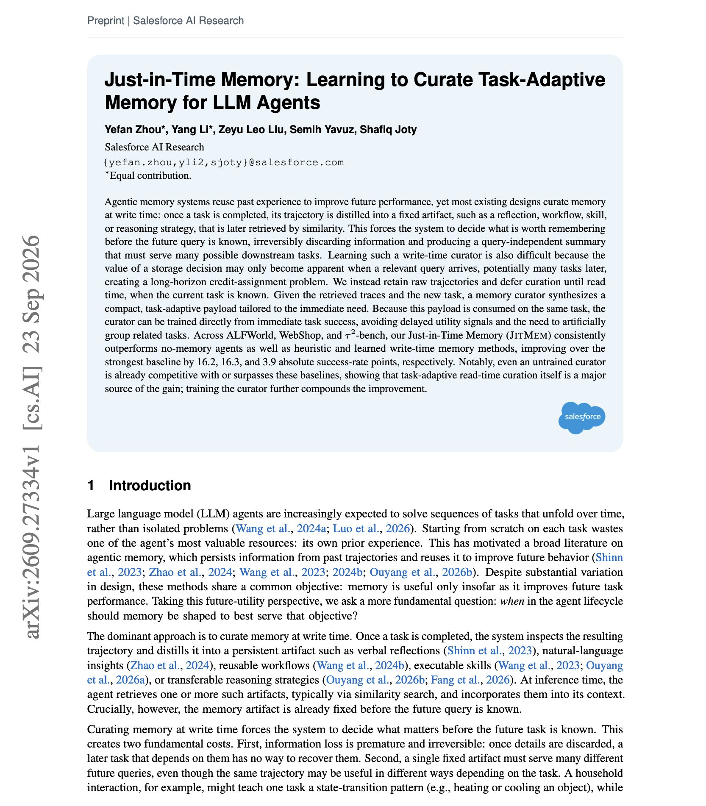
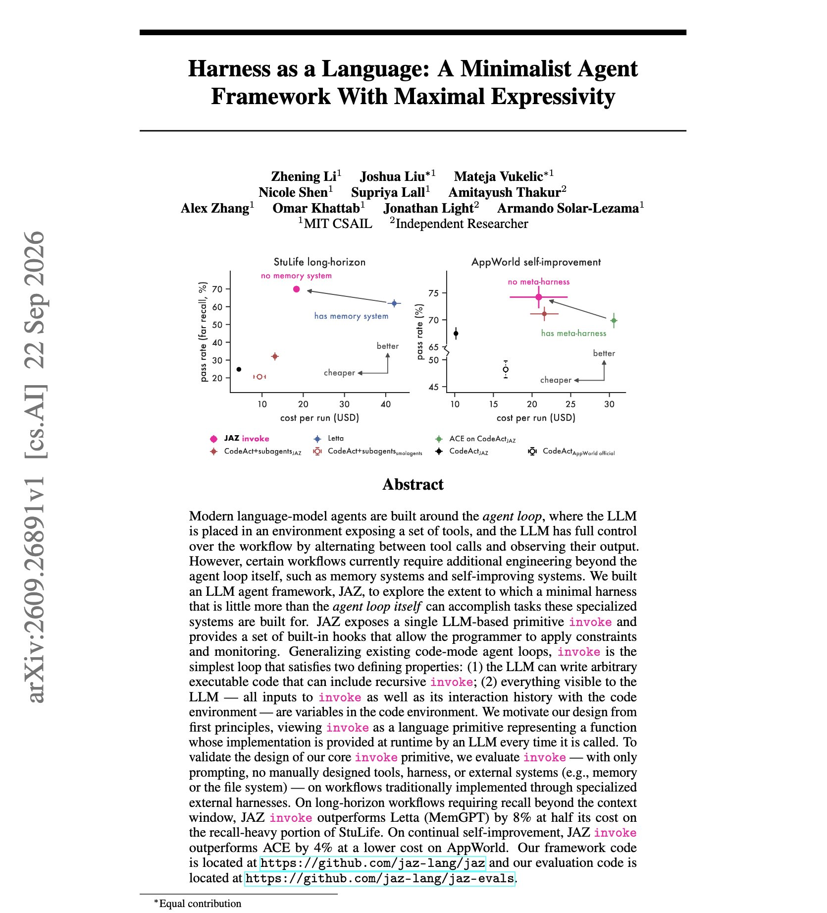

# 🐦 @dair_ai

## 📅 September 26, 2026

> 2 post(s) archived.

---

### 🕐 12:45 UTC · @dair_ai

> Banger paper from Salesforce AI Research on agent memory. The overall finding is that you want to store raw trajectories and decide what to extract from them when the next task arrives, instead of summarizing each run when it ends. Just-in-Time Memory uses a curator that reads the retrieved traces together with the new task and writes a short memory payload for that task. Because the payload is used right away, the curator can be trained on whether that same task succeeds. On ALFWorld, WebShop and tau2-bench it beats the strongest baseline by 16.2, 16.3 and 3.9 success-rate points. Even the untrained curator matches or beats memory that is written when a task ends. Paper: https://academy.dair.ai/papers/just-in-time-memory-learning-to-curate-task-adaptive-memory-for-llm-agents-2609.27334

🔗 [View original post](https://x.com/dair_ai/status/2103828189407834259)

---

### 🕐 12:40 UTC · @dair_ai

> Keep your agent harness minimal, folks. This paper from MIT CSAIL shows why. (bookmark it) While being very minimal it looks effective and promising for building self-improving agents. They present JAZ, an agent framework with one primitive, invoke. The LLM writes code, can call invoke recursively, and sees all of its inputs and history as variables in the code environment. With prompting only and no memory system, it beats Letta (MemGPT) by 8% at half the cost on the recall-heavy part of StuLife. On AppWorld it beats ACE, a self-improvement method, by 4% at lower cost. Memory and self-improvement are usually built as separate subsystems. Here both are code the agent writes inside the loop, and hooks handle the constraints and monitoring you want to enforce. Paper: https://arxiv.org/abs/2609.26891 Explore Paper: https://academy.dair.ai/papers/harness-as-a-language-a-minimalist-agent-framework-with-maximal-expressivity-2609.26891

🔗 [View original post](https://x.com/omarsar0/status/2103826930181308720)

---
