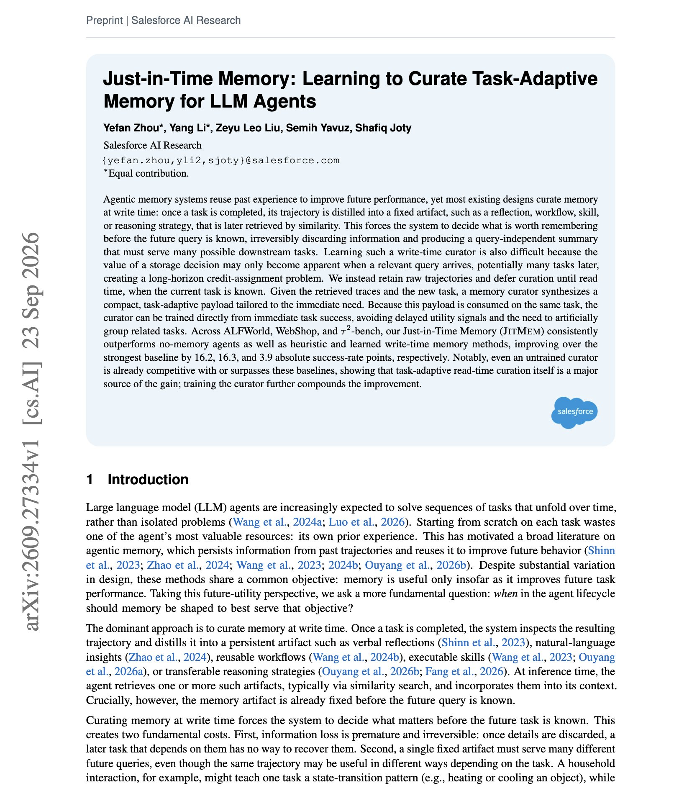
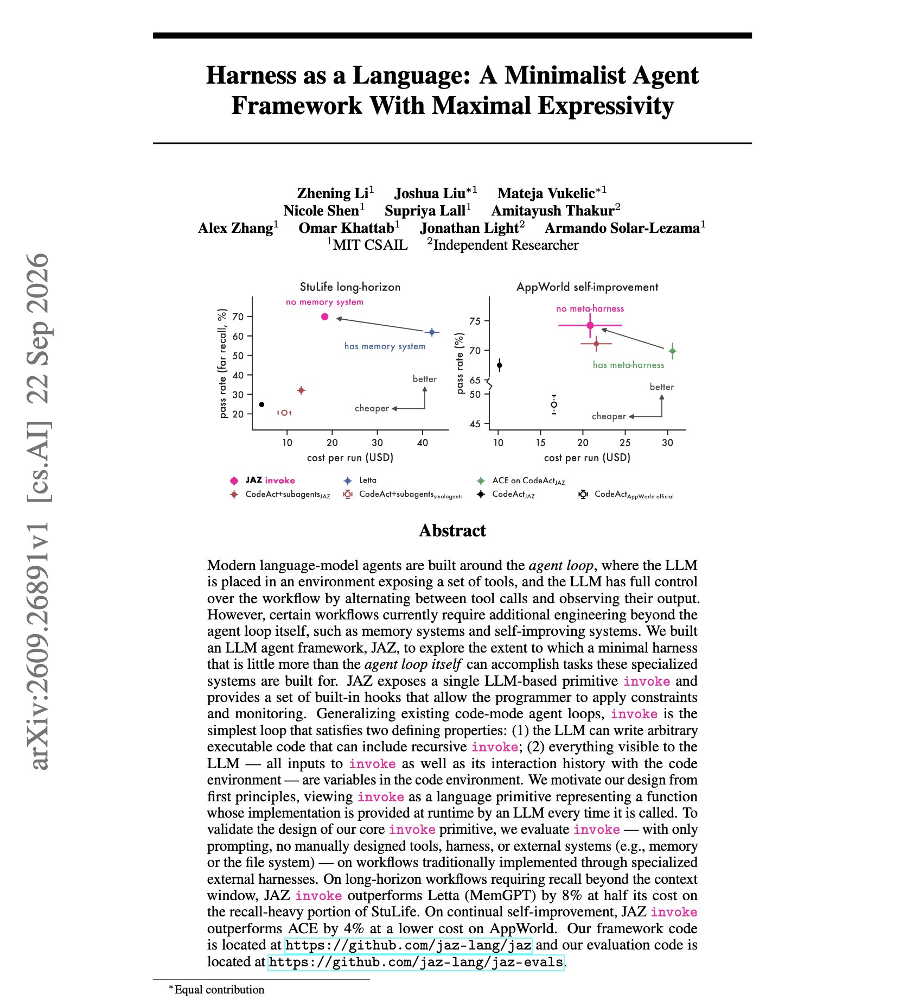

# 🐦 @dair_ai

## 📅 September 26, 2026

> 5 post(s) archived.

---

### 🕐 21:26 UTC · @dair_ai

> I agree. Learn the fundamentals, folks! If you plan to be a solid builder using agents, this is a really important point. There is no way around it. I have recently started digging deep into evals, infra, architecture, scaling search, and things like sandboxes @dair_ai using agents, and I can tell you that it&apos;s really easy to produce absolute slop. You could be using the most advanced models today confidently and not know that everything is broken because the agents somehow got it to work through some weird hack. Agents don&apos;t have the taste of someone with proper domain expertise. And I don&apos;t think that&apos;s coming anytime soon. But something you learn in algorithms (one important fundamental subject) is that solutions can be optimal or suboptimal. In other words, many ways to transform inputs to get the same outputs. Agents don&apos;t give a crap about that and sometimes feel like they are flipping a coin. I can tell you that much. Stay learning, folks. This is the way. The AI influencers are telling you that you don&apos;t need to learn coding and engineering since Claude Code will do all the work and you just need to give it some very high-level command. Meanwhile, real builders are making important engineering decisions and using Claude Code to im…

🔗 [View original post](https://x.com/omarsar0/status/2103959517742448947)

---

### 🕐 15:51 UTC · @dair_ai

> This is one of the strongest use cases I&apos;ve seen for System One models like Jev. Pay close attention if you build custom harnesses. Jev is now available as a packaged router. What is it? You send the conversation to typesafe/jev-router, and OpenRouter picks the model and reasoning effort for each request. Choosing the right model and reasoning effort is an art, and doing it manually is inefficient, to say the least. It makes sense to offload reasoning effort, but you want to do it efficiently, smartly, and cheaply. System One Models like Jev are a great fit for this. Does it work? I tested Jev Router on a small support agent built with a custom harness I built with the Pi SDK. I ran the same 8 cases against a fixed GPT-6 Sol baseline, 32 real calls in total. Both got every case right. The router cost less than half as much ($0.008 vs $0.018) and had a lower median response time (1.5s vs 1.9s). The sample is small, but it&apos;s clear that, at scale, this could make a huge difference in cost and efficiency. One of my biggest concerns about Jev-as-a-Router is caching. While it&apos;s not fully solved, Jev Router gives me hope for smarter, more efficient routing patterns in custom harnesses that leads to better tradeoffs. I have shared an implementation of a routing pattern I&apos;m excited about here: https://academy.dair.ai/resources/jev-decisions-in-a-pi-sdk-harness The takeaway here is that Jev is unlocking interesting new patterns (routing, verification, guardrails, dynamic workflows, judges, and more) that you can tap into in your custom harness. I expect this trend to continue growing. And harnesses that are easier to customize, like Pi, will benefit even more. You&apos;ve never routed like this before. @OpenRouter is bringing Jev to all of your LLM calls, so your agentic workflows never have to waste a token again. As always, faster, cheaper, more intelligent. Go build the future.

🔗 [View original post](https://x.com/omarsar0/status/2103875089779261682)

---

### 🕐 14:22 UTC · @dair_ai

> Most of the personal agents I see today are heavily optimized to make us consume more (e.g., buy stuff online, book flights, plan a vacation, etc.). I get that every company building these has its own incentives. To be clear, nothing wrong with consumer agents. They are useful. However, I&apos;d also love to see more human-centric agents that unlock real opportunities, like starting a business, getting a job, running a company, or learning something new. Sadly, today&apos;s agents just aren&apos;t sufficiently trained and aligned for this. But I think it&apos;s worth solving. To be fair, I do recognize a few companies that are trying hard to build more human-centric AI models. And I hope they continue doing so. But who is building personal agents to solve this?

🔗 [View original post](https://x.com/omarsar0/status/2103852791747764653)

---

### 🕐 12:45 UTC · @dair_ai

> Banger paper from Salesforce AI Research on agent memory. The overall finding is that you want to store raw trajectories and decide what to extract from them when the next task arrives, instead of summarizing each run when it ends. Just-in-Time Memory uses a curator that reads the retrieved traces together with the new task and writes a short memory payload for that task. Because the payload is used right away, the curator can be trained on whether that same task succeeds. On ALFWorld, WebShop and tau2-bench it beats the strongest baseline by 16.2, 16.3 and 3.9 success-rate points. Even the untrained curator matches or beats memory that is written when a task ends. Paper: https://academy.dair.ai/papers/just-in-time-memory-learning-to-curate-task-adaptive-memory-for-llm-agents-2609.27334

🔗 [View original post](https://x.com/dair_ai/status/2103828189407834259)

---

### 🕐 12:40 UTC · @dair_ai

> Keep your agent harness minimal, folks. This paper from MIT CSAIL shows why. (bookmark it) While being very minimal it looks effective and promising for building self-improving agents. They present JAZ, an agent framework with one primitive, invoke. The LLM writes code, can call invoke recursively, and sees all of its inputs and history as variables in the code environment. With prompting only and no memory system, it beats Letta (MemGPT) by 8% at half the cost on the recall-heavy part of StuLife. On AppWorld it beats ACE, a self-improvement method, by 4% at lower cost. Memory and self-improvement are usually built as separate subsystems. Here both are code the agent writes inside the loop, and hooks handle the constraints and monitoring you want to enforce. Paper: https://arxiv.org/abs/2609.26891 Explore Paper: https://academy.dair.ai/papers/harness-as-a-language-a-minimalist-agent-framework-with-maximal-expressivity-2609.26891

🔗 [View original post](https://x.com/omarsar0/status/2103826930181308720)

---
