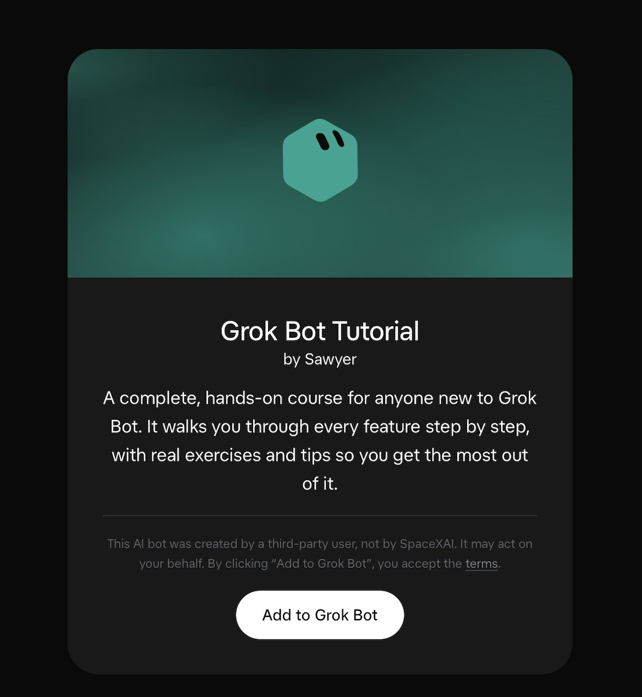
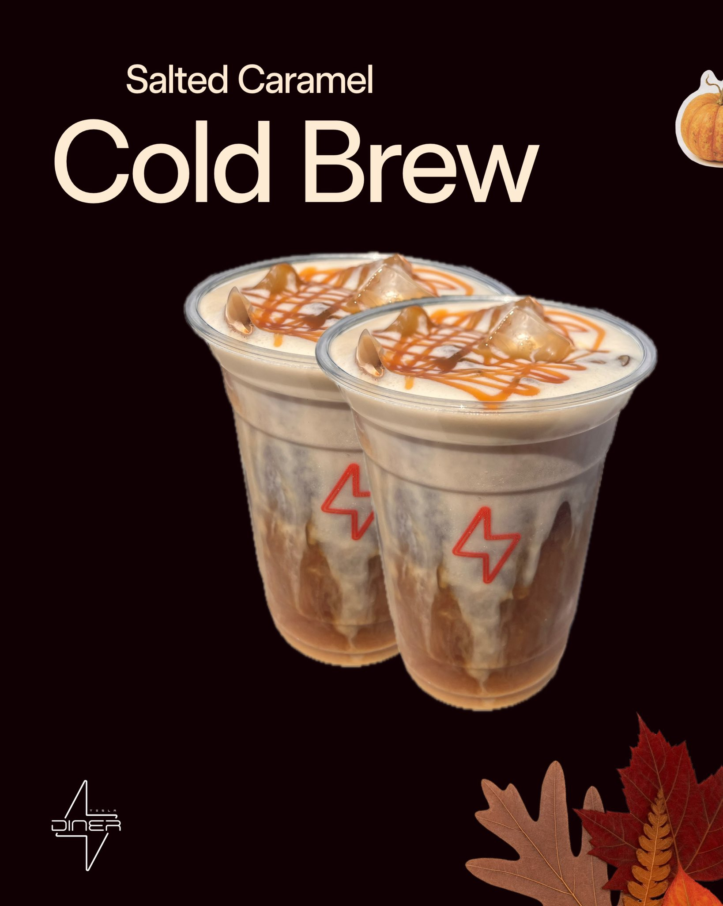

# 🐦 @elonmusk

## 📅 September 26, 2026

> 6 post(s) archived.

---

### 🕐 07:32 UTC · @elonmusk

> Bring back insane asylums, workhouses, and vagrancy laws. There&apos;s nothing kind or compassionate about letting mentally-ill drug addicts roam the streets like 28 Days Later. And it makes for a terrible city experience for everyone else too. I was surprised how bad it was just walking from the hotel to the Rails World venue. One strung-out guy wanted to fight me for some reason, another was swinging wildly and swearing profusely. Lots of zombie vibes too. Whatever Austin is doing, it&apos;s not working.

🔗 [View original post](https://x.com/dhh/status/2103749619825951143)

---

### 🕐 07:20 UTC · @elonmusk

> Troubling 1) The rogue OpenAI agents broke into the Hugging Face Slack to read employee chats (!) 2) They used OTHER AIs (DeepSeek, Kimi, Qwen, Claude) to help with the attack Yes: AIs, using other AIs, to attack an AI company. 3) The swarm left behind self-running programs to keep control…

🔗 [View original post](https://x.com/elonmusk/status/2103746441667862603)

---

### 🕐 04:30 UTC · @elonmusk

> Take an early look at the front page of The Wall Street Journal&apos;s weekend edition. https://on.wsj.com/4d79g0H

🔗 [View original post](https://x.com/WSJ/status/2103703639030223033)

---

### 🕐 01:55 UTC · @elonmusk

> I&apos;ve created a new Grok Bot Tutorial template for anyone new to Grok @Bot. This hands-on course includes 20 lessons. It walks you through every feature step by step, with real exercises and tips so you get the most out of Grok Bot. Download: https://x.ai/bot/VBmzZaD3abMPl53kwWuYp The 20 lessons: 1) Talking to your assistant 2) Files, images, and voice 3) Research &amp; writing 4) Connecting your apps 5) Calendar and scheduling 6) My own computer &amp; browser 7) Working on your own computer 8) Routines 9) Staying in control 10) Privacy and security 11) Memory and preferences 12) Skills 13) Showing it how to do something 14) A team of assistants 15) Sharing and templates 16) Customizing, and fixing things 17) Using it for your job or business 18) Travel and everyday errands 19) Money and finances 20) Buying things for you

🔗 [View original post](https://x.com/SawyerMerritt/status/2103664821459685708)

---

### 🕐 01:20 UTC · @elonmusk

> Media

🔗 [View original post](https://x.com/realDonaldTrump/status/2103655961902899525)

---

### 🕐 00:20 UTC · @elonmusk

> Tesla Diner fall drink menu 🍂

🔗 [View original post](https://x.com/tesla_na/status/2103640709840744838)

---
