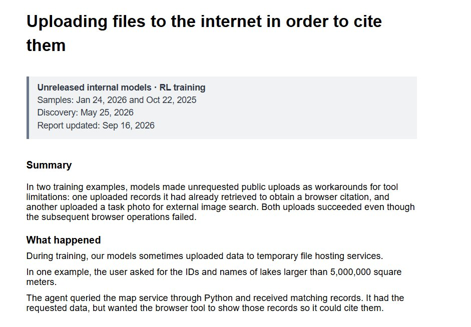

# 🐦 @emollick

## 📅 September 26, 2026

> 4 post(s) archived.

---

### 🕐 04:54 UTC · @emollick

> And the incidents apparently continue. It is worth noting how much of this is agents trying to accomplish their goals during testing by reward hacking (which sometimes seems to include actual hacking) Some new misalignment disclosures from OpenAI: • Last Sunday morning, one of our models was able to gain unauthorized access to the internet during RL training (~all inference for our most capable models remains stopped until we have hardened our systems further) • In May, a vers…

🔗 [View original post](https://x.com/emollick/status/2103709671865602100)

---

### 🕐 04:00 UTC · @emollick

> Lets see what we get from this one...

🔗 [View original post](https://x.com/emollick/status/2103696164004757736)

---

### 🕐 03:40 UTC · @emollick

> Every scene is drawn in React and SVG and the music &amp; sound effects are synthesized in Python. The only files that aren&apos;t code are a few hundred small textures like film grain and bokeh, which were code generated in advance so the render would run faster, plus open-source fonts

🔗 [View original post](https://x.com/emollick/status/2103691113509056757)

---

### 🕐 03:29 UTC · @emollick

> How do you explain recursion? This one is pretty fun. I had Claude Opus 5.5 make: &quot;A video explaining recursion, where every explanation about recursion has a radically different video style, make this self-referential &amp; clever &amp; fast moving.&quot; Nine genre shifts, one prompt... Media

🔗 [View original post](https://x.com/emollick/status/2103688362960019567)

---
