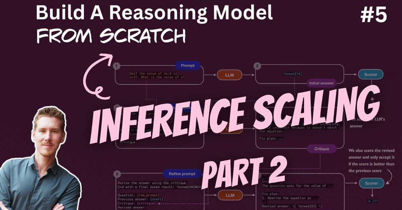

# 🐦 @rasbt

## 📅 September 26, 2026

> 2 post(s) archived.

---

### 🕐 13:28 UTC · @rasbt

> And a link to the video on YouTube: https://www.youtube.com/watch?v=TVMyOJ_3Gxo

🔗 [View original post](https://x.com/rasbt/status/2103839035596611977)

---

### 🕐 13:28 UTC · @rasbt

> Reasoning from scratch, round number 5! This time, talking about log-probability scoring (also a great fundamental concept for loss functions like cross-entropy in pre-training and distillation) and self-refinement. 00:00 Introduction and inference-time scaling recap 05:02 Loading the pretrained LLM 08:00 Comparing and scoring model answers 10:18 Building a rule-based scorer 17:53 Token probabilities and sequence likelihood 26:47 Computing token probabilities in PyTorch 30:12 Token indexing and shifted targets 37:27 Log probabilities and numerical stability 45:57 Scoring answers with average log probabilities 56:24 How self-refinement works 59:07 Generating critiques and revised answers 1:01:00 Implementing the self-refinement loop 1:05:57 MATH-500 evaluation results 1:07:35 Takeaways and next steps Media

🔗 [View original post](https://x.com/rasbt/status/2103839032484442506)

---
