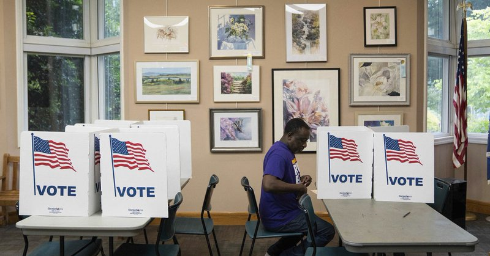

# 🐦 @ylecun

## 📅 September 26, 2026

> 2 post(s) archived.

---

### 🕐 11:49 UTC · @ylecun

> Si Marine Le Pen devient Présidente de la République, on va avoir droit à 5 ans de désintégration européenne, 5 ans de capitulation devant la Russie, 5 ans d&apos;ingérences massives, 5 ans d&apos;indignité internationale et de loi du plus fort. Si vous voulez que la France se couche et s&apos;offre au plus puissant, votez pour ça 👇🏿 Soit l’OTAN entrera en guerre, et ce sera la Troisième Guerre mondiale, soit ce sera la guerre de cent ans. Voilà ce que je disais il y a déjà trois ans. Je ne me suis pas trompée, puisque cette guerre dure déjà depuis de trop nombreuses années.

🔗 [View original post](https://x.com/Enthoven_R/status/2103814258462949796)

---

### 🕐 03:05 UTC · @ylecun

> The Trump administration’s decision not to invite the leading international election observation body to monitor crucial US midterm polls fuels fears of serious human rights concerns around the upcoming elections. https://trib.al/C9cng4w

🔗 [View original post](https://x.com/KenRoth/status/2103682280493355157)

---
