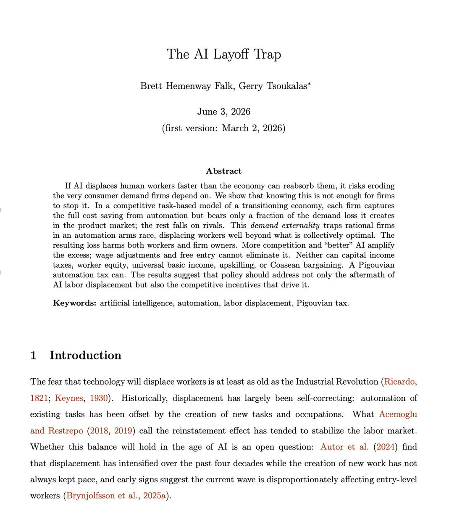

# 🐦 @AiEvolutio58513

## 📅 September 27, 2026

> 11 post(s) archived.

---

### 🕐 14:03 UTC · @AiEvolutio58513

> Interested in AI? Follow @AiEvolutio58513 and never fall behind. I track ChatGPT, Claude, and every tool quietly changing how we work and create, then hand you the tested signals.

🔗 [View original post](https://x.com/AiEvolutio58513/status/2104210418059350429)

---

### 🕐 14:03 UTC · @AiEvolutio58513

> TLDR: 8 Elon Musk predictions 1) High income and unrest, together 2) AI already does half your job 3) Currency becomes energy 4) China leads on AI compute 5) AI&apos;s cheapest home is space 6) Batteries double US energy 7) Robots meet all desire 8) The danger is no challenge left

🔗 [View original post](https://x.com/AiEvolutio58513/status/2104210406189502553)

---

### 🕐 14:03 UTC · @AiEvolutio58513

> Elon Musk believes we&apos;re living through the singularity right now, where technological growth accelerates beyond human control. On Peter Diamandis&apos;s podcast, he shared 8 predictions about what&apos;s coming: 1) We&apos;re heading for universal high income and social unrest, together Media

🔗 [View original post](https://x.com/AiEvolutio58513/status/2104210225154888139)

---

### 🕐 12:57 UTC · @AiEvolutio58513

> Two economists have mathematically shown how AI could hollow out the economy. Researchers at Wharton and Boston University published a paper called &quot;The AI Layoff Trap.&quot; It maps the end-game of the AI transition, and it exposes a structural flaw in competitive capitalism. When a company swaps a worker for AI, it keeps 100% of the wage savings. But that worker was also a customer. Lose the job, stop spending. The savings land on one balance sheet. The lost demand is spread thin across the whole economy. With 20 competitors in a market, a CEO absorbs only 1/20th of the damage their own layoffs create. So every rational CEO has a mathematical reason to automate as fast as possible. They can see the cliff. They accelerate anyway. It is a Prisoner&apos;s Dilemma with no exit. If you don&apos;t automate, a competitor will, and they will undercut you on price. Workers get hurt first. Then the businesses do. The economy locks into an automation arms race: companies cut staff to stay competitive until the customer base itself is hollowed out. At the limit, in the paper&apos;s words: “Firms automate their way to boundless productivity and zero demand.” The uncomfortable part? They tested every popular fix. Universal Basic Income? Fails. Living standards rise, but the incentive to cut jobs does not move. Retraining? Fails. Worker equity? Fails. More competition makes the collapse arrive faster. Better AI makes it deeper. The only lever that holds up in the math is a targeted automation tax: companies pay for the purchasing power they remove before they automate the job. Interested in AI? Follow @AiEvolutio58513 and never fall behind. I track ChatGPT, Claude, and every tool quietly changing how we work and create, then hand you the tested signals.

🔗 [View original post](https://x.com/AiEvolutio58513/status/2104193594668257639)

---

### 🕐 10:58 UTC · @AiEvolutio58513

> Interested in AI? Follow @AiEvolutio58513 and never fall behind. I track ChatGPT, Claude, and every tool quietly changing how we work and create, then hand you the tested signals.

🔗 [View original post](https://x.com/AiEvolutio58513/status/2104163665767543072)

---

### 🕐 10:58 UTC · @AiEvolutio58513

> TL;DR: 1. The reason you are doing it at all 2. The plan, written out in full detail 3. Knowing what the tool does underneath 4. Taste, because the machine has none 5. Catching what passes every test 6. Plain sense about the real world

🔗 [View original post](https://x.com/AiEvolutio58513/status/2104163654082150772)

---

### 🕐 10:57 UTC · @AiEvolutio58513

> 5. Catching the mistake that passes every test. On his own app you sign in with one account and pay with another. His agent matched them by email address, so &quot;there wasn&apos;t a persistent user ID&quot; and it &quot;would not associate the funds&quot;. Every test passed and it was still wrong. Media

🔗 [View original post](https://x.com/AiEvolutio58513/status/2104163601359736836)

---

### 🕐 10:57 UTC · @AiEvolutio58513

> 4. Taste, because there is none of it in the machine. Karpathy opens the code it writes. &quot;sometimes I get a little bit of a heart attack&quot;. It is &quot;very bloated&quot; and &quot;really gross&quot;. What is left for you: &quot;the aesthetics, the judgment, the taste, and a little bit of oversight.&quot; Media

🔗 [View original post](https://x.com/AiEvolutio58513/status/2104163546020073812)

---

### 🕐 10:57 UTC · @AiEvolutio58513

> 3. Knowing what the tool does underneath, long after you forget how it is spelled. Karpathy dropped the small print of the tools he made his name on. &quot;I don&apos;t remember this stuff anymore&quot;. What stays: &quot;an understanding of what this stuff is doing and some of the fundamentals&quot;. Media

🔗 [View original post](https://x.com/AiEvolutio58513/status/2104163510678929624)

---

### 🕐 10:57 UTC · @AiEvolutio58513

> 2. The plan, which he says you now write in far more detail than before. He wants the whole job written out with the agent before a line gets built. &quot;you have to work with your agent to design a spec that is very detailed&quot;. You keep &quot;the oversight and the top-level categories&quot;. Media

🔗 [View original post](https://x.com/AiEvolutio58513/status/2104163468148703517)

---

### 🕐 10:57 UTC · @AiEvolutio58513

> Andrej Karpathy helped build OpenAI, the AI everyone hands their work to now. &quot;You can outsource your thinking, but you can&apos;t outsource your understanding.&quot; 6 things that stay yours: 1. Handing over the work is easy, and handing over the reason you are doing it is not possible Media SemiAnalysis&apos; Jordan Nanos reveals the OpenAI engineers scrolling their own kernel code had no idea what it did line by line, and it didn&apos;t matter because the AI does &quot;It&apos;s not slop, because it performs, but it&apos;s literally just AI-generated assembly basically puked out in Gluon, …

🔗 [View original post](https://x.com/AiEvolutio58513/status/2104163419893244010)

---
