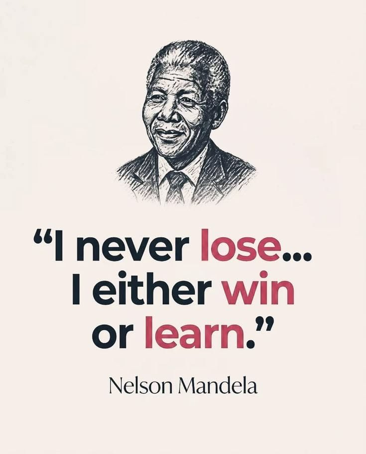

# 🐦 @Letstalk246

## 📅 September 27, 2026

> 5 post(s) archived.

---

### 🕐 19:33 UTC · @Letstalk246

> https://x.com/letstalk246/status/2101238396634959917 Growth is not about becoming perfect it’s about becoming better, wiser, and stronger than you were yesterday. -Letstalkwisdom

🔗 [View original post](https://x.com/Letstalk246/status/2104293415026352152)

---

### 🕐 19:17 UTC · @Letstalk246

🔗 [View original post](https://x.com/Letstalk246/status/2104289342050934972)

---

### 🕐 19:17 UTC · @Letstalk246

🔗 [View original post](https://x.com/Letstalk246/status/2104289315798806718)

---

### 🕐 19:08 UTC · @Letstalk246

🔗 [View original post](https://x.com/Letstalk246/status/2104287006595358791)

---

### 🕐 12:57 UTC · @Letstalk246

> Spirituality is finding peace within when the world becomes noisy. It is trusting the journey even when you cannot see the whole path. Sometimes, the deepest answers are found in stillness. -Letstalkwisdom

🔗 [View original post](https://x.com/Letstalk246/status/2104193663664333006)

---
