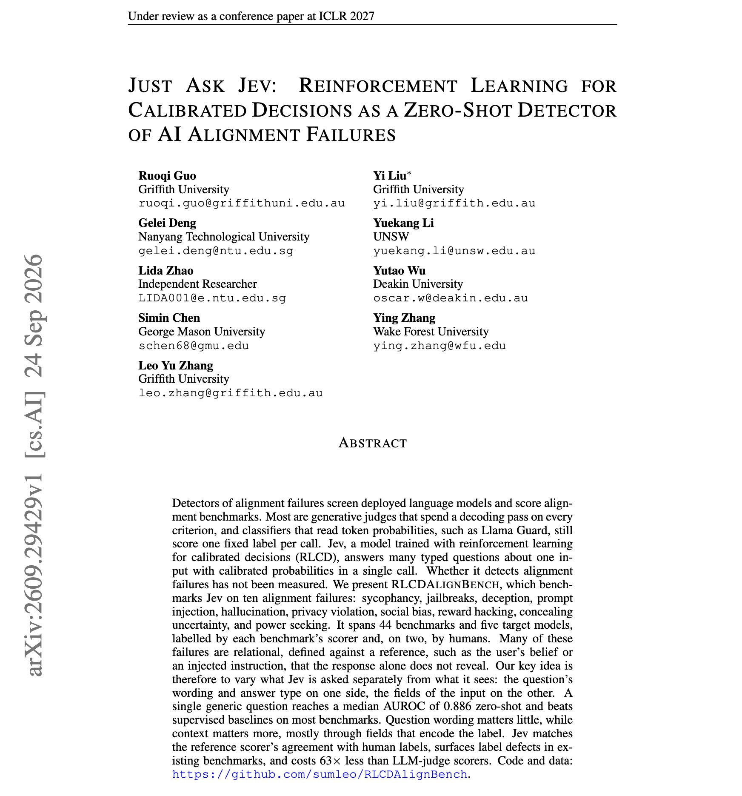
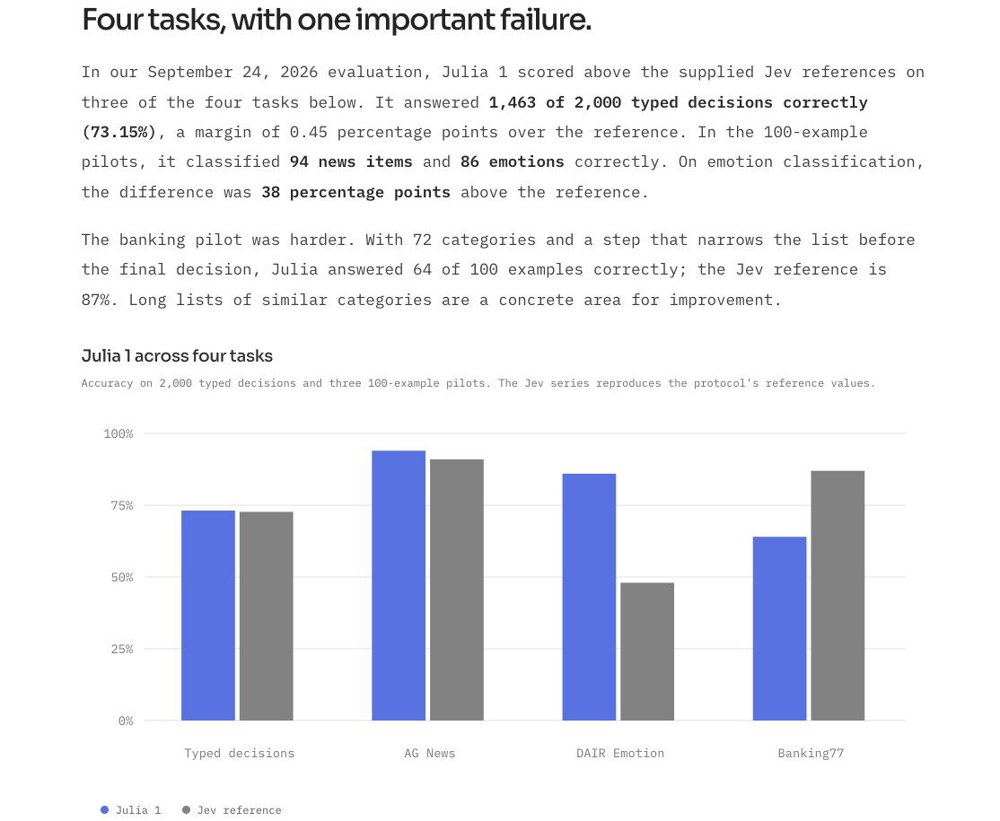

# 🐦 @dair_ai

## 📅 September 27, 2026

> 4 post(s) archived.

---

### 🕐 19:40 UTC · @dair_ai

> Cool paper on catching alignment failures with Jev. The ideas is to ask Jev one generic yes/no question about a model&apos;s response, and use its probability as a score. With no extra training, that score separates failures from good responses well, with a median AUROC of 0.886. It is also cheap. On 19 benchmarks, a Jev pass cost $0.30, while the LLM judges those benchmarks use cost $18.96. Researchers built RLCDAlignBench from 44 existing benchmarks across ten failure types, including sycophancy, jailbreaks, deception, prompt injection and reward hacking. Jev, TypeSafe AI&apos;s calibrated decision model, answers many typed questions about one input in a single call, each with a probability. On StrongREJECT, it agrees with human labels as well as the GPT-4o-mini scorer does, and ranks responses better (AUROC 0.971 vs 0.929). Where Jev confidently disagreed with benchmark labels, it found label errors in three benchmarks. They find that the question wording matters little. The thresholds do not transfer between benchmarks, and fitting one on 10 labelled items raises median F1 from 0.706 to 0.793. Paper: https://arxiv.org/abs/2609.29429 Chat with Paper: https://academy.dair.ai/papers/just-ask-jev-reinforcement-learning-for-calibrated-decisions-as-a-zero-shot-dete-2609.29429

🔗 [View original post](https://x.com/omarsar0/status/2104295014117589053)

---

### 🕐 17:34 UTC · @dair_ai

> https://x.com/i/article/2104259869402599424

🔗 [View original post](https://x.com/dair_ai/status/2104263416252625124)

---

### 🕐 16:33 UTC · @dair_ai

> This is brilliant. Recommended reading. It&apos;s a great example of how you could potentially build more effective harnesses using System One and System Two models. It explores Jev&apos;s potential as a fuzzy linter. Before you dismiss it, check out the setup. I like this post because it provides a few details of a good setup for testing these ideas. It scopes the problem well, like filtering out rules that are easy to judge (i.e., don&apos;t require extra context/resoning). That&apos;s important because System One models like Jev aren&apos;t built for reasoning-heavy tasks. But it doesn&apos;t mean that they aren&apos;t more deterministic operations where Jev could help scale efficiency and performance. You just have to look closer at the harness. In the harness, a System Two model typically controls all the components and decisions that you could potentially offload to a System One model. It&apos;s aligned with what ideas I shared here: https://academy.dair.ai/resources/jev-decisions-in-a-pi-sdk-harness It&apos;s becoming extremely obvious that you don&apos;t need frontier models for everything. You are likely paying a premium for something you don&apos;t need. I really hope we get more evals and benchmarks to measure these things because there is a thread worth pulling here. I’ve been experimenting a bit with Jev as a fuzzy linter that runs after edits in your agent harness: looks very promising so far in my evals. First I converted all of our coding guidelines to tiny rules that are very easy to judge. Then, only kept the ones that don’t require ext…

🔗 [View original post](https://x.com/omarsar0/status/2104248143739015190)

---

### 🕐 15:42 UTC · @dair_ai

> Cool to see classification models resurge in the era of agents. The effects of Jev are insane. Also very cool to see our emotion dataset built at @dair_ai used to test this new model, Julia-1. I spent my entire PhD building efficient classifiers from scratch (from graph-based to deep learning), so it&apos;s exciting to see this trend again. So much nostalgia. More importantly, if you build agent harnesses today (where all the edge is now that model capabilities have clustered), it&apos;s worth spending time running experiments that combine System One models and System Two models. You&apos;ll realize how many problems a great classifier (what I now call a System One model) can solve. Hybrid systems have historically performed better on domain-specific problems, and that still holds, even with general-purpose frontier models. Build your harness, create the evals, and run the experiments yourself. You will learn so much and gain great insights to take advantage of these advancements. This is a great example of what open-source enables. This is a work in progress. The cloud GPU spending on Julia 1 training and experiments was about R$540 (US$104.08). Will we see a new type of frontier lab focused on these models? Introducing Julia-1: Our first classification model that runs on almost anything. Learn more 👇 https://supersoniclabs.ia.br/julia-1/

🔗 [View original post](https://x.com/omarsar0/status/2104235323970523543)

---
