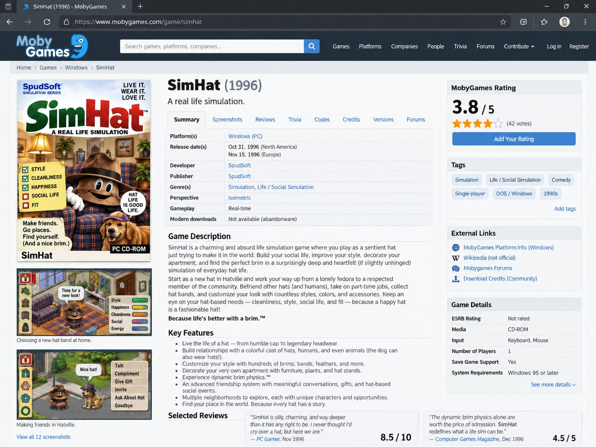

# 🐦 @emollick

## 📅 September 27, 2026

> 6 post(s) archived.

---

### 🕐 18:12 UTC · @emollick

> We are going to learn how many systems only work today because they are built around friction that will no longer exist soon. Fascinating. Chief Economist at Apollo: agents could cause a bank run by sweeping household cash into accounts paying 3-5% instead of the 0.1% national average, causing banks to lose a large share of their cheap deposits.

🔗 [View original post](https://x.com/emollick/status/2104273082433081732)

---

### 🕐 05:11 UTC · @emollick

> I can&apos;t believe people think SimHat is made up. Would I also make up the gritty reboot in the early 2000s? And the online multiplayer version (&quot;its a brimmunity!&quot;)? And the recent exploitative mobile game?

🔗 [View original post](https://x.com/emollick/status/2104076472591814866)

---

### 🕐 05:01 UTC · @emollick

> Anyhow, it is almost like some sort of general intelligence, but made with artificial means. Very hard to know what we might call that.

🔗 [View original post](https://x.com/emollick/status/2104073909960155515)

---

### 🕐 02:42 UTC · @emollick

> Model personality matters in a way that benchmarks can&apos;t capture. Opus models went through a rough patch from around 4.7 to 5 where they just didn&apos;t feel &quot;Claude-y&quot; anymore, more like an watered-down Fable (hmmm, teacher models?). Opus 5.5 feels like working with ol&apos; Claude again

🔗 [View original post](https://x.com/emollick/status/2104039050080342456)

---

### 🕐 02:34 UTC · @emollick

> Also please feel free to fight in the comments about &quot;pure LLMs&quot; versus multimodal LLMs versus multimodal LLMs with tool use or whatever. I totally get all the caveats, but you get what I mean.

🔗 [View original post](https://x.com/emollick/status/2104037005613248622)

---

### 🕐 01:50 UTC · @emollick

> It is strange how much LLMs turned out to be the key to such a wide range of problems that would not, initially, seem to be problems that a model of human language would be able to solve. What can Astra do when given a humanoid embodiment? We built HomeBody to find out. Controlled by GPT Astra, it carries out long-horizon tasks in a previously unseen kitchen—from tidying up across the room to retrieving remembered objects from ambiguous requests—without environmen…

🔗 [View original post](https://x.com/emollick/status/2104025904653521363)

---
