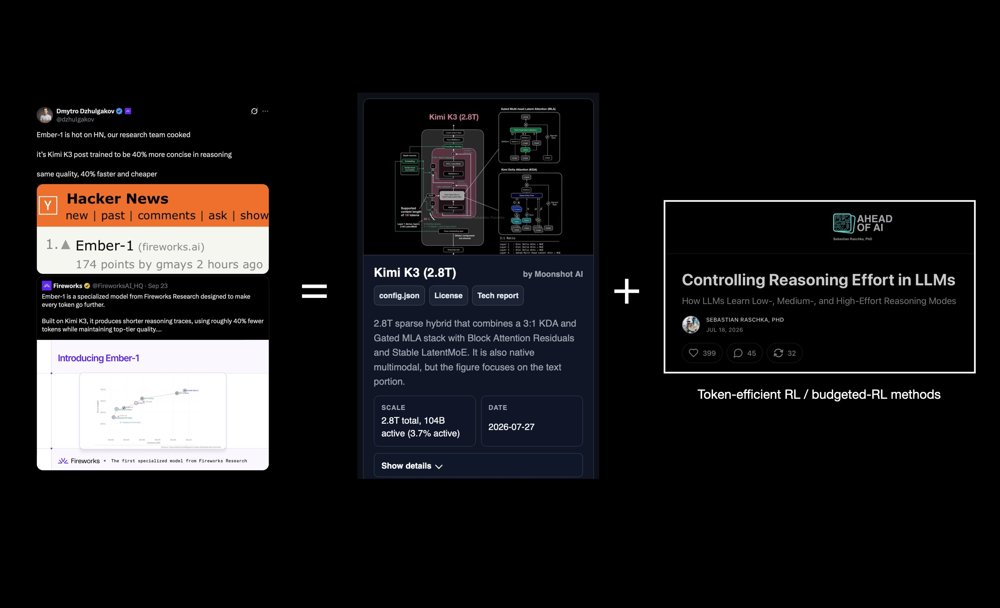

# 🐦 @rasbt

## 📅 September 27, 2026

> 1 post(s) archived.

---

### 🕐 21:45 UTC · @rasbt

> A little Ember-1 tl;dr. Seems like a great model! (Was recently asked on a podcast, given $ xx million, what&apos;s the best way to develop a frontier LLM today? My recommendation was: start with an existing one and spend that budget on post-training. Great example here.) Ember-1 is hot on HN, our research team cooked it’s Kimi K3 post trained to be 40% more concise in reasoning same quality, 40% faster and cheaper

🔗 [View original post](https://x.com/rasbt/status/2104326522354147793)

---
