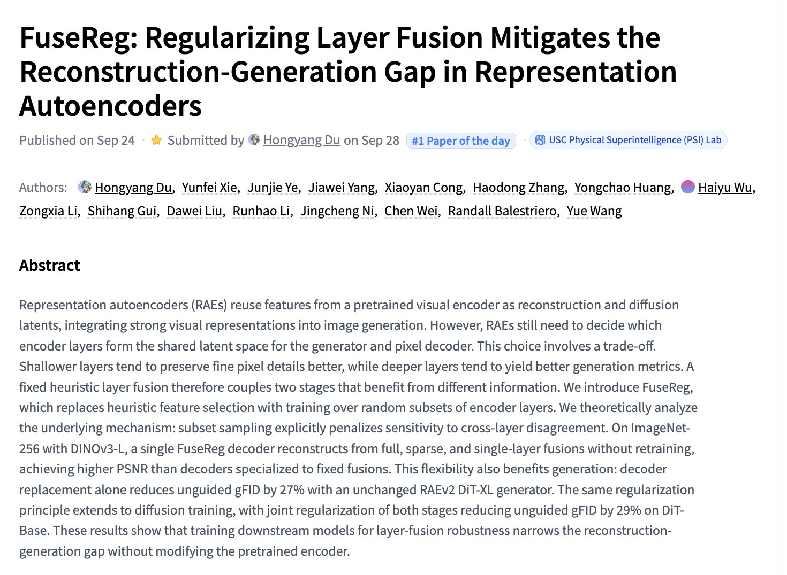

# 🐦 @_akhaliq

## 📅 September 28, 2026

> 5 post(s) archived.

---

### 🕐 19:09 UTC · @_akhaliq

> FuseReg Regularizing Layer Fusion Mitigates the Reconstruction-Generation Gap in Representation Autoencoders paper: https://huggingface.co/papers/2609.31620

🔗 [View original post](https://x.com/_akhaliq/status/2104649800654504175)

---

### 🕐 19:06 UTC · @_akhaliq

> 5 years ago, we released @Gradio to make it easier to build frontends for AI apps. At that time, that was the main blocker for making AI more accessible to the community. But this is no longer a challenge. So we asked ourselves and other developers: &quot;what are the main challenges that you face now when building and using AI apps&quot; – and we are now working hard to redesign Gradio from scratch to solve these issues!

🔗 [View original post](https://x.com/abidlabs/status/2104648858630516846)

---

### 🕐 16:26 UTC · @_akhaliq

> today, we’re releasing the largest open-source human video preferences dataset, along with doubling our data grant to $2M - 300K+ annotations by real people - 15 SOTA video models ranked (Seedance 2.5, Omni 1.1, Wan 3, Flux Video 3 etc.) - 8 categories (ads, camera movement, physics etc) dataset + benchmark + frontier plot below: Media

🔗 [View original post](https://x.com/datapointai/status/2104608654867542278)

---

### 🕐 16:17 UTC · @_akhaliq

> InternW0-Δ: a world action model for robots Pretrained on over 20,000 hours of open robot and human data, this model jointly learns predictive dynamics and action generation, outperforming prior methods across benchmarks and real robots. Media

🔗 [View original post](https://x.com/HuggingPapers/status/2104606518024786257)

---

### 🕐 05:40 UTC · @_akhaliq

> High quality Image generation can be fast. Viggle Turbo (6-step Qwen-Image-2.1) now runs as a @Gradio Workflow: prompt, up to 6 reference images and settings wired into one node you can see and rewire. Workflow by @_akhaliq 🙌 Try it https://huggingface.co/spaces/Viggle/Qwen-Image-2.1-viggle-turbo-workflow

🔗 [View original post](https://x.com/t_mux/status/2104446096411885571)

---
