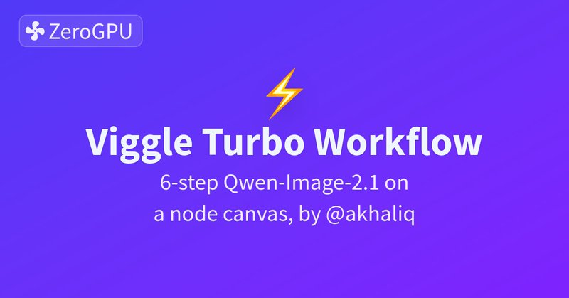

# 🐦 @_akhaliq

## 📅 September 28, 2026

> 1 post(s) archived.

---

### 🕐 05:40 UTC · @_akhaliq

> High quality Image generation can be fast. Viggle Turbo (6-step Qwen-Image-2.1) now runs as a @Gradio Workflow: prompt, up to 6 reference images and settings wired into one node you can see and rewire. Workflow by @_akhaliq 🙌 Try it https://huggingface.co/spaces/Viggle/Qwen-Image-2.1-viggle-turbo-workflow

🔗 [View original post](https://x.com/t_mux/status/2104446096411885571)

---
